# Introduction

Given advances in medicine, including increased longevity and improved outcomes with various medical conditions, we are facing an ever-enlarging population of immunocompromised hosts. Although fairly heterogenous, it has been estimated that 6% of the population in the United States and between 4–6% of the Italian population and other Western European populations are immunocompromised [@Martinson2024]. Using direct pharmaceutical claims in a large cohort of adults in the United States to describe the contemporary prevalence of drug-induced immunosuppression (including corticosteroids, antirejection medications, tumor necrosis factor inhibitors, antineoplastic agents, and other biologic medications), Wallace and colleagues found that 2.8% of the population met the criteria for drug-induced immunosuppression during the period January 1, 2018 through December 31, 2019 [@Wallace2021]. Using a broader definition, Clark and associates found that an estimated 1 in 5 people throughout the world were at risk for severe COVID-19, based on risk factors such as age, chronic kidney disease, diabetes, cardiovascular disease, and chronic respiratory disease [@Clark2020].

The immunocompromised host thus constitutes a sizeable and growing proportion of the population, with estimates contingent on the definition used. Factors to consider in assessing the general level of immunosuppression in an individual patient include disease severity, duration, clinical stability, complications, comorbidities, and any potentially immunosuppressive medications or therapies.

{fig-align="center" width="75%"}

In an era of increasingly complex medical care, many patients have extensive prior treatments and immunosuppression that render them at higher risk for infectious complications when they undergo subsequent therapies, such as transplant (hematopoietic cell or solid organ) or CAR-T cell therapy [@Maschmeyer2019]. Some agents, such as fludarabine, antithymocyte globulin, and alemtuzumab, can affect the immune system for many months afterward. In addition, complications such as mucositis, cytopenias, and surgical site infections can increase vulnerability for infection.

| Immunocompromising Conditions and/or Therapies |
|---|
| Active treatment for solid tumor or hematologic malignancies |
| Immunosuppressive therapy for solid-organ transplant |
| CAR T-cell or hematopoietic stem cell transplant |
| Moderate or severe primary immunodeficiency (e.g., DiGeorge syndrome, Wiskott-Aldrich syndrome) |
| Advanced or untreated HIV infection |
| High-dose corticosteroids (≥20 mg prednisone or equivalent per day) |
| Alkylating agents, antimetabolites |
| Transplant-related immunosuppressive drugs |
| Cancer chemotherapeutic agents classified as severely immunosuppressive |
| Tumor-necrosis factor blockers and other biologic agents that are immunosuppressive or immunomodulatory |

: Major Conditions Leading to Immunocompromise {#tbl-immunocompromise}

## The Net State of Immunosuppression

The "net state of immunosuppression," a term originally described by Dr. Robert Rubin at Massachusetts General Hospital in Boston, represents a composite of host, underlying disease, treatment, and other factors that may contribute to an augmented risk of infection.

{fig-align="center" width="60%"}

Autoimmune diseases (i.e., lupus, rheumatoid arthritis, sarcoidosis, others) often have higher rates of infection, even without immunosuppressive therapies. Advanced organ disease, such as kidney, liver, heart, and lung disease for those awaiting organ transplant, as well as other comorbidities or conditions (i.e., poorly controlled diabetes, obesity, malnutrition, weight loss, hypogammaglobulinemia) and advanced age can all augment infection risk. Acute issues around the time of treatment, such as the need for renal replacement therapy, hemorrhage, long ischemic times and/or need for retransplantation of an organ, long intensive care unit stays, and extensive transfusion needs can all augment the risk of infection.

Some concomitant infections, such as human immunodeficiency virus (HIV), cytomegalovirus (CMV), Epstein-Barr virus (EBV) or alterations in the microbiome can also contribute to the net state of immunosuppression. Exogenous immunosuppression is perhaps the most obvious contributor and is often used at higher doses initially followed by chronic doses [@Roberts2021]. Treatment of organ transplant rejection or graft-versus-host disease (GVHD) can cause extended periods of high infection risk.

::: {.callout-note}
## Clinical Pearl
The "net state of immunosuppression" is a composite measure that includes host factors, underlying disease, treatment effects, and other variables that contribute to infection risk. This concept helps clinicians assess individual patient risk and guide preventive strategies.
:::

## Infectious Complications and Mortality

Infectious complications result in significant morbidity and mortality in people with immunocompromise. In a cohort of solid organ transplant (SOT) recipients in Switzerland evaluated from 2008–2014, 6% died from infection within the first year after transplant [@vanDelden2020]. In a cohort of 804 renal transplant recipients in the German Center of Infectious Diseases, 55% had 972 infections in the first year after transplant, with about half occurring in the first 3 months, and of those infections, bacteria caused 66%, viruses caused 29%, and fungi caused 5% [@Sommerer2022].

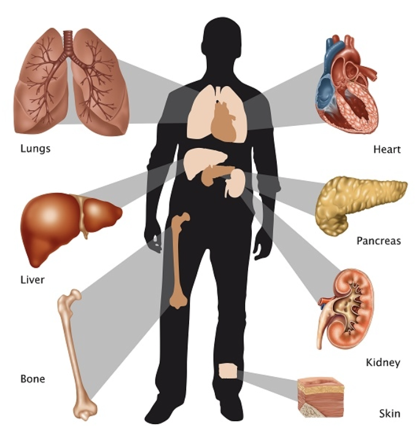{fig-align="center" width="70%"}

The leading cause of mortality in hematopoietic cell transplant (HCT) recipients is relapse of primary disease; infection comes second. Those patients undergoing chimeric antigen receptor (CAR-T) cell therapy are often profoundly immunosuppressed; up to one-third of patients will suffer a serious bacterial infection in the first 30 days after therapy [@Stewart2021].

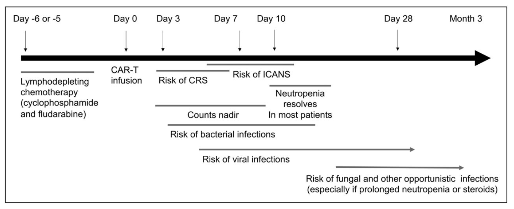{fig-align="center" width="75%"}

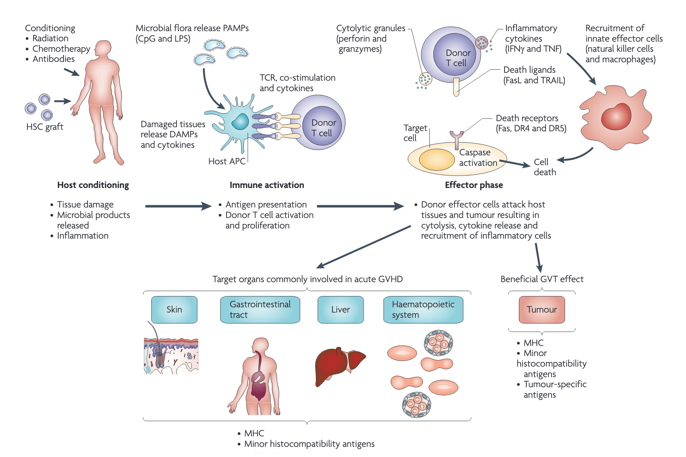{fig-align="center" width="70%"}

## Measuring Immunosuppression

Measuring the extent of immunosuppression has been a long sought-after goal. In persons living with HIV (PLWHIV), much is known about how the absolute CD4 count, CD4 percentage, and CD4/CD8 ratio correlate with risk of specific infections. Neutropenia and lymphopenia have been shown to correlate with an augmented risk.

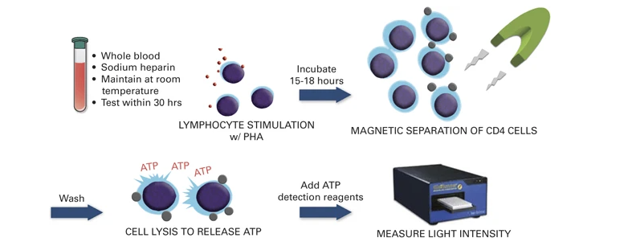{fig-align="center" width="65%"}

Inflammatory markers such as the erythrocyte sedimentation rate, C-reactive protein, and procalcitonin have not been shown to be predictive markers in this population. Therapeutic drug monitoring of immunosuppression can be done for only a limited number of agents (i.e., tacrolimus, cyclosporine, sirolimus), and when used in isolation does not correlate with risk of infection in an individual.

# Sources and Risks of Various Infections

A plethora of pathogens can infect the immunocompromised host, from many different sources, with the most common mimicking those that occur and/or are acquired in the community. In addition, given the augmented frequency with which they are in contact with health care settings, these patients are at higher risk for multidrug resistant and other nosocomial organisms.

{fig-align="center" width="70%"}

Immunosuppressed persons are also at risk for reactivation of latent infections, such as *Mycobacterium tuberculosis*, *Strongyloides*, hepatitis B, *Coccidioides*, *Histoplasma*, and *Trypanosoma cruzi* (the etiologic agent of Chagas disease). Donor-derived infections, acquired from the organ transplant, stem cell transplant, blood products, or other tissues, may occur, especially in the first 6 months after transplant.

::: {.callout-note}
## Key Point: Timing of Infections
Solid organ and stem cell transplant recipients are at highest risk for infection in the first 100 days after transplant, with the risk gradually falling over the next 1–2 years. Active prophylaxis alters the risk of various infections and can help guide the differential diagnosis.
:::

Prophylaxis against *Pneumocystis* includes trimethoprim-sulfamethoxazole, which can prevent a variety of other pathogens, ranging from *Toxoplasma* to *Staphylococcus aureus* and *Nocardia*, as well as numerous other gram-positive and gram-negative organisms. Anti-herpes viral prophylaxis with valganciclovir, letermovir, acyclovir, valacyclovir, and famciclovir can greatly decrease the risk for CMV, herpes simplex, and disseminated zoster.

{fig-align="center" width="75%"}

# Components of Host Defense

## Cellular and Humoral Immunity

Host defense against pathogenic microorganisms includes innate and acquired immunity. The innate immune system comprises both cellular components, including monocytes, neutrophils, natural killer (NK) cells, and innate lymphoid cells; humoral components include complement, some antibodies, antimicrobial peptides, and lysozyme. The innate immune system not only specifically recognizes various classes of microorganisms via pattern recognition receptors that sense conserved structures of the invading microorganisms, but also initiates and modulates the subsequent adaptive responses delivered by T cells and B cells [@Quintana-Murci2007].

## Innate Immunity

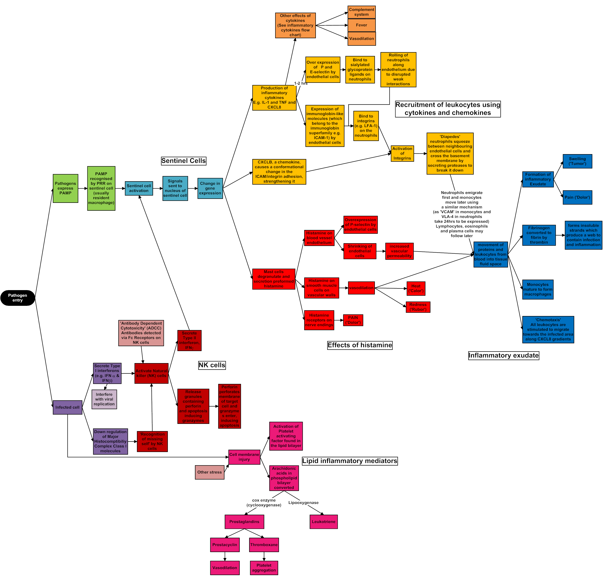{fig-align="center" width="75%"}

### Granulocytes

Virtually all cytotoxic drugs used in the treatment of malignant diseases have a deleterious effect on the proliferation of normal hematopoietic progenitor cells. Therefore, after obliteration of the mitotic pool and depletion of the marrow pool reserve, neutropenia ensues [@Takizawa2012]. Profound neutropenia is an unavoidable consequence of the treatment of malignancy and may persist for 3 or 4 weeks or even longer.

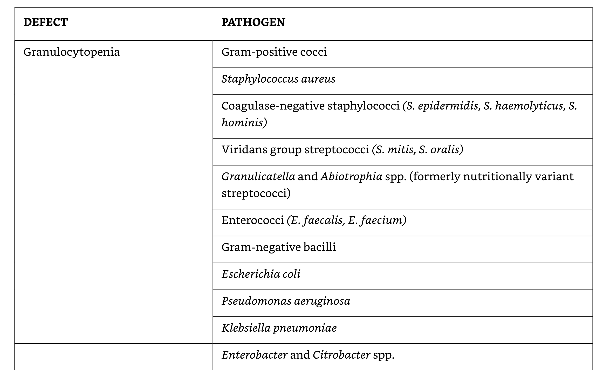{fig-align="center" width="70%"}

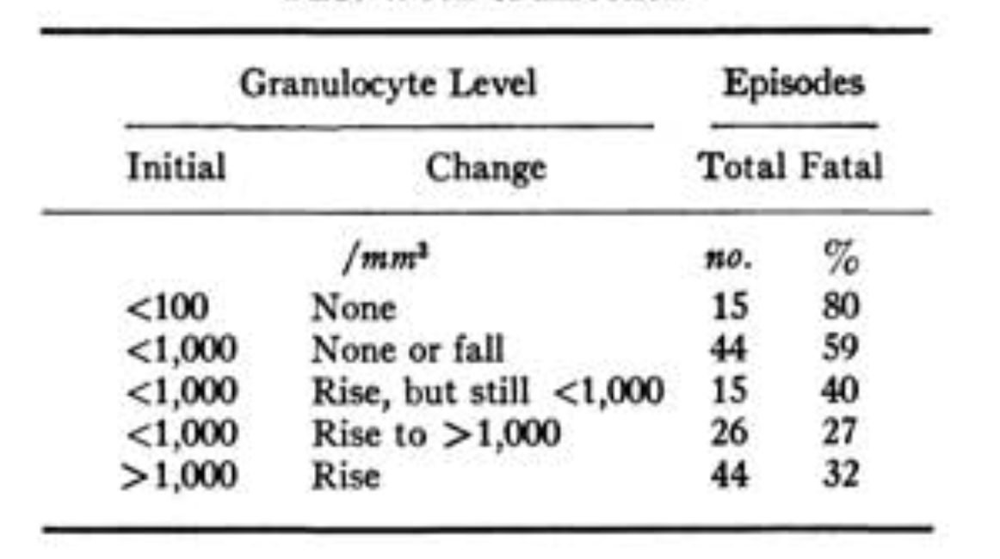{fig-align="center" width="65%"}

Granulocytes that accumulate at the site of infection are of little use if they are unable to function normally. Some antineoplastic drugs and irradiation interfere with these nonproliferating cells and their function, resulting in decreased chemotaxis, diminished phagocytic capacity, and defective intracellular killing by granulocytes. Glucocorticosteroids curb the accumulation of neutrophils at the site of inflammation by reducing their adherent capacity and diminishing their chemotactic activity.

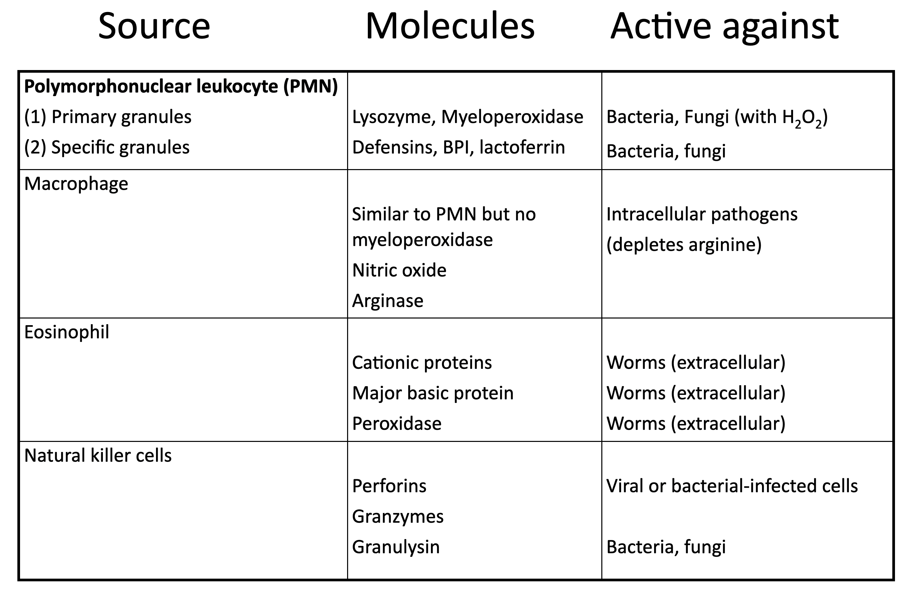{fig-align="center" width="65%"}

### Monocytes and Macrophages

Monocytes reside in the bloodstream and contribute to rapid responses against invading bacteria and fungi. Monocytopenia can occur in parallel with neutropenia and sometimes be overlooked as a risk for infection. Activation of macrophages is a complex process, primarily under the control of cytokines (e.g., IFN-γ) provided by T lymphocytes.

An example is ibrutinib, a specific inhibitor of B-cell signaling through Bruton tyrosine kinase (BTK), used in some people with lymphoid malignancies. Studies have shown heightened risks for pulmonary and disseminated aspergillosis, especially in people receiving concurrent glucocorticoid therapy — now considered to be largely mediated by a secondary impact on monocyte/macrophage function.

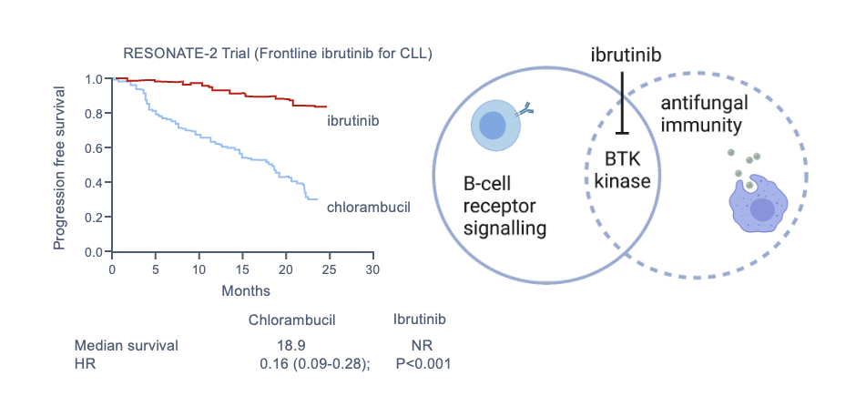{fig-align="center" width="60%"}

### Natural Killer Cells

NK cells are cytotoxic lymphocytes belonging to the pool of innate lymphoid cells, responding primarily to viruses and malignant cells. Depletion of NK cells by monoclonal antibodies or dysfunction during transplant immunosuppression contributes to the overall susceptibility to viral and probably fungal infections.

### Platelets

Not typically considered a significant component of innate immunity, recent studies outline potential protective roles of platelets against bacterial and fungal infections. Thrombocytopenia appears to be an independent risk factor for bacteremia [@Gafter-Gvili2011]. Animal models have shown that platelets may be particularly important in protection against both yeast and mold infections [@Tischler2020].

## Acquired Immunity

### Cellular Immunity

Both antigen-specific and antigen-nonspecific cells contribute to the development of cellular immunity. Long-term cytotoxic therapy, extensive irradiation, and immunosuppressive drugs such as corticosteroids, azathioprine, cyclosporine, tacrolimus, and the mTOR inhibitors sirolimus and everolimus suppress cellular immunity.

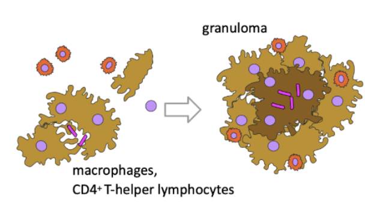{fig-align="center" width="70%"}

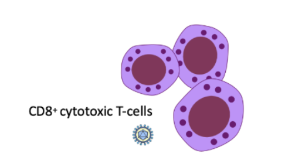{fig-align="center" width="70%"}

Purine analogues, including fludarabine and cladribine, are particularly detrimental to cellular immunity and create a situation similar to acquired immunodeficiency syndrome. Emerging targeted therapies — including TKIs, BCL2 inhibitors, JAK-STAT inhibitors, and PI3K inhibitors — have an impact on specific cellular immunity, exemplified by the occurrence of opportunistic infections with ruxolitinib, ibrutinib, and idelalisib [@Teh2016].

### Humoral Immunity

The humoral branch of the immune system, which is primarily responsible for clearing extracellular bacteria, involves the interaction of B cells with antigen and their subsequent proliferation and differentiation into antibody-secreting plasma cells.

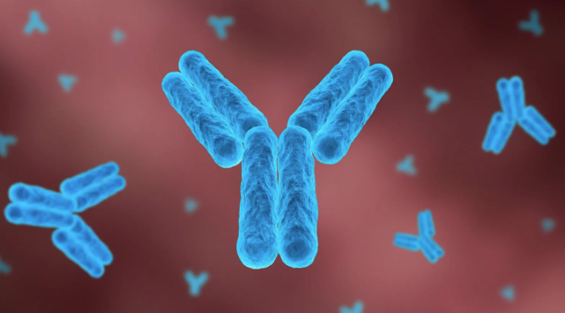{fig-align="center" width="65%"}

The production of immunoglobulins is decreased in lymphoproliferative disorders such as CLL and multiple myeloma. Monoclonal antibodies such as rituximab and blinatumomab and CD19- and CD22-targeted CAR-T cells deplete B lymphocytes, may induce profound and long-lasting hypogammaglobulinemia and infections [@Brudno2016; @Maude2015]. Cytokines and chemokines are indispensable for communication between innate and acquired immune cells; interference by anticytokine antibodies (e.g., infliximab, anakinra, tocilizumab) results in increased risk for infection [@Grijalva2011]. The lack of opsonizing antibodies impairs the activity of all phagocytic cells, including granulocytes, monocytes, and macrophages. Splenectomy results in reduced complement factor properdin, suboptimal opsonization, and low circulating IgM, impairing clearance of encapsulated bacteria such as *Streptococcus pneumoniae* and *Haemophilus influenzae* [@VanderMeer1994].

## The Integument as Host Defense

The skin, the respiratory tract, the ears and conjunctivae, the alimentary tract, and the genitourinary tract are in contact with the environment and provide a first line of defense against microbial invasion.

### Skin

Immunosuppressive treatments, such as chemotherapy and irradiation, can cause radical changes in healthy skin. Needle punctures and catheters provide a ready means of access for microorganisms through the stratum corneum and into the bloodstream [@Roth1988]. When the skin is broken, the release of fibronectin is thought to assist colonization with *S. aureus*.

### Oropharynx

Mucous membranes lining the oropharynx and salivary glands constitute a special first line of defense. Concurrent antibiotics, corticosteroids, and loss of saliva production through surgery, drugs, or irradiation lead to modification of this barrier function and to overgrowth of enteric microorganisms. As a result, oral candidiasis (thrush) and bacterial infections occur with increased frequency.

### Alimentary Tract

Antibiotic-induced changes in the gut microbiome predispose to acquisition of exogenous pathogens, with a particular risk for *Clostridioides difficile* infection [@Hooper2001]. High-dose chemotherapy damages gut epithelium — the so-called mucosal barrier injury — which facilitates translocation of aerobic intestinal bacteria.

{fig-align="center" width="65%"}

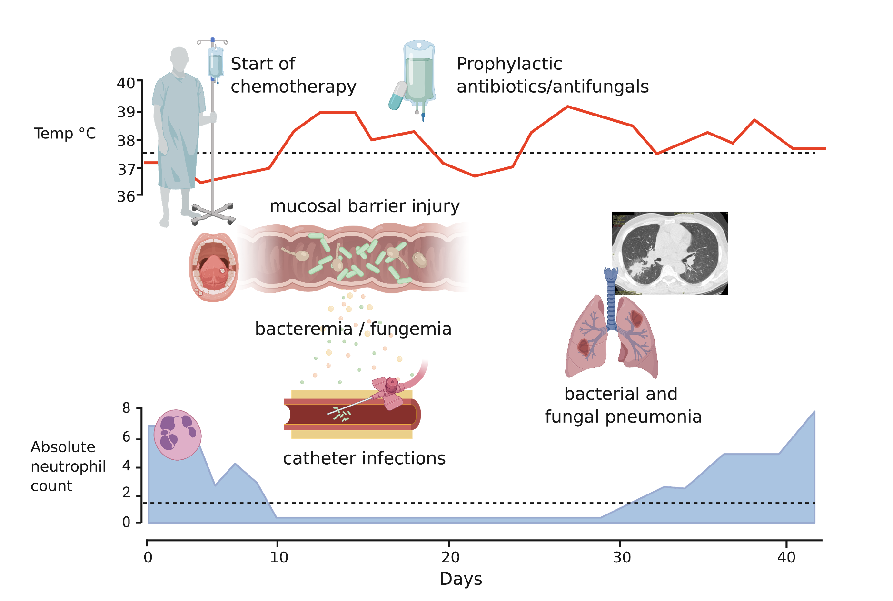{fig-align="center" width="70%"}

## Immunomodulatory Therapy Toxicities

Checkpoint inhibitors and other immunomodulatory therapies can cause adverse reactions in many organ systems [@Haanen2017]. Recognizing these is essential because, although they affect immunocompromised hosts, these adverse reactions often mimic clinical presentations of infections. Affected organs include the skin, endocrine glands, lung, gastrointestinal tract, liver, and heart.

# Common Infections in Immunocompromised Hosts

## Common Viral Infections

Herpes zoster is common in immunocompromised persons [@McKay2020]. Reactivation disease may be complicated by skin dissemination, cutaneous bacterial superinfection, visceral disease, or post-herpetic neuralgia [@Balfour1988]. CMV reactivation causes many syndromes in immunocompromised hosts. BK virus may cause nephropathy or hemorrhagic cystitis after stem cell transplant [@Imlay2022; @Imlay2020]. Respiratory viruses may be associated with mortality in hematopoietic cell transplant recipients [@Seo2017].

## Common Fungal Infections

Invasive fungal disease is a serious complication of acute leukemia, high-dose chemotherapy, and stem cell and solid organ transplant [@Hammond2010; @Pergam2017]. After HCT, invasive mold infections may occur during neutropenia or GVHD [@Lindsay2023; @Marr2010].

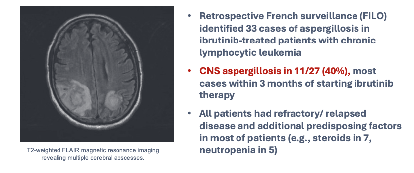{fig-align="center" width="65%"}

## Common Bacterial Infections

Bacteremia remains a significant problem in immunocompromised hosts, with gram-negative infections becoming more common and potentially multidrug resistant [@Zimmer2022; @Neofytos2023]. Antimicrobial resistance, including vancomycin-resistant *Enterococcus*, is a major concern [@Ubeda2010; @Gottesdiener2023; @Ford2017]. Nontuberculous mycobacteria cause infections in solid organ transplant recipients and those with other immunosuppression [@Abad2016; @Tabaja2022].

{fig-align="center" width="70%"}

{fig-align="center" width="65%"}

| DEFECT | PATHOGEN |
|---|---|
| Neutropenia | *S. aureus*, coagulase-negative staphylococci, viridans streptococci, *E. coli*, *P. aeruginosa*, *K. pneumoniae* |
| Damaged integument | Coagulase-negative staphylococci, *S. aureus*, *Candida* spp., *Pseudomonas aeruginosa* |
| Oral mucositis | Viridans streptococci, *Candida* spp., herpes simplex virus |
| Gut mucosal barrier injury | *E. coli*, *P. aeruginosa*, enterococci, *Candida* spp. |
| Cellular immune deficiency | *Pneumocystis jirovecii*, *Listeria*, CMV, *Aspergillus*, *Cryptococcus* |
| Humoral immune deficiency | *S. pneumoniae*, *H. influenzae*, enteroviruses |
| Complement deficiency | Encapsulated bacteria (*Neisseria*, *S. pneumoniae*) |

: Immunodeficiencies and Associated Prevalent Pathogens {#tbl-pathogens}

## References
