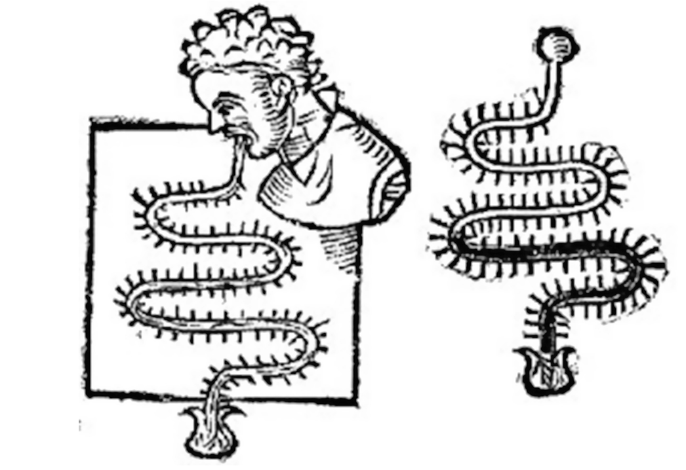
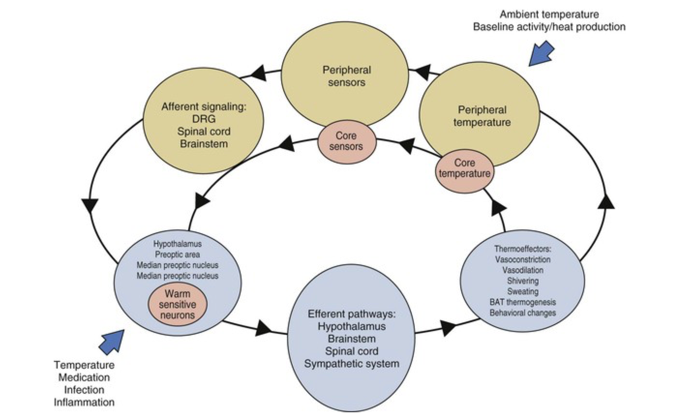
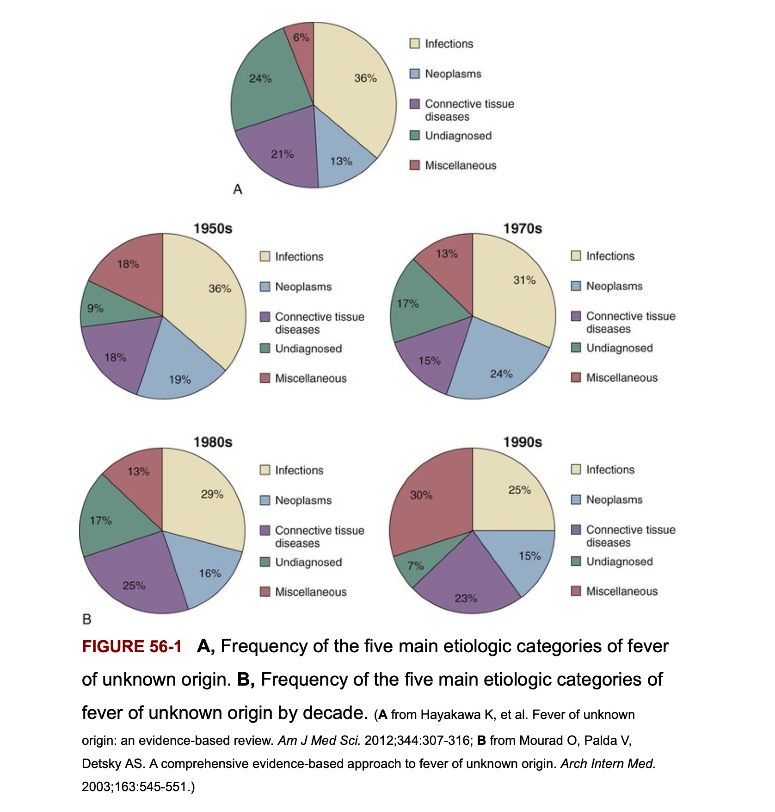
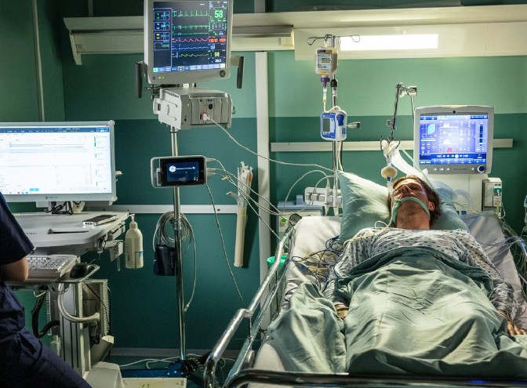
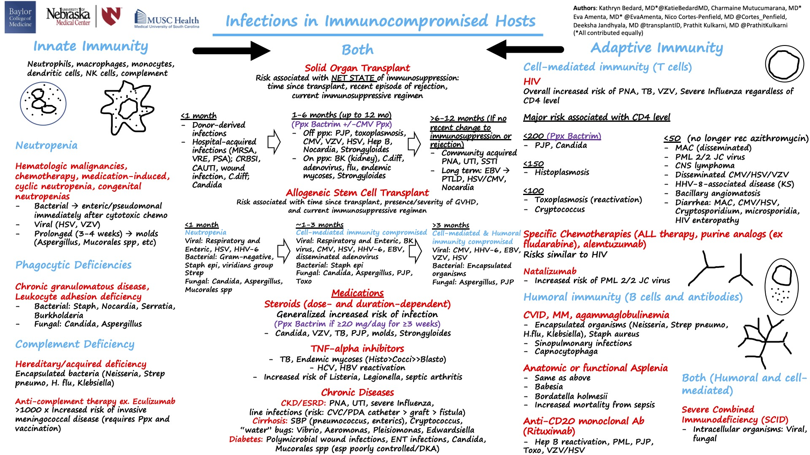
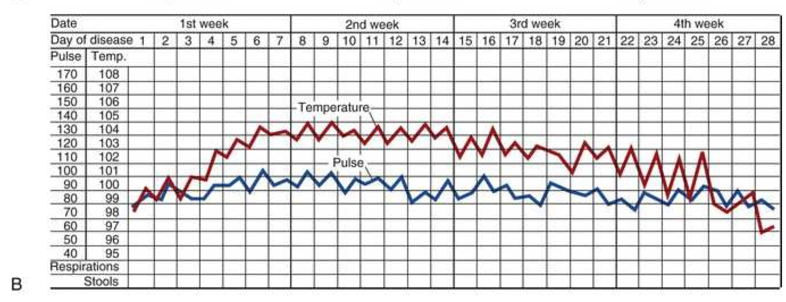
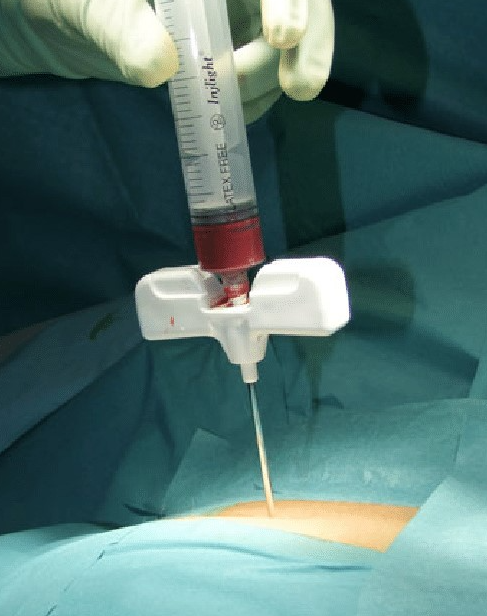
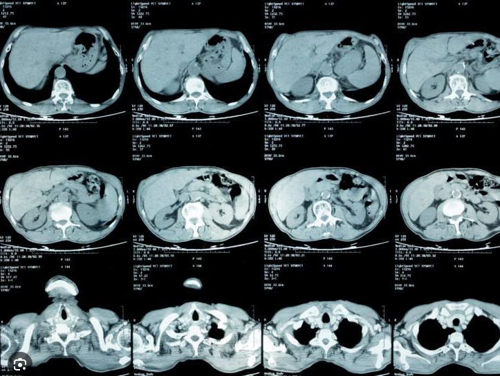

# Introduction

Understanding the pathogenesis of fever is essential for infectious disease practitioners, as fever remains one of the most common presenting signs in clinical medicine. This integration of thermophysiology and clinical diagnosis provides a complete framework for comprehending both the mechanism underlying the febrile response and the systematic approach to patients presenting with prolonged unexplained fever.

# PART 1: TEMPERATURE REGULATION AND THE PATHOGENESIS OF FEVER

## Historical Perspectives on Fever

The concept of fever has occupied medical thought for millennia, with documentation of febrile illness dating back to the earliest recorded medical writings. Among the oldest records of fever are references in Akkadian cuneiform tablets, representing humanity's earliest attempts to document and understand abnormal elevations in body temperature. These ancient accounts demonstrate that fever was recognized as a sign of serious illness, though the mechanisms were entirely unknown to the practitioners of that era.

The development of fever theory paralleled broader advances in medical understanding. In the 10th century, the Persian physician Akhawayni produced some of the earliest systematic fever curves, attempting to correlate the pattern and duration of fever with clinical outcomes. This represented an important shift toward quantitative observation of the febrile response, though the theoretical framework remained grounded in ancient humoral theory.

{fig-align="center" width="400"}

::: {.callout-note}
## Historical Definition of Fever
The four humors theory, dominant during the Hippocratic era, proposed that fever resulted from an excess of yellow bile, one of the four bodily humors (blood, phlegm, black bile, yellow bile). This theoretical framework, while incorrect, represented the first systematic attempt to conceptualize the underlying cause of fever rather than viewing it as merely a symptom.
:::

::: {.callout-note}
## Febris — Roman Goddess of Fever
The legend of Febris centered around the haunting marshes of Campagna in southern Italy, where like clockwork every year, the people would become deathly ill with a mysterious disease. She was so feared by the Romans that the suffering population created a cult to Febris, wearing protective amulets and building temples to worship her and win her favour.

{fig-align="center" width="300"}
:::

Galen, the Roman physician and anatomist, built upon Hippocratic theory by proposing that fever arose from putrefaction of the humors themselves—a concept that acknowledged fermentation and decomposition as possible mechanisms, even if the specific biological agents remained unknown. This theory persisted throughout the Middle Ages, though in that era, fever was often attributed to demonic possession, representing a regression in medical understanding despite Galen's earlier mechanistic insights.

The Renaissance brought paradigm shifts in understanding fever. William Harvey's discovery of blood circulation in the 17th century necessitated a reevaluation of fever pathogenesis. New theories emerged proposing that fever resulted from friction of the blood against vessel walls or from internal fermentation processes—concepts that, while still incorrect, represented an important transition toward mechanistic explanations rooted in circulation and biochemistry rather than humoral imbalance.

The 19th century witnessed the emergence of modern fever science. Claude Bernard's work on metabolic processes provided the first accurate conceptualization that fever represented a disturbance in the balance between heat production and heat dissipation. His insights into internal homeostasis formed the foundation for understanding thermoregulation as an active physiologic process rather than a passive pathologic state. Simultaneously, Carl Wunderlich's systematic application of thermometry established fever curves as diagnostic and prognostic tools. Wunderlich's measurements set the widely accepted normal body temperature at 37°C (98.6°F), a figure that would remain the medical standard for over a century.

{fig-align="center" width="500"}

## Clinical Thermometry

Accurate measurement of body temperature requires understanding the distinction between shell and core temperatures—a principle fundamental to the interpretation of any temperature reading. The core temperature represents the temperature of the deep structures of the body, including the brain, thoracic organs, and abdominal viscera, and is maintained within a very narrow range by thermoregulatory mechanisms. The shell temperature, by contrast, includes the skin and superficial tissues, which are much more variable because they interface directly with the environment and serve as the primary site of heat dissipation.

### Measurement Sites and Their Relationships

Different anatomic sites provide varying approximations to true core temperature, and clinicians must understand these relationships for accurate interpretation of recorded temperatures. The rectal temperature is considered the clinical gold standard, providing the closest approximation to core temperature among routine clinical measurements. A rectal temperature measurement requires several minutes of contact time for equilibration and must be obtained with proper technique to avoid artifacts.

The oral temperature is perhaps the most commonly obtained measurement in clinical practice due to its convenience and acceptability to patients. However, the oral temperature typically reads approximately 0.4°C lower than the simultaneous rectal temperature, a systematic difference that must be considered when comparing readings obtained from different sites. Patients may consume hot or cold beverages immediately before measurement, which can introduce artifact; current guidelines recommend waiting 15-30 minutes after consumption before measuring oral temperature.

::: {.callout-tip}
## Clinical Pearl: Temperature Site Equivalencies
When comparing temperature readings across measurement sites, remember that rectal readings exceed oral readings by approximately 0.4°C, and tympanic membrane readings are typically 0.8°C lower than rectal readings. Consistency in site selection is essential when trending fever in individual patients.
:::

Tympanic membrane thermometry measures the infrared radiation emitted by the tympanum, which is supplied by the carotid artery and therefore reflects core temperature more directly than the oral cavity. However, proper probe placement requires skill and the accuracy varies considerably with technique. Tympanic readings typically register approximately 0.8°C lower than simultaneous rectal measurements, though this relationship shows considerable variability among individuals.

Temporal artery thermometers represent a noninvasive approach that has gained popularity in recent years, particularly in pediatric and geriatric populations where cooperation with conventional measurement may be difficult. These devices measure infrared radiation from the temporal artery, which is superficially located and readily accessible. A comprehensive meta-analysis of temporal artery thermometry revealed a pooled sensitivity of 0.808 and specificity of 0.920 compared with reference standard measurements, suggesting reasonable accuracy but with limitations that clinicians should recognize.

Noncontact infrared thermometers, which measure infrared radiation from the forehead without direct contact, have become increasingly prevalent, particularly in settings seeking infection control advantages. Despite their convenience, these devices show the poorest correlation with core temperature among the various measurement methods. Forehead measurements are significantly affected by ambient temperature, skin perfusion, and perspiration, and should not be relied upon for accurate fever detection in clinical decision-making. A meta-analysis demonstrated pooled sensitivity of 0.808 and specificity of 0.920, indicating substantial limitations in their reliability.

Axillary temperature measurement, obtained by placing a thermometer in the axilla for several minutes, provides readings approximately 0.5°C lower than oral measurements and is therefore about 0.9°C lower than rectal measurements. This method is often used in infants and young children where other sites are less practical, but the prolonged contact time required and the considerable interindividual variability limit its utility.

### Clinical Recommendations

The overriding principle in clinical thermometry is consistency. Rather than seeking the absolute most accurate site for a single measurement, clinicians should select a consistent measurement site and method for a given patient and adhere to this approach throughout the clinical course. This allows for meaningful comparison of serial measurements and facilitates recognition of trends in the febrile course. Clinicians must also maintain awareness of the limitations of their measurement device and site, and recognize that borderline temperatures require consideration of the specific site and device used in their measurement.

## Physiologic Variables Affecting Body Temperature

Numerous physiologic and environmental variables influence baseline body temperature and must be considered when interpreting temperature measurements in individual patients. These variables can cause variations of several tenths of a degree Celsius and may be clinically significant in distinguishing fever from normal variation.

### Age-Related Influences

Age exerts a profound influence on thermoregulation and temperature measurement. In neonates and infants, thermoregulatory mechanisms are immature and core body temperature shows greater variability. The infant's larger surface-area-to-volume ratio contributes to more rapid heat loss, and the ability to mount appropriate thermoregulatory responses—particularly nonshivering thermogenesis—develops gradually over the first weeks and months of life. Newborns typically display circadian rhythm patterns that are less pronounced than in older children and adults, with the adult-like pattern of temperature variation establishing by approximately 10 weeks of age.

In older adults, thermoregulation becomes progressively impaired. Elderly individuals show reduced responsiveness to both cold and heat challenges, with blunted vasomotor and sweating responses. This age-related thermoregulatory decline has important clinical implications, as elderly patients may fail to mount a robust febrile response to serious infections, and the absence of significant fever should not be reassuring in the elderly patient with signs of infection. Additionally, the threshold for recognizing abnormal temperatures in elderly patients must account for baseline temperature that may already be lower than the typical young adult.

### Sex-Related Differences

Sex differences in body temperature are documented, with women averaging approximately 0.5°C higher than men during the luteal phase of the menstrual cycle. This elevation correlates with progesterone production and represents a physiologic elevation in the thermoregulatory set point rather than pathologic fever. Ovulation represents the time of maximum elevation in basal body temperature. During pregnancy, core body temperature increases by approximately 0.5°C due to the increased metabolic demands of pregnancy and placental circulation. Postmenopausal women experience a loss of this cyclic variation in temperature related to estrogen deficiency.

### Race and Ethnicity

Racial differences in temperature detection accuracy have been documented, though these differences appear to relate primarily to measurement methodology and technique rather than actual biologic differences in thermoregulation. Differences in body composition and skin characteristics may influence the accuracy of certain measurement methods, particularly noncontact infrared thermometers that depend on detection of infrared radiation from the skin surface.

### Circadian Rhythm

The most consistent and predictable physiologic variation in body temperature follows a circadian rhythm, with the nadir (minimum temperature) occurring in the early morning hours, typically between 4:00 and 6:00 AM, and the zenith (maximum temperature) occurring in the late afternoon or early evening, typically between 4:00 PM and 6:00 PM. The amplitude of this circadian variation is approximately 0.5°C, with some individuals showing variation up to 1°C or more. This circadian variation persists even in patients with sustained fever and must be considered when documenting febrile temperatures. A patient may have a morning temperature of 37.0°C and an evening temperature of 38.0°C, representing the same degree of fever that has been raised approximately 0.5°C higher due to the normal circadian rhythm.

### Additional Factors Influencing Temperature

Strenuous exercise elevates core body temperature in proportion to the metabolic demands of the exercise. This elevation can persist for several hours after exercise cessation and may be mistaken for fever in patients evaluated shortly after exertion. Certain medications, particularly corticosteroids, can elevate baseline body temperature and may blunt appropriate thermoregulatory responses to fever. Digestion of food increases metabolic rate and produces a modest elevation in core temperature, the thermic effect of food. Patients with chronic renal failure may demonstrate baseline elevations in core temperature, possibly related to uremic effects on thermoregulation. Patients in shock, regardless of etiology, may paradoxically have low or normal core temperatures despite serious underlying infection, as thermoregulatory responses fail in the setting of systemic hypoperfusion. Local inflammation, such as that occurring with myositis or cellulitis, can raise nearby tissue temperatures substantially above core temperature without affecting core body temperature itself.

## Definition of Normal Body Temperature and Fever

The recognition that Wunderlich's widely accepted standard of 37°C (98.6°F) represented an overestimate of normal body temperature emerged gradually over the latter half of the 20th century. In a landmark 1992 study by Mackowiak and colleagues, direct measurement of oral temperatures in healthy volunteers revealed a mean of 36.8±0.4°C (98.2±0.7°F), with only 8% of measurements equaling or exceeding 37.0°C. This study, confirmed by subsequent investigations, established that normal human body temperature had actually declined over the century since Wunderlich's original measurements, a change likely attributable to reduced metabolic rates in modern populations.

::: {.callout-warning}
## Important Distinction: Normal Temperature Values
The commonly taught threshold of 38.3°C (101°F) as the definition of fever is NOT based on empirical evidence. Rather, it represents a convenient round number that has become embedded in medical tradition. Evidence-based definitions of fever must account for the time of measurement relative to the circadian rhythm.
:::

{fig-align="center" width="500"}

Current evidence-based definitions of fever recommend the following thresholds: an early morning (before 9 AM) oral temperature of ≥37.2°C (99.0°F) or any oral temperature ≥37.8°C (100°F) constitutes fever. For rectal temperature, which exceeds oral temperature by about 0.4°C, fever should be defined as ≥37.6°C in the early morning or ≥38.2°C at other times of day. These definitions account for the normal circadian rhythm and provide objective criteria that are physiologically sound rather than arbitrarily derived.

The distinction between documented fever—that is, actual recorded elevation in body temperature above threshold—and the patient's subjective report of fever sensation is clinically important. Many patients experience chills, malaise, and other symptoms that they attribute to fever without actually having elevated body temperature; conversely, some patients with documented fever may not experience subjective fever sensation, particularly in immunocompromised states.

## Thermoregulation: Normal Physiology

The human thermoregulatory system is best conceptualized as a federation of independent, parallel control loops rather than a single unified system under the dominion of a central thermostat. This distributed control architecture provides redundancy and allows fine-tuning of temperature regulation in different regions of the body. Each thermoregulatory effector loop operates according to principles of negative feedback control, maintaining core temperature within a narrow range by comparing the sensed temperature against a set point and activating appropriate effector mechanisms.

### Behavioral Thermoregulation

Humans utilize complex behavioral responses to maintain thermal homeostasis, responses that are often unconscious and automatic but nonetheless highly effective. When sensing cold, individuals spontaneously seek warmer environments, add layers of clothing, decrease physical activity, or move toward heat sources. When sensing warmth, conversely, individuals remove clothing, seek cooler environments, and increase physical activity. These behavioral responses are the most energetically efficient mechanisms of thermoregulation and explain why humans can survive in environments ranging from arctic cold to desert heat through purely behavioral adjustments in clothing and environmental selection.

### Physiologic Cold Defenses

When behavioral responses are inadequate to maintain core temperature, the sympathetic nervous system activates physiologic mechanisms of heat generation and conservation. Shivering represents involuntary rhythmic muscle contractions that increase metabolic rate and heat production; shivering can increase metabolic rate up to five-fold and is a very effective mechanism of heat generation but is energetically expensive and can be sustained only for limited periods.

Nonshivering thermogenesis occurs primarily in brown adipose tissue (BAT), which is particularly abundant in infants and young children but persists in adults. Brown adipocytes contain abundant mitochondria and express uncoupling protein 1 (UCP1) in their inner mitochondrial membrane. UCP1 allows protons to dissipate across the mitochondrial membrane without driving ATP synthesis, thereby releasing the energy from oxidation as heat rather than storing it in high-energy phosphate bonds. Brown adipose tissue is innervated by sympathetic nerves that release norepinephrine, which activates β3-adrenergic receptors on brown adipocytes, stimulating the pathway leading to UCP1 activation and heat generation.

Skin vasoconstriction represents an important heat conservation mechanism in response to cold exposure. The sympathetic nervous system activates cutaneous arteriolar constriction, reducing blood flow to the skin and thereby reducing heat loss through radiation, conduction, and convection. By maintaining blood flow in the core compartment and reducing the gradient between core and shell temperature, vasoconstriction is a highly effective mechanism of heat conservation.

### Physiologic Heat Defenses

When body temperature rises above the set point, thermoregulatory mechanisms activate to promote heat loss. Cutaneous vasodilation, mediated by sympathetic cholinergic neurons and local release of nitric oxide and other vasodilators, increases blood flow to the skin, dramatically increasing heat loss through radiation and convection. A person can increase skin blood flow from a baseline of 0.4 L/minute to over 2.0 L/minute through maximal vasodilation, dramatically increasing heat transfer from core to environment.

Sweating represents the most powerful mechanism of heat dissipation available to humans, as the evaporation of sweat requires substantial energy transfer, making it an extremely effective heat loss mechanism. The eccrine sweat glands are innervated by sympathetic cholinergic neurons and respond to both temperature elevation and circulating catecholamines. During maximal sweating, an individual can lose nearly 1 liter per hour of sweat, dissipating up to 600-800 kcal of heat per hour, though such maximal sweating is unsustainable for prolonged periods and requires careful attention to fluid and electrolyte replacement.

Hyperpnea (increased ventilation) represents an additional mechanism of heat loss through the respiratory tract, though this mechanism is quantitatively less important than cutaneous heat dissipation. Increased respiratory rate and minute ventilation increase the volume of air passing through the upper and lower respiratory tract, promoting heat loss through humidification of inspired air and exhalation of warm, humidified breath.

{fig-align="center" width="700"}

### Central Integration of Thermoregulation

The preoptic anterior hypothalamus (POA) serves as the primary integration center for thermoregulatory information, receiving temperature signals from multiple sources and orchestrating appropriate thermoregulatory responses. The POA contains intrinsic temperature-sensitive neurons that respond to local temperature changes as well as receiving afferent signals from peripheral thermoreceptors through the spinothalamic tract. Cold-sensitive and warm-sensitive neurons within the POA have been identified, and the balance of activity between these populations appears to determine whether the net signal calls for heat generation or heat dissipation.

Each thermoregulatory effector loop can be conceived as a control loop with similar elements: a neural pathway for command signals, a main control variable (core temperature), and feedback from auxiliary variables (particularly skin temperature). The hypothalamus compares the sensed temperature against the set point temperature for that particular loop and adjusts effector activity accordingly. Importantly, the hypothalamic set point is not fixed but can be raised or lowered by various inputs, including the presence of pyrogenic cytokines (as discussed subsequently in the section on fever).

## Fever Versus Hyperthermia: A Critical Distinction

A fundamental principle in the clinical approach to elevated body temperature is the distinction between fever and hyperthermia. While both conditions present as elevated core body temperature, they represent fundamentally different pathophysiologic processes and therefore require different therapeutic approaches. Clinicians unfamiliar with this distinction may apply inappropriate therapy and potentially worsen patient outcomes.

::: {.callout-important}
## Critical Clinical Distinction: Fever Versus Hyperthermia
Fever is a regulated elevation in body temperature in which the thermoregulatory set point is raised; the body actively generates and conserves heat in response to a higher set point, typically mediated by pyrogenic cytokines. Hyperthermia is an unregulated elevation in body temperature resulting from failure of the heat dissipation mechanisms; the set point remains normal or low, but heat generation exceeds heat loss. This distinction has profound therapeutic implications.
:::

### Fever: Regulated Elevation in Set Point

In fever, the thermoregulatory set point is raised above its normal value, typically in response to infection or inflammation. The body responds to this elevated set point in the same way it responds to a lowering of environmental temperature—by generating and conserving heat. A febrile patient will experience chills and shivering as the body attempts to raise core temperature toward the newly elevated set point. The patient perceives cold despite having elevated body temperature because their core temperature is below their new (pathologically elevated) set point. Once core temperature rises to equal the new set point, shivering ceases and the patient may feel relatively comfortable, though they may continue to experience hot flashes as skin vasodilation attempts to dissipate the heat. This pattern is characteristic of fever and reflects the coordinated physiologic response to pyrogenic stimuli.

### Hyperthermia: Failure of Heat Dissipation

Hyperthermia, by contrast, represents an uncontrolled elevation in body temperature resulting from excessive heat generation or failure of heat dissipation mechanisms. The thermoregulatory set point remains normal or may even be low, but the mechanisms that normally dissipate heat are overwhelmed or nonfunctional. Classic examples include exertional heat stroke, in which intense muscular exercise in hot environments generates heat faster than the body can dissipate it despite maximal activation of heat loss mechanisms; malignant hyperthermia, an inherited disorder in which certain anesthetic agents trigger uncontrolled heat generation through sustained muscle contraction; and anticholinergic toxicity, in which the inability to sweat prevents heat dissipation.

In hyperthermia, the patient generally does not experience chills or shivering because the set point is not elevated; rather, the patient feels hot and attempts to remove clothing and seek cooler environments. The skin remains warm and dry in some forms of hyperthermia (such as anticholinergic toxicity with absent sweating) while being markedly diaphoretic in others (such as exertional heat stroke where sweating is present but insufficient to prevent temperature rise).

### Therapeutic Implications

This distinction has crucial implications for therapy. In fever, antipyretic medications that lower the set point (such as acetaminophen or nonsteroidal anti-inflammatory drugs) are appropriate and effective. Conversely, external cooling measures such as ice baths or cooling blankets are counterproductive in fever because they are vigorously opposed by thermoregulatory mechanisms attempting to maintain the elevated set point; patients will shiver intensely in response to external cooling, generating substantial heat and potentially worsening fever, and may experience considerable discomfort.

In hyperthermia, conversely, antipyretic medications are ineffective because they target the set point, which is not elevated. External cooling measures are essential and appropriate in hyperthermia, as there is no physiologic drive to defend the elevated temperature. Aggressive physical cooling using ice water immersion, cooling blankets, or intravenous cold saline may be necessary to reduce core temperature in life-threatening hyperthermia.

## Pathogenesis of Fever

The discovery of the inflammatory cytokines responsible for fever represented a major advance in understanding infection and the acute-phase response to inflammatory stimuli. The pathway from microbial infection to the febrile response involves a cascade of events beginning with recognition of pathogen-associated molecular patterns, progressing through cytokine release, crossing of the blood-brain barrier, and ultimately resetting of the hypothalamic thermoregulatory set point.

### Exogenous and Endogenous Pyrogens

Exogenous pyrogens are fever-inducing substances derived from external sources, primarily pathogenic organisms and their products. Lipopolysaccharide (LPS), also known as endotoxin, is a component of the outer membrane of gram-negative bacteria and is among the most potent known pyrogens. Other microbial pyrogens include peptidoglycans from gram-positive bacteria, lipoteichoic acid, bacterial flagellins, and superantigens. Viruses stimulate fever through pathogen-associated molecular patterns including viral nucleic acids and viral proteins. Certain fungal components and parasitic antigens also serve as exogenous pyrogens.

Importantly, exogenous pyrogens do not directly affect the hypothalamus; rather, they must first stimulate the production of endogenous pyrogens. Endogenous pyrogens are the soluble mediators produced by immune cells in response to exogenous pyrogens, and these endogenous pyrogens are responsible for the resetting of the thermoregulatory set point. The primary endogenous pyrogens are the pro-inflammatory cytokines interleukin-1 (IL-1), interleukin-6 (IL-6), and tumor necrosis factor-alpha (TNF-α), along with interferon-alpha (IFN-α). These cytokines are released primarily by activated monocytes and macrophages but may also be produced by other immune cells, endothelial cells, and astrocytes.

::: {.callout-note}
## Key Mechanism: The Febrile Cascade
Pathogenic stimuli → macrophage activation → release of pyrogenic cytokines (IL-1, IL-6, TNF-α, IFN-α) → crossing of blood-brain barrier → stimulation of PGE₂ production in the central nervous system → binding to EP3 receptors on warm-sensitive neurons → set point elevation → fever
:::

### Mechanisms of Central Effects

The major pyrogenic cytokines are relatively large molecules and cannot readily cross the intact blood-brain barrier through normal translocation mechanisms. However, cytokine entry into the brain occurs through several mechanisms. The organum vasculosum of the lamina terminalis (OVLT) is a specialized region of the brain lacking a complete blood-brain barrier; macrophages resident in this region can directly sense circulating pyrogenic cytokines. Additionally, pyrogenic cytokines can stimulate endothelial cells of the blood-brain barrier to produce prostaglandins, particularly prostaglandin E₂ (PGE₂), which crosses the blood-brain barrier through active transport and exerts its effects on the central nervous system.

![The febrile cascade: LPS and other PAMPs activate macrophages to release pyrogenic cytokines (IL-1, TNF-α, IL-6), which stimulate PGE₂ synthesis in the hypothalamus and reset the thermoregulatory set point upward. [@wright_auwaerter20]](images-fuo-webpage/LPSfever.png){fig-align="center" width="600"}

Prostaglandin E₂ produced in the vicinity of the preoptic anterior hypothalamus acts on EP3 receptors on warm-sensitive neurons within this region. The normal tonic activity of warm-sensitive neurons provides inhibition of cold-defense mechanisms; PGE₂-mediated activation of these neurons enhances their inhibitory output, paradoxically leading to a net increase in the firing of cold-defense neurons through the mechanism of disinhibition. This increased activity of cold-defense neurons raises the thermoregulatory set point, leading to heat generation and conservation as the body attempts to achieve the new, higher set point temperature.

Alternatively, pyrogenic cytokines can exert effects on thermoregulation through neural pathways, particularly the vagus nerve. Vagal afferents bearing information about cytokine concentrations in the periphery may transmit signals to the brainstem, which then modulates hypothalamic thermoregulation through polysynaptic pathways. This neural pathway appears to be particularly important for rapid transmission of fever signals and may be responsible for the very rapid onset of fever that can occur with certain stimuli.

## The Acute-Phase Response

Fever does not occur in isolation but is one component of a broader systemic response to infection and inflammation termed the acute-phase response. This response encompasses hematologic, humoral, metabolic, and behavioral changes that collectively represent the organism's attempt to contain infection, eliminate pathogens, and promote tissue repair. Understanding the acute-phase response provides insight into the relationship between fever and other manifestations of infection.

### Hematologic Changes

The acute-phase response includes profound changes in white blood cell kinetics and function. Leukocytosis, particularly neutrophilia, is among the most characteristic findings, resulting from both increased release of neutrophils from the bone marrow reserve and stimulation of neutrophil mobilization from the marginal pool. Cytokines such as IL-1, TNF-α, and IL-8 stimulate the bone marrow to increase production and release of neutrophils, and additionally stimulate the adhesion of neutrophils to endothelial surfaces, promoting migration into tissue. The degree of leukocytosis may vary depending on the pathogen and the chronicity of infection; overwhelming infection or depressed immune function may paradoxically result in leukopenia.

The erythrocyte sedimentation rate (ESR) becomes markedly elevated during acute infection, primarily due to acute-phase changes in plasma proteins. Increased production of fibrinogen, immunoglobulins, and other large proteins during the acute-phase response increases plasma viscosity and the electrical charge surrounding red blood cells, promoting their aggregation into rouleaux and increasing their sedimentation rate. While the ESR is sensitive to acute inflammation, it is quite nonspecific and may remain elevated long after clinical resolution of infection.

### Acute-Phase Proteins

Acute-phase proteins are plasma proteins whose concentrations increase during acute infection and inflammation; these include positive acute-phase proteins such as C-reactive protein (CRP), serum amyloid A (SAA), fibrinogen, alpha-1 antitrypsin, haptoglobin, ferritin, and ceruloplasmin. These proteins are produced primarily in the liver in response to stimulation by IL-1, IL-6, and TNF-α. Conversely, the concentrations of negative acute-phase proteins, such as serum albumin and transferrin, typically decrease during acute infection due to a shift in hepatic protein synthesis away from these constitutive proteins and toward the acute-phase reactants. The ratio of albumin to acute-phase proteins may be used as an indicator of the severity of the acute inflammatory response.

### Iron Metabolism and Nutritional Changes

A dramatic alteration in iron metabolism occurs during the acute-phase response, mediated largely through the hormone hepcidin. Hepcidin is produced by hepatocytes in response to IL-6 and is one of the most important regulators of systemic iron homeostasis. During acute infection, hepcidin levels increase, leading to internalization and degradation of ferroportin on the surface of iron-exporting cells (intestinal enterocytes and iron-recycling macrophages), thereby blocking intestinal iron absorption and iron recycling, and causing serum iron levels to drop sharply. Additionally, lactoferrin released from neutrophil granules binds iron and transports it away from pathogens, further reducing the availability of free iron in blood and tissue. This iron sequestration is thought to represent an important antimicrobial mechanism, as most pathogenic bacteria are obligate aerobic or microaerophilic organisms that require iron as a cofactor for essential enzymatic processes; limitation of iron availability restricts bacterial growth and multiplication.

### Behavioral Changes

Beyond the physiologic changes in temperature, hematology, and metabolism, the acute-phase response includes characteristic behavioral alterations. These behavioral changes, collectively termed "sickness behavior," include anorexia (loss of appetite), somnolence and fatigue, malaise, diminished interest in social interaction, and reduced spontaneous activity. These changes appear to be mediated by the same cytokines that produce fever and other systemic manifestations, particularly IL-1 and TNF-α. While these behavioral changes may seem maladaptive—for instance, anorexia during a state of presumably increased metabolic demand—there is evidence suggesting they are adaptive, redirecting energy away from nonessential functions toward immune responses and tissue repair.

## Biologic Significance and Benefits of Fever

For several decades following the discovery of antibiotics, fever was viewed by many clinicians primarily as an uncomfortable symptom to be suppressed with antipyretic medications. However, accumulating evidence suggests that fever is a highly conserved physiologic response with significant adaptive value, and aggressive suppression of fever may sometimes be counterproductive.

### Phylogenetic Conservation

The observation that fever is phylogenetically conserved across vertebrate species, and that even some invertebrates (including certain fish, amphibians, and arthropods) exhibit behavioral fever in response to infection, suggests that fever confers significant survival advantage. The energetic cost of maintaining fever is substantial—fever increases metabolic rate by approximately 13% for each degree Celsius of temperature elevation—yet this cost has apparently not selected against the fever response over millions of years of evolution. This phylogenetic conservation argues strongly for an adaptive function of fever.

### Effects on Pathogenic Organisms

Most pathogenic bacteria are mesophiles with optimal growth temperatures around 35-37°C. Even modest elevations in temperature above this optimum reduce bacterial replication rates substantially. In vitro studies consistently demonstrate reduced growth of pathogenic organisms at elevated temperatures; for instance, Neisseria meningitidis shows reduced virulence, reduced biofilm formation, and altered expression of virulence factors at temperatures above 37°C. While the therapeutic implications of these findings remain debated, they suggest that fever may directly impair bacterial replication and virulence.

### Enhancement of Immune Function

Mounting evidence indicates that fever enhances multiple aspects of immune function. Elevated temperature increases the migration of leukocytes toward sites of infection, enhances the phagocytic function of neutrophils and macrophages, increases the production of cytokines by immune cells, and enhances T lymphocyte proliferation and differentiation. Specific immune functions that appear enhanced by fever include the generation of high-affinity antibodies through somatic hypermutation, the development of T cell memory, and the activity of natural killer cells. These immune-enhancing effects of fever appear to require elevations in temperature within the physiologic range of fever and are not further enhanced by pathologic hyperthermia.

### Outcome Implications

Clinical observations support the notion that fever may be beneficial in infectious disease. Hypothermia in critically ill patients is consistently associated with worse outcomes; patients admitted to the ICU with core temperatures below normal range have substantially higher mortality rates than normothermic or mildly hyperthermic patients. While this observation may partly reflect the severity of underlying illness—very ill patients may develop hypothermia as a manifestation of shock and thermoregulatory failure—deliberate warming of hypothermic patients improves outcomes compared to permissive hypothermia. Conversely, patients who mount appropriate febrile responses to infection often have better outcomes than those who develop hypothermia or fail to mount fever.

::: {.callout-tip}
## Clinical Pearl: Benefits Versus Risks of Fever
While fever has significant immune-enhancing benefits, excessively high temperatures (above 40-41°C) can cause direct toxicity to neurologic tissue and organ dysfunction. The clinical challenge is achieving the immune-enhancing benefits of fever without allowing temperature to rise to levels causing tissue damage.
:::

## Antipyretic Therapy

The management of fever with pharmacologic agents represents one of the most common therapeutic interventions in clinical medicine. The choice of antipyretic agent, the timing of administration, and the target temperature for treatment all merit careful consideration.

### Pharmacologic Antipyretics

The two primary classes of antipyretic medications are acetaminophen (paracetamol) and nonsteroidal anti-inflammatory drugs (NSAIDs). Both classes function by inhibiting cyclooxygenase (COX) enzymes, which catalyze the production of prostaglandins, particularly PGE₂, from arachidonic acid. By reducing PGE₂ synthesis in the central nervous system, these agents lower the hypothalamic set point, causing the body to recognize that its core temperature is above the (now-lowered) set point, and therefore activating heat loss mechanisms—sweating and cutaneous vasodilation—that cool the body toward the new, lower set point.

Acetaminophen is typically administered at doses of 650-1000 mg orally every four to six hours, with a maximum daily dose of 3-4 grams. Importantly, acetaminophen should not be used in patients with severe hepatic dysfunction or chronic alcoholism, as it is metabolized hepatically and can cause serious hepatotoxicity at elevated doses. Acetaminophen has analgesic and antipyretic properties but lacks the anti-inflammatory effects of NSAIDs.

Nonsteroidal anti-inflammatory drugs include aspirin, ibuprofen, naproxen, and numerous other agents. In addition to antipyretic effects, NSAIDs provide anti-inflammatory and analgesic benefits. However, NSAIDs carry risk of gastrointestinal toxicity (ulceration, bleeding), cardiovascular effects (particularly in susceptible populations), renal dysfunction, and other adverse effects. For this reason, acetaminophen is generally preferred over NSAIDs for fever suppression in the outpatient setting due to its lower adverse event profile.

### Physical Methods of Cooling

Tepid water sponging, in which the skin is dampened with lukewarm water and air exposure promotes evaporative cooling, has been used for fever management for centuries. This approach is safe and can provide patient comfort, particularly when combined with pharmacologic antipyretics. Importantly, tepid sponging should not be aggressively cold, as ice-cold water applied to the skin triggers intense cutaneous vasoconstriction and shivering, which increase core temperature and cause considerable patient discomfort.

### Important Caveat: External Cooling in Fever

A critical error in fever management is the application of cooling blankets or ice baths to febrile patients with infection. These external cooling measures are vigorously opposed by thermoregulatory mechanisms, resulting in intense shivering (which can increase metabolic heat production five-fold), cutaneous vasoconstriction (to conserve heat), and severe patient discomfort. External cooling is appropriate only for hyperthermia, in which there is no physiologic drive to defend elevated temperature and the set point is not raised. For fever resulting from infection, external cooling should be avoided; antipyretic medications that lower the set point are far more appropriate and effective.

::: {.callout-warning}
## Important Clinical Error to Avoid
Do NOT apply cooling blankets or ice baths to febrile patients with infection. These measures are opposed by thermoregulatory mechanisms and will increase discomfort, increase metabolic heat generation through shivering, and may paradoxically worsen fever. Reserve external cooling for true hyperthermia (malignant hyperthermia, heat stroke). For infection-related fever, use antipyretic medications.
:::

# PART 2: FEVER OF UNKNOWN ORIGIN

## Definition and Classification

The concept of fever of unknown origin (FUO) emerged as a distinct diagnostic entity in 1961, when Petersdorf and Beeson proposed a systematic definition that has guided clinical practice for over six decades. Their definition established a framework for identifying patients whose fever required a more intensive and systematic diagnostic approach than might be routine for common causes of acute fever.

### Petersdorf-Beeson Criteria (1961)

The original definition of classic FUO established by Petersdorf and Beeson required the following criteria: (1) fever greater than 38.3°C (100.9°F) on several occasions; (2) fever lasting more than 3 weeks duration; and (3) failure to reach a diagnosis after 1 week of in-hospital investigation. These criteria were based on the observation that fever of short duration and high magnitude was typically attributable to common acute viral or bacterial infections that would become apparent after basic investigation, while fever of longer duration or lower magnitude with diagnostic uncertainty after standard evaluation represented a distinct clinical problem requiring more aggressive investigation.

This definition was specifically designed for the hospitalized patient in the pre-antibiotic era, and it acknowledged that most fever ultimately has an identifiable cause, but that some patients present a diagnostic challenge despite standard laboratory and physical examination findings.

### Durack-Street Classification (1991)

By the late 20th century, it became apparent that the original Petersdorf-Beeson definition required modification to account for changing patterns of infectious disease, the emergence of iatrogenic causes of fever, and the growing population of immunocompromised patients. Durack and Street proposed a classification system that divided FUO into four distinct categories: classic FUO (most closely corresponding to the original definition), nosocomial FUO (fever occurring in hospitalized patients), neutropenic FUO (fever in patients with absolute neutrophil count below 500 cells/mm³), and HIV-associated FUO (fever in patients with advanced HIV disease).

This classification system remains clinically useful because the differential diagnosis, diagnostic approach, and management vary substantially among these categories. A patient with nosocomial fever and a urinary catheter has a substantially different diagnostic likelihood than a community-dwelling patient with 3 weeks of fever, for instance, and the search strategy must be tailored to the category of FUO.

### Modern Modifications

Contemporary definitions of classic FUO often include outpatient-based criteria, recognizing that many patients are evaluated and followed in ambulatory settings and that "3 weeks of investigation" is increasingly performed in the outpatient clinic rather than during hospitalization. Some modern definitions specifically require that at least one temperature measurement exceed 38.3°C, while acknowledging that pattern and persistence of fever may be more diagnostically useful than absolute height.

## Epidemiology and Changing Patterns of FUO

The epidemiologic profile of FUO has undergone remarkable changes over the past 70 years, reflecting advances in diagnostic technology, changes in antibiotic usage, the emergence of new pathogens, and demographic shifts in the populations at risk for specific causes of fever.

### Overall Epidemiologic Trends

Systematically cataloging the causes of FUO in large patient series reveals that fever of unknown origin can be attributed to one of several broad categories: infections (bacterial, fungal, parasitic, viral), noninfectious inflammatory diseases (NIID), malignancies, miscellaneous causes, and truly undiagnosed cases. The relative proportions of these categories have shifted substantially over time.

{fig-align="center" width="700"}

In the 1960s and 1970s, infections accounted for approximately 40-50% of FUO cases in developed countries, with tuberculosis, endocarditis, and abscess (both intraabdominal and other sites) being particularly common. Neoplastic causes accounted for 15-20%, connective tissue diseases approximately 15-20%, and miscellaneous causes 10-15%. By the 1990s and 2000s, this distribution had shifted dramatically in developed countries, with infections declining to approximately 25-35% of cases. This decline reflects the impact of more sophisticated diagnostic imaging (CT, MRI, PET), molecular diagnostics, and more effective empiric antibiotic therapy that eliminates some previously undiagnosed infectious causes.

Conversely, noninfectious inflammatory diseases (NIID) have increased as a proportion of FUO cases in developed countries, now accounting for 30-40% of cases. This apparent increase may partly reflect improved recognition of these conditions and greater precision in diagnosis, but it also reflects the genuine decline in infectious causes. Malignancies account for approximately 10-15% of FUO cases and tend to occur more commonly in older patient populations. Miscellaneous causes and undiagnosed FUO account for the remainder.

### Geographic Variation

The epidemiologic distribution of FUO causes varies dramatically by geographic region and level of economic development. In low- and middle-income countries, infections remain the leading cause of FUO, accounting for 50-70% of cases depending on the region. Tuberculosis, brucellosis, malaria, and other endemic infections occur at much higher frequency in these settings. In developing countries, environmental factors such as animal exposure, water quality, and prevalence of parasitic and mycobacterial infections all influence the differential diagnosis of FUO.

### Timeline of Diagnostic Technology Impact

The introduction and widespread adoption of computed tomography in the 1980s marked a major watershed in FUO diagnosis, dramatically improving the detection of occult abscesses, malignancies, and other structural lesions. The subsequent development of PET-CT imaging in the late 1990s and 2000s further enhanced diagnostic capabilities, particularly for malignancy and certain infections. Molecular diagnostics based on nucleic acid amplification have enabled detection of fastidious organisms previously difficult or impossible to identify. These technological advances have progressively shifted the epidemiologic pattern of FUO, improving diagnostic yield while paradoxically increasing the proportion of cases attributable to NIID (by identifying and excluding infectious causes more effectively).

## Classic FUO by Patient Population

The differential diagnosis and clinical approach to FUO varies substantially depending on the patient's age, comorbidities, and geographic and epidemiologic context. Several patient populations merit specific discussion because their presentations and diagnostic patterns differ markedly from general adult populations.

### FUO in Infants and Young Children

In infants under 3 months of age, bacteremia with common neonatal pathogens (group B Streptococcus, Escherichia coli, Listeria monocytogenes) represents the leading concern, and FUO in neonates requires empiric evaluation for bacteremia and meningitis even when signs of localized infection are absent. Bloodstream infections and respiratory infections remain the most common identifiable sources of fever in infants and young children, followed by urinary tract infections.

In children older than 3 months but less than 5 years of age, Kawasaki disease must be considered high in the differential diagnosis, particularly in febrile children presenting with rash, conjunctivitis, and mucosal changes. Failure to recognize and treat Kawasaki disease promptly with intravenous immunoglobulin and aspirin can result in coronary artery complications and lifelong cardiac sequelae, making early recognition essential.

{fig-align="center" width="500"}

In older children (5-18 years of age), the differential diagnosis broadens to include Epstein-Barr virus infection (accounting for approximately 15% of FUO cases in this age group), osteomyelitis (approximately 10%), systemic-onset juvenile idiopathic arthritis (formerly known as Still disease), bartonellosis (approximately 5%), and urinary tract infections (approximately 4%). Geographic variation is important; for instance, in endemic areas, Q fever and other zoonotic infections account for higher proportions of FUO in children.

### FUO in Older Adults

The epidemiologic pattern of FUO shifts significantly in adults above 65-70 years of age, with substantial differences from younger populations. In this age group, noninfectious inflammatory diseases predominate over infections in developed countries. Giant cell arteritis (temporal arteritis) and polymyalgia rheumatica, both autoimmune vasculitic conditions more common in older adults, account for a substantial proportion of FUO cases in this population. Giant cell arteritis can present as fever with only mild systemic symptoms, and the association of fever with headache, jaw claudication, and vision changes should raise immediate suspicion.

When infections are identified in older adults with FUO, they tend to be serious and deep-seated: intraabdominal abscess, complicated pyelonephritis with bacteremia, tuberculosis (both recent infection and reactivation of remote foci), and endocarditis in the setting of underlying valvular disease. Older adults are at increased risk for infections that evade typical diagnostic modalities, such as mycobacterial infections that may not be cultured during standard microbiologic evaluation.

{fig-align="center" width="450"}

An important distinction between older and younger patients with FUO is that factitious fever is rare in older adults; the vast majority of older patients with documented fever have genuine pathology that will eventually be identified with appropriate investigation. Undiagnosed FUO in older adults generally carries a poor prognosis, as the underlying diagnosis, while not identified during the initial evaluation, is typically eventually discovered to be serious—often a malignancy or deep-seated infection.

### FUO in Returned Travelers

Travelers returning from endemic areas with fever present a unique diagnostic challenge and require specific consideration of geographic epidemiology in the differential diagnosis. Malaria stands out as the leading cause of fever in returned travelers, accounting for 27-47.6% of FUO cases in various series of ill returned travelers. The importance of obtaining a travel history and specifically asking about the destinations visited, activities undertaken, and prophylaxis taken cannot be overstated.

Hepatitis A and hepatitis E are common causes of fever in returned travelers, often accompanied by jaundice and elevated transaminase levels that facilitate recognition. However, hepatitis without jaundice can occur, and serologic testing is required for diagnosis. Respiratory tract infections from endemic pathogens are common and may be attributed to common causes until serologic or molecular testing reveals the true etiology.

Dengue fever presents with fever, headache, myalgias, and arthralgia—a combination often referred to as "breakbone fever" due to the severity of pain—and may progress to dengue hemorrhagic fever in a proportion of infected individuals. Typhoid fever, caused by Salmonella Typhi, remains common in areas with poor sanitation and can present as sustained fever often described as "rose spots" rash on the trunk, relative bradycardia, and gastrointestinal manifestations including diarrhea or constipation.

Amebic liver abscess, caused by Entamoeba histolytica, typically presents with fever and right upper quadrant pain and hepatomegaly. This condition is more common in travelers returning from Mexico and Latin America and can be diagnosed by imaging (ultrasound or CT showing a hypodense hepatic lesion) and serology (positive antibodies to E. histolytica).

Acute HIV infection can present with fever in returned travelers, often accompanied by a characteristic maculopapular rash, lymphadenopathy, and mucocutaneous ulceration. Recognition of acute retroviral syndrome is important because antiretroviral therapy initiated during acute infection may offer benefits for immunologic recovery and reduction in viral reservoir.

::: {.callout-note}
## Table: Common Causes of FUO in Returned Travelers

| Diagnosis | Frequency | Key Clinical Features |
|-----------|-----------|----------------------|
| Malaria | 27-47.6% | Periodic fever, hemolysis, thrombocytopenia; blood smear/PCR diagnostic |
| Hepatitis A/E | 10-15% | Jaundice, transaminitis; serology diagnostic |
| Dengue | 5-12% | Myalgias, arthralgia, rash; serologic testing |
| Typhoid fever | 5-10% | Rose spots rash, relative bradycardia, GI symptoms; blood/bone marrow culture |
| Amebic liver abscess | 3-8% | RUQ pain, hepatomegaly; serology and imaging |
| Acute HIV | 2-5% | Rash, lymphadenopathy, mucocutaneous ulcers; fourth-generation antigen/antibody test |
| TB | 2-5% | Insidious onset, night sweats, weight loss; chest X-ray, AFB culture/PCR |
| Q fever | 1-3% | Severe headache, myalgias; serologic testing |

:::

## Nosocomial Fever and Related Syndromes

Fever occurring in hospitalized patients presents a distinct diagnostic challenge and has been classified by Durack and Street as nosocomial FUO. This category is defined as fever ≥38.0°C on multiple occasions in patients hospitalized for acute illness, with no source identified after 3 days of investigation while the patient is hospitalized or within 3 days of discharge. The epidemiology of nosocomial fever differs substantially from community-acquired fever, reflecting the prevalence of iatrogenic causes and healthcare-associated infections.

### Etiology and Risk Factors

Causes of nosocomial fever can be categorized as infections (healthcare-associated infections including surgical site infections, healthcare-associated pneumonia, urinary tract infections, bloodstream infections from central lines, and clostridioides difficile infection) and noninfectious causes (medication fever, transfusion reactions, venous thromboembolism, myocardial infarction, and physiologic response to surgical trauma). In many cases, multiple simultaneous causes contribute to fever in hospitalized patients.

Surgical procedures represent a major risk factor for nosocomial fever, with one large series documenting fever in approximately 39% of postoperative patients. However, infectious complications accounted for fewer than 10% of these cases; the majority of postoperative fever appears to represent a physiologic response to tissue injury and inflammation rather than pathologic infection. Fever occurring in the immediate postoperative period (first 24-48 hours) is particularly likely to be noninfectious, whereas fever developing after postoperative day 3 is more likely to represent infection.

Instrumentation and foreign bodies contribute significantly to nosocomial fever. Urinary catheters are associated with bacteriuria and bacteremia; the risk of bacteriuria increases approximately 5% per day of catheterization, such that nearly all patients with long-term indwelling urinary catheters develop bacteriuria. However, bacteriuria alone should not be treated with antibiotics in asymptomatic patients, as asymptomatic bacteriuria does not progress to serious infection in most cases. Mechanical ventilation and endotracheal intubation increase the risk of ventilator-associated pneumonia (VAP), which typically develops several days after intubation. Central venous catheters carry risk of catheter-related bloodstream infection (CRBSI), which may present as fever with or without positive blood cultures.

### Common Infections in Nosocomial FUO

Healthcare-associated pneumonia (HCAP) is the most common infection in hospitalized patients with fever, and includes both ventilator-associated pneumonia (in intubated patients) and non-ventilator hospital-acquired pneumonia. These infections tend to involve resistant gram-negative organisms and methicillin-resistant Staphylococcus aureus (MRSA), reflecting the selective pressure of hospitalization and antibiotic use.

Clostridium difficile colitis has become an increasingly important cause of nosocomial fever and diarrhea, particularly since the emergence of more virulent strains (such as the BI/NAP1/027 strain). Risk factors include recent antibiotic use, advanced age, and prolonged hospitalization. C. difficile colitis can range from asymptomatic colonization to fulminant colitis with megacolon and toxic shock.

Pyelonephritis associated with indwelling urinary catheters presents with fever, often accompanied by costovertebral angle tenderness and pyuria. Distinction between asymptomatic bacteriuria (which should not be treated in most patients) and true pyelonephritis requires clinical judgment, as the presence of fever and systemic symptoms generally indicates the need for antimicrobial therapy.

Venous thromboembolism (deep vein thrombosis and pulmonary embolism) is an important noninfectious cause of fever in hospitalized patients, particularly in the postoperative period and in patients with immobility, malignancy, or prior thrombotic events. Fever associated with VTE likely results from tissue necrosis; recognition of this noninfectious etiology is important because the appropriate management is anticoagulation rather than antibiotics.

### Uncommon Infections in Hospitalized Patients

Several infections deserve specific mention because they are easily overlooked in hospitalized patients. Healthcare-associated sinusitis can develop in patients with prolonged nasogastric or endotracheal intubation; the tubes obstruct normal sinus drainage, leading to secondary bacterial infection. This diagnosis is often missed because clinical signs (rhinorrhea, headache) may be absent or attributed to other causes. Diagnosis requires high suspicion and imaging (CT) confirmation.

Intraabdominal abscess can develop postoperatively or from perforation of a viscus; fever may be the only clinical sign, and diagnosis requires imaging (CT, ultrasound). Bowel ischemia may occur in the setting of hypovolemia, hypotension, or thrombosis of mesenteric vessels, and presents with fever, abdominal pain, and evidence of systemic toxicity. Diagnosis requires high clinical suspicion and imaging confirmation (CT or conventional angiography).

Meningitis and other central nervous system infections can occur in hospitalized patients, particularly those with recent CNS procedures or ventricular catheters. Recognition may be delayed because classic signs of meningeal irritation may be masked by sedation or critical illness.

{fig-align="center" width="500"}

## Postoperative Fever

Fever occurring in the postoperative period deserves specific discussion because it is extremely common yet rarely has an identified infectious source, and it represents a diagnostic challenge for clinicians who must balance the need to identify serious infections with the overuse of empiric antibiotics in noninfectious fever.

### Timing and Etiology

The timing of postoperative fever carries important diagnostic implications. Fever occurring within the first 24-48 hours after surgery is almost never infectious; rather, it represents the physiologic inflammatory response to surgical trauma. This early postoperative fever is expected and self-limited, typically resolving over 24-72 hours, and rarely requires intervention beyond supportive care.

Fever developing on postoperative day 3-5 may represent either ongoing inflammatory response to surgery or early infectious complications such as surgical site infection, pneumonia, or urinary tract infection. The location of surgery, the magnitude of tissue trauma, and the patient's risk factors for infection all influence the likelihood of postoperative infection.

Fever developing after postoperative day 5-7 is much more likely to represent infection, and in this timeframe infectious causes should be actively sought. Surgical site infections typically present with localized signs (wound erythema, drainage, fluctuance) in addition to fever; when these signs are absent, other sources (pneumonia, urinary tract infection, thrombophlebitis) should be sought.

### Diagnostic Approach

A careful physical examination is essential, paying particular attention to the surgical wound (for erythema, drainage, dehiscence, or fluctuance), lungs (for signs of pneumonia), urinary system (for evidence of urinary tract infection), and extremities (for signs of thrombosis or thrombophlebitis). When signs of infection are absent or minimal, fever in the first few postoperative days is usually physiologic, and empiric antibiotics are not indicated.

Laboratory evaluation should be tailored to the clinical presentation. When localized signs of infection are present, appropriate culture (wound culture, sputum culture, urine culture) should be obtained. Blood cultures are appropriate when the patient shows signs of systemic toxicity or sepsis. Broad-spectrum empiric antibiotics should not be initiated unless there is objective evidence of infection or clinical deterioration suggesting serious infection.

## Fever in Neutropenic Patients

Fever in the setting of neutropenia (absolute neutrophil count below 500 cells/mm³) represents a medical emergency and warrants rapid evaluation and initiation of empiric broad-spectrum antimicrobial therapy, as neutropenic patients are at extreme risk for rapid progression of bacteremia to sepsis and septic shock.

### Definitions and Context

Neutropenic fever is defined as a single temperature measurement ≥38.3°C (101°F) or sustained temperature ≥38.0°C (100.4°F) for ≥1 hour in a patient with absolute neutrophil count below 500 cells/mm³. This definition is less stringent than the FUO definition because neutropenic patients are at such high risk for serious infection that any fever warrants empiric evaluation and therapy.

Febrile neutropenia occurs in 10-50% of patients receiving chemotherapy for solid tumors and in approximately 80% of patients with hematologic malignancies receiving intensive chemotherapy. The risk of febrile neutropenia varies with the specific chemotherapy regimen, the duration and severity of neutropenia, and patient risk factors such as advanced age or the presence of significant comorbidities.

{fig-align="center" width="650"}

### Pathophysiology and Clinical Manifestations

The absence of normal neutrophil-mediated inflammatory responses in the neutropenic patient leads to profoundly altered presentations of infection. The classic signs of infection—purulent drainage, warmth, erythema, abscess formation—depend on an adequate neutrophil infiltrate; in the severely neutropenic patient, these signs may be entirely absent despite serious underlying infection. A patient with bacterial pneumonia and an ANC of 100 cells/mm³ may have minimal or no findings on physical examination or even on chest X-ray, yet have life-threatening bacteremia.

For this reason, fever is the only reliable sign of infection in the neutropenic patient, and empiric evaluation and therapy are indicated for any documented fever regardless of physical examination findings. Blood cultures should be drawn from both peripheral blood and from any central venous catheter (if present), as catheter-related bacteremia is a major source of fever in this population.

### Table: Clinical Manifestations by Absolute Neutrophil Count

| ANC (cells/mm³) | Clinical Risk | Time to Life-Threatening Infection | Physical Findings |
|-----------------|---------------|----------------------------------|-------------------|
| 500-1000 | Low | 5-7 days | May be present |
| 100-500 | Moderate | 3-5 days | Often absent |
| <100 | High | 1-3 days | Usually absent; may have minimal signs |

Bone marrow examination may be helpful in identifying disseminated fungal infections or mycobacterial infections, particularly when other diagnostic methods have been unrevealing. Cultures of marrow aspirate may grow Mycobacterium avium intracellulare (MAC), Histoplasma capsulatum, or other organisms not readily isolated from peripheral blood.

### Empiric Therapy

Empiric broad-spectrum antibiotic therapy is indicated immediately upon documentation of fever in the neutropenic patient, without waiting for culture results. Typical regimens include combination therapy with an anti-pseudomonal beta-lactam (such as piperacillin-tazobactam or a carbapenem) together with either an aminoglycoside or a fluoroquinolone. The choice of regimen depends on local resistance patterns and the patient's prior antibiotic exposures.

Antifungal therapy (with fluconazole or an echinocandin) is typically added if fever persists for more than 4-7 days despite appropriate antibacterial therapy and neutrophil count remains low. The high incidence of invasive fungal infections (particularly Candida species and Aspergillus) in persistently neutropenic patients necessitates empiric antifungal coverage when bacteremia and other sources have been excluded or inadequately treated.

## Fever in Patients with Advanced HIV Disease

The epidemiology of fever in patients with advanced HIV disease has changed dramatically since the introduction of highly active antiretroviral therapy (HAART) in the 1990s. In the era before HAART, fever of unknown origin was extremely common in patients with CD4 counts below 100 cells/mm³ and was frequently the presenting manifestation of serious opportunistic infections.

### Primary HIV Infection

Acute HIV infection presents with a mononucleosis-like syndrome in a proportion of infected individuals, typically 1-2 weeks after transmission. Fever, myalgias, arthralgia, and mucocutaneous ulceration may occur, along with lymphadenopathy. A characteristic exanthem consisting of small macules and pustules on the face and trunk is common. The diagnosis of acute retroviral syndrome requires a high index of suspicion, as the symptoms are nonspecific and often attributed to viral gastroenteritis or influenza. Fourth-generation antigen/antibody tests that detect both p24 antigen and antibodies to HIV should be used for diagnosis, as antibody-only tests may be falsely negative during the very early phase of acute infection when antibodies are still developing.

### Opportunistic Infections in Advanced HIV

In patients with CD4 counts below 200 cells/mm³ who are not receiving HAART or who have not yet achieved immune reconstitution, opportunistic infections account for the vast majority of febrile episodes. Mycobacterium avium intracellulare (MAC) typically develops in patients with CD4 counts below 50 cells/mm³ and presents as fever, constitutional symptoms, and often disseminated disease with bacteremia. Diagnosis is established by blood culture, which is more sensitive than bone marrow culture for MAC.

Tuberculosis can occur at any CD4 count but is more common in patients with counts below 200 cells/mm³. Both pulmonary and extrapulmonary tuberculosis occur in HIV-positive patients; the presentation may be atypical with minimal findings on chest X-ray in patients with very low CD4 counts.

Cytomegalovirus (CMV) can cause fever in advanced HIV disease, though it typically presents with organ-specific manifestations (retinitis, colitis, esophagitis) rather than primarily as FUO. When CMV presents as fever without organ-specific involvement, diagnosis is challenging and may require blood culture or PCR testing for CMV.

Lymphomas, particularly non-Hodgkin's lymphoma with a predilection for extranodal sites and central nervous system involvement, occur at increased frequency in HIV-positive patients even in the HAART era. B-cell lymphomas can present with fever and, despite being malignancies rather than infections, may be included in the differential diagnosis of FUO in HIV-positive patients.

### Impact of Antiretroviral Therapy

The widespread adoption of HAART has dramatically changed the epidemiology of fever in HIV-positive patients. Patients who achieve adequate immune reconstitution (CD4 count >200 cells/mm³ sustained on therapy) show dramatic reductions in the frequency of opportunistic infections and FUO. However, some patients initially present with advanced HIV disease and very low CD4 counts; in these patients, opportunistic infections may become apparent or worsen shortly after initiation of HAART, a phenomenon called immune reconstitution inflammatory syndrome (IRIS), which can present as fever and may require careful diagnostic evaluation to distinguish from treatment failure or adverse drug effects.

## Diagnostic Approach to FUO

The successful evaluation of a patient with fever of unknown origin requires a systematic approach combining detailed history and physical examination, targeted laboratory investigations, radiographic imaging, and in some cases invasive diagnostic procedures. The approach must be tailored to the specific category of FUO and informed by epidemiologic considerations including the patient's age, geographic history, and comorbidities.

### History and Physical Examination

The initial evaluation of any patient with FUO begins with a comprehensive and detailed history, with particular attention to elements that might suggest specific diagnoses. Travel history must be specifically elicited, asking not only about international travel but also about travel within the United States (where endemic mycotic infections, tick-borne illnesses, and other regional pathogens may be encountered). The history should document all travel destinations, duration of stay in each location, activities undertaken (hiking, camping, swimming, animal exposure), and any prophylactic medications taken.

A thorough occupational history is essential, as certain occupations carry specific disease risks. Healthcare workers have increased risk of tuberculosis and bloodborne pathogen exposure. Construction workers and others with environmental exposures may encounter fungi (such as Histoplasma, Coccidioides, Blastomyces) that cause endemic mycoses. Veterinarians and animal handlers have risk of zoonotic infections including brucellosis, leptospirosis, and Q fever.

::: {.callout-note}
## Key Historical Elements in FUO Evaluation

- Recent travel, including domestic travel and specific activities
- Occupational exposures (construction, healthcare, animal handling)
- Animal exposure (pets, wildlife, farm animals)
- Medication history (including new medications or recent medication changes)
- Family history (familial fever syndromes)
- Immunization status and recent vaccinations
- Sexual history and practices
- Intravenous drug use
- Food and water exposures
:::

The history should also document contact with ill individuals, both in the home and workplace, and should inquire about the source of drinking water (well water carries risk of infections such as leptospirosis and other water-borne pathogens). Medication history is essential, as certain medications can cause drug fever. A family history should be elicited, as familial periodic fever syndromes (such as familial Mediterranean fever) may present with FUO.

Physical examination must be thorough and repeated; many patients with FUO have subtle physical findings that may not be apparent on initial examination but become evident with repeated careful examination. The skin should be examined closely for rash (which may be evanescent in dengue fever or early typhoid fever), eschars or inoculation sites (suggesting tick-borne diseases or cutaneous anthrax), and vasculitic lesions. The oral cavity, including the teeth and gums, should be examined (as endocarditis may present with Osler nodes on the fingertips, Janeway lesions on the palms and soles, splinter hemorrhages under the nails, and petechiae in the oral vault). The abdomen should be examined for hepatosplenomegaly, masses, and areas of tenderness, as occult malignancy or infection may manifest with organomegaly. The extremities should be examined for signs of thrombophlebitis and for nodes in the epitrochlear and inguinal areas.

Auscultation of the heart may reveal murmurs suggestive of endocarditis; careful auscultation of the lungs may reveal subtle findings of pneumonia or other pulmonary pathology. The fundus should be examined for Roth spots and the conjunctiva for petechiae (both seen in endocarditis). The lymph nodes, including axillary, inguinal, supraclavicular, and occipital nodes should be specifically examined and any nodes palpated noted for size, consistency, and tenderness.

### Fever Patterns and Their Diagnostic Significance

While fever patterns have less diagnostic specificity than previously believed, certain patterns remain suggestive of particular diagnoses and merit consideration in the differential diagnosis.

Continuous or sustained fever, in which temperature remains elevated throughout the day without significant fluctuation (varying less than 0.5°C), is typical of pneumonia, rickettsiosis, typhoid fever, CNS infections (meningitis, encephalitis), and falciparum malaria. Patients with sustained fever typically appear quite ill and often have tachycardia, tachypnea, and other signs of significant systemic illness.

![**Continuous/sustained fever pattern.** Temperature remains elevated with variation of less than 2°C. Associated with lobar pneumonia, rickettsiosis, typhoid fever, CNS disorders, tularemia, and falciparum malaria. [@mackowiak_etal97a]](images-fuo-webpage/continuous.png){fig-align="center" width="550"}

Intermittent or quotidian fever, in which fever spikes occur daily (usually in the late afternoon or evening) with return to normal or near-normal temperature, is characteristic of pyogenic infections such as osteomyelitis, endocarditis, and abscesses. Malaria classically presents with quotidian fever (fever every day), though tertian fever (every other day) and quartan fever (every third day) patterns also occur depending on the Plasmodium species involved.

![**Intermittent (quotidian) fever pattern.** Wide daily fluctuations with temperature peaking between 4–8 PM. A double quotidian pattern (two daily spikes) is seen in salmonellosis, miliary tuberculosis, and gonococcal/meningococcal endocarditis. [@mackowiak_etal97a]](images-fuo-webpage/intermittent.png){fig-align="center" width="550"}

{fig-align="center" width="600"}

Saddle-back or biphasic fever pattern, characterized by two separate fever spikes separated by a period of relative defervescence, is classic for dengue fever, yellow fever, and Colorado tick fever. The biphasic pattern results from the initial viremic phase, followed by a period of viral control, and then recurrence of viremia.

![**Saddle-back (biphasic) fever pattern.** Several days of fever, followed by a distinct period of near-defervescence (~1 day), then recurrence with a second febrile phase. Classic for dengue, yellow fever, Colorado tick fever, and influenza. [@mackowiak_etal97a]](images-fuo-webpage/biphasic.png){fig-align="center" width="550"}

Pel-Ebstein fever, an intermittent pattern with periods of fever alternating with periods of afebrile or hypothermic days, was historically associated with Hodgkin's disease but is now recognized to occur with other conditions including brucellosis and is not sufficiently specific to be diagnostically useful.

![**Undulating (Pel-Ebstein) fever pattern.** Weekly or longer cycles of fever alternating with equally long afebrile periods. Classically associated with Hodgkin's disease and brucellosis due to *Brucella melitensis*. [@mackowiak_etal97a]](images-fuo-webpage/Pelebstein.png){fig-align="center" width="550"}

Typus inversus, in which the normal diurnal pattern of temperature variation is inverted (with the nadir in the afternoon and zenith in the early morning), is described in miliary tuberculosis, salmonellosis, and hepatic abscess, though this pattern is not frequently encountered and is not sufficiently specific to be relied upon for diagnosis.

![***Typus inversus* fever pattern.** Reversal of the normal diurnal rhythm, with the highest temperatures occurring in the early morning hours rather than the late afternoon. Described in miliary TB, salmonellosis, hepatic abscess, and bacterial endocarditis. [@mackowiak_etal97a]](images-fuo-webpage/typhus_inversus.png){fig-align="center" width="550"}

{fig-align="center" width="600"}

Double quotidian fever, in which there are two fever spikes per day, is described in patients with certain types of endocarditis (particularly gonococcal or meningococcal), miliary tuberculosis, and salmonellosis.

The Jarisch-Herxheimer reaction, a paradoxical exacerbation of fever and systemic symptoms that can occur within hours of initiating therapy for spirochetal infections (particularly syphilis and leptospirosis), reflects rapid release of endotoxin from killed organisms and usually self-resolves within 24-48 hours.

{fig-align="center" width="500"}

![**Hectic (Charcot's) intermittent fever.** Sporadic fever episodes with periods of normal temperature in between. Frequently seen in cholangitis associated with cholelithiasis — the classic Charcot's triad is jaundice, fever, and right upper quadrant pain. [@mackowiak_etal97a]](images-fuo-webpage/recurrent.png){fig-align="center" width="550"}

::: {.callout-tip}
## Clinical Pearl: Fever Pattern Limitations
While fever patterns can provide diagnostic clues, they should not be relied upon as the primary diagnostic tool. Many conditions can present with atypical fever patterns, and the same pattern can be seen in diverse conditions. Fever pattern should inform but not direct the diagnostic workup.
:::

### Verification of Fever

A surprisingly common finding in the evaluation of patients referred for FUO is that the fever is not actually documented; approximately 30% of referrals for FUO may not have objectively documented fever on careful review. Patients may have subjective sensation of fever, chills, and malaise without actually having elevated body temperature. In some cases, patients may have had fever at the referring institution but have resolved fever by the time they reach the tertiary care center. For this reason, careful documentation of temperature measurements is essential, and in some cases hospitalization for repeated temperature monitoring may be necessary to verify that true fever is present.

### Laboratory Investigations

Laboratory evaluation of FUO should be systematic and directed by the clinical presentation rather than consisting of shotgun panels of tests. Initial studies should include complete blood count with differential, comprehensive metabolic panel, and liver function tests. These tests provide important information about the degree of inflammation (elevated white blood cell count, elevated bands), cytopenias (suggesting malignancy or certain infections), renal dysfunction (suggesting infections such as acute glomerulonephritis from endocarditis), and hepatic dysfunction (suggesting infections or malignancies affecting the liver).

Inflammatory markers including erythrocyte sedimentation rate (ESR) and C-reactive protein (CRP) are commonly elevated in FUO and help confirm the presence of inflammation, though they are nonspecific. The ESR can remain elevated for weeks to months after resolution of acute illness and is less useful in chronic FUO. CRP tends to normalize more rapidly and may be more useful for monitoring response to therapy.

Blood cultures should be obtained before any antimicrobial therapy in patients with suspected bacteremia or endocarditis. Multiple blood cultures (typically 2-3 sets) increase the likelihood of isolating the pathogen and help distinguish contamination from true bacteremia. Special culture media and extended incubation periods may be needed for fastidious organisms.

Serology should be directed by the clinical and epidemiologic context. Specific serologic tests for infections such as Lyme disease, Q fever, bartonellosis, brucellosis, and leptospirosis should be ordered based on the patient's travel and exposure history. Serologic testing for autoimmune conditions including antinuclear antibodies (ANA), rheumatoid factor (RF), and markers of vasculitis (antineutrophil cytoplasmic antibodies [ANCA]) should be considered in patients with features suggestive of autoimmune disease.

Blood smears should be examined for microorganisms in patients with travel to malaria-endemic areas; multiple thick and thin smears should be obtained if malaria is suspected, and rapid diagnostic tests (such as rapid antigen detection or PCR) are more sensitive than microscopy. Louse-borne and tick-borne relapsing fevers may be detected on blood smears stained with Wright-Giemsa stain.

Bone marrow examination can be extremely valuable in FUO evaluation in selected cases. A bone marrow aspirate and biopsy should be obtained when granulomatous infection (such as tuberculosis, histoplasmosis, or brucellosis) is suspected, when hematologic malignancy is in the differential diagnosis, or when other diagnostic methods have been unrevealing. The marrow can be cultured for mycobacteria, fungi, and other organisms, and can be examined for granulomas, malignant cells, or other diagnostic features.

{fig-align="center" width="400"}

### Imaging Studies

Computed tomography has become the single most important imaging modality in the evaluation of FUO, with sensitivities ranging from 60-92% depending on the specific site of involvement and the pathology being sought. CT of the abdomen and pelvis is particularly valuable for identifying occult abdominal pathology including occult abscess, necrotic lymph nodes suggesting tuberculosis or lymphoma, splenic infarction, or other sources of fever. CT of the chest is valuable for identifying pneumonia, mediastinal pathology, and other thoracic sources of fever.

{fig-align="center" width="550"}

Magnetic resonance imaging excels in evaluation of certain conditions, particularly those involving the central nervous system and those affecting the vascular system. MRI is superior to CT for detecting vasculitis affecting the aorta and major vessels; giant cell arteritis shows characteristic vessel wall enhancement on MRI, and MRI is valuable for detecting vasculitis in other conditions including Takayasu's arteritis and granulomatosis with polyangiitis (GPA, formerly known as Wegener's granulomatosis). Brain MRI is valuable for detecting encephalitis, meningitis, and other CNS pathology.

¹⁸Fluorodeoxyglucose positron emission tomography combined with CT (¹⁸FDG-PET/CT) has emerged as an extremely valuable tool in FUO evaluation, with reported sensitivities of 86-98% in various series. PET/CT is particularly valuable for detecting occult infections (such as osteomyelitis and deep abscesses), malignancies, and vasculitis. The high sensitivity of PET/CT has led to recommendations that it be performed relatively early in the diagnostic evaluation of FUO rather than being reserved for cases where standard imaging has been unrevealing.

Gallium scans and indium-labeled white blood cell scans, which were historically used for infection and inflammation detection, have largely been replaced by PET/CT due to superior sensitivity and faster acquisition. However, these nuclear medicine studies may still be useful in specific circumstances, particularly in patients where PET/CT is contraindicated or unavailable.

![¹⁸F-FDG PET/CT has revolutionized FUO diagnosis, with sensitivities of 86–98% and specificities of 52–85%. It is particularly valuable for detecting abscesses, osteomyelitis, vasculitis, adult-onset Still disease, and sites for targeted biopsy. [@kouijzer_etal18]](images-fuo-webpage/pet2.png){fig-align="center" width="600"}

Echocardiography should be performed in any patient with suspected endocarditis, as transthoracic echocardiography can visualize vegetations on valves, and transesophageal echocardiography provides superior resolution and should be performed if transthoracic echocardiography is negative but clinical suspicion for endocarditis remains high. Echocardiography is also valuable for assessing cardiac structure and function in patients with suspected cardiac pathology as a cause of fever (such as myocarditis).

### Invasive Diagnostic Procedures

Biopsy of affected tissue may be necessary to establish diagnosis in some cases of FUO. Lymph node biopsy is valuable when lymphadenopathy is present, as histopathology may reveal granulomas suggesting tuberculosis or fungal infection, or may reveal malignancy. Liver biopsy can similarly reveal granulomas or malignancy. Muscle biopsy may be useful in suspected myositis or vasculitis. The yield of biopsy, defined as the proportion of biopsies that result in a diagnostic finding, varies from 30-50% depending on the biopsy site and the clinical presentation; on average, 2-3 separate biopsies may be needed to establish diagnosis.

Laparoscopy and laparotomy have become less frequently used in the diagnostic evaluation of FUO with the advent of superior imaging modalities (CT, PET/CT), but remain valuable tools in selected cases. Laparoscopic evaluation allows direct visualization of intraabdominal structures and collection of tissue for diagnosis; it is less invasive than open laparotomy but provides less extensive visualization. Laparotomy may be justified in cases where a specific abdominal pathology is suspected and other diagnostic methods have been unrevealing, such as when peritoneal carcinomatosis, disseminated abdominal tuberculosis, or small-bowel Crohn disease is suspected.

### Molecular and Advanced Diagnostics

Next-generation sequencing (NGS) of microbial nucleic acids is emerging as a powerful diagnostic tool for fastidious organisms that may not grow in culture. 16S rRNA gene sequencing can identify bacterial pathogens from culture-negative specimens or directly from clinical specimens such as blood or tissue. 18S rRNA gene sequencing similarly provides identification of fungal pathogens. These techniques are particularly valuable in cases where conventional culture has been unrevealing.

Molecular genetic testing using panel-based or single-gene approaches can identify monogenic periodic fever syndromes, including familial Mediterranean fever (MEFV gene mutations), tumor necrosis factor (TNF)-receptor-associated periodic syndrome (TNFRSF1A mutations), mevalonate kinase deficiency (MVK mutations), and cryopyrin-associated periodic syndromes (NLRP3 mutations). These rare genetic conditions can present as FUO and should be considered, particularly in younger patients with recurrent episodes of fever.

![Diagnostic summary and approach to fever of unknown origin. A stepwise, history-guided evaluation is the foundation of efficient FUO workup. [@wright_auwaerter20]](images-fuo-webpage/clinicalsigns.jpeg){fig-align="center" width="700"}

## Therapy and Management

A fundamental principle in the management of FUO is that empiric antimicrobial therapy should generally be withheld until diagnosis is established. Many cases of FUO eventually prove to have non-infectious causes, for which antibiotics are not only ineffective but may delay diagnosis by masking underlying pathology. Unnecessary antibiotic exposure also contributes to the development of antimicrobial resistance and exposes patients to adverse effects of antimicrobial medications.

### The Empiric Therapy Dilemma

Despite the general principle of withholding therapy pending diagnosis, certain clinical circumstances warrant empiric therapy before diagnosis is established. Empiric therapy is indicated when the patient is seriously ill or deteriorating and diagnostic evaluation has been inadequate. In cases of suspected temporal arteritis in an elderly patient with constitutional symptoms and elevated inflammatory markers, empiric corticosteroid therapy is indicated because the risk of permanent vision loss from untreated temporal arteritis outweighs the risks of therapy pending diagnostic confirmation with temporal artery biopsy.

In patients with febrile neutropenia, empiric broad-spectrum antibiotic therapy is mandatory, as discussed above, because the risk of rapid progression to sepsis and septic shock in this population is so high that waiting for diagnostic confirmation is not acceptable.

In cases of suspected tuberculosis, particularly miliary tuberculosis or tuberculous meningitis, empiric antituberculous therapy may be justified pending diagnostic confirmation because the risk of progressive disease is substantial and delay in therapy can result in permanent neurologic damage or death.

### Naproxen as a Diagnostic Tool

An interesting but controversial diagnostic approach in FUO is the "naproxen test," in which a trial of naproxen (a nonsteroidal anti-inflammatory drug) is administered and response to therapy observed. The rationale is that neoplastic fever (particularly fever from lymphomas) may respond to NSAIDs, whereas fever from infection typically does not. However, this test lacks sufficient sensitivity and specificity to be relied upon and is not widely recommended.

### Monitoring and Follow-up

Patients with established FUO who are not receiving empiric therapy require close follow-up and continued evaluation. Serial laboratory testing, imaging, and examination may reveal findings that were not apparent on initial evaluation. Some diagnoses, such as endocarditis, may develop progressively with cardiac damage occurring over weeks; repeated echocardiography and blood cultures may be necessary to establish the diagnosis. Malignancies may become more evident with time as tumors enlarge and produce more prominent signs and symptoms.

## Prognosis of FUO

The outcome of FUO varies dramatically depending on the underlying cause and is substantially influenced by the patient's age and comorbidities.

### Outcome by Diagnostic Category

Patients in whom infection is identified as the cause of FUO have variable prognosis depending on the specific infection and the timeliness of diagnosis. Deep-seated infections such as intraabdominal abscess, mycobacterial infections, and disseminated fungal infections require prolonged therapy and may result in permanent morbidity or mortality if diagnosis is delayed. Patients with endocarditis face high mortality if the condition is not rapidly recognized and treated; the longer the duration of disease before diagnosis, the more likely significant cardiac damage will have occurred.

Patients diagnosed with malignancy causing FUO generally have poor prognosis, with outcome depending on the specific malignancy, stage at diagnosis, and responsiveness to therapy. Lymphomas causing FUO are typically advanced at the time of diagnosis and have worse prognosis than lymphomas diagnosed when they present with localized symptomatic disease.

Patients diagnosed with noninfectious inflammatory disease (particularly connective tissue diseases such as giant cell arteritis and other vasculitides) generally have excellent prognosis with appropriate therapy. Giant cell arteritis, while serious, is eminently treatable with corticosteroids, and patients who receive prompt therapy have good long-term outcomes.

### Outcome by Age

Older patients with FUO tend to have worse prognosis than younger patients, particularly those with malignancies or deep-seated infections. Elderly patients with undiagnosed FUO after extensive investigation have particularly poor outcomes, with eventual diagnosis often revealing serious malignancy or infection. The 5-year mortality rate for elderly patients with undiagnosed FUO approaches 25-30% in some series.

### Undiagnosed FUO

Interestingly, younger and middle-aged patients who remain undiagnosed after extensive evaluation for FUO generally have favorable long-term prognosis. In these patients, prolonged follow-up often reveals that the fever eventually resolves, and the patient experiences good long-term health. The 5-year mortality rate for patients with undiagnosed FUO in younger and middle-aged populations is very low, approximately 3.2% in one large series. This observation suggests that many cases of undiagnosed FUO in younger patients represent self-limited processes, either self-resolving infections or noninfectious inflammatory processes that spontaneously remit.

::: {.callout-important}
## Key Prognostic Points

1. Diagnostic delay worsens outcomes in serious infections (intraabdominal abscess, miliary TB, disseminated fungal infection, recurrent PE)
2. Elderly patients with malignancy have poorest prognosis
3. Younger patients with undiagnosed FUO after appropriate evaluation generally have favorable long-term outcomes
4. Aggressive diagnostic pursuit is warranted to identify serious causes before they result in irreversible damage
:::

## Summary and Clinical Integration

The evaluation and management of fever remains among the most challenging and rewarding aspects of clinical infectious disease practice. From the fundamental understanding of thermoregulation and the pathogenesis of fever provided in the first part of this document, we see that fever is a carefully orchestrated physiologic response that, while sometimes uncomfortable for the patient, serves important immune functions and should be understood rather than reflexively suppressed.

The clinical challenge of fever of unknown origin, detailed in the second part, requires systematic approach combining careful history and physical examination, thoughtfully selected laboratory and radiographic investigations, and in some cases invasive diagnostic procedures. The epidemiology of FUO varies with the patient's age, geographic location, and immune status, and clinicians must tailor their diagnostic approach accordingly.

Understanding both the physiology and the clinical approach to fever allows clinicians to interpret fever appropriately, distinguish fever from hyperthermia, recognize the emergency nature of febrile neutropenia and other high-risk scenarios, and pursue diagnosis methodically in patients with prolonged fever. The integration of these two chapters provides a comprehensive framework for understanding fever in all its manifestations—from the beneficial fever of acute infection to the diagnostic challenge of prolonged unexplained fever—and enables clinicians to provide optimal care to febrile patients.
