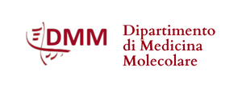

::: {style="text-align: center; margin-bottom: 1.5rem;"}
{width="500"}

{width="180"}
:::

## Welcome

Welcome to the slide repository and resources page for Prof. Lewis (University of Padua).

Instructions for accessing UptoDate are found [here](uptodate.pdf). Treviso students: recorded lectures can be found [here](treviso.qmd).

------------------------------------------------------------------------

## Lecture Topics

| Topic | Description |
|----|----|
| [Principles of Antibiotic Therapy](antibiotic-principles.qmd) | Mechanisms of action, PK/PD, susceptibility testing, and therapeutic drug monitoring |
| [Antibiotic Allergies](allergies.qmd) | Diagnosis and management of penicillin and antibiotic allergy, de-labeling strategies |
| [Fever of Unknown Origin](fuo.qmd) | Definitions, diagnostic workup, and common infectious and non-infectious causes |
| [Intraabdominal Infections](intraabdominal.qmd) | Peritonitis, appendicitis, and hepatobiliary infections |
| [Immunosuppression & Infection Risk](immunosuppression.qmd) | Immunosuppression principles and infection risk in the compromised host |
| [Febrile Neutropenia](febrile-neutropenia.qmd) | Risk assessment, empiric therapy, and prophylaxis in neutropenic patients |
| [Infectious Diarrhea](diarrhea.qmd) | Etiology, syndromic testing, and management of acute infectious diarrhea |
| [Malaria & Leishmaniasis](malaria.qmd) | Epidemiology, diagnosis, and treatment of malaria and leishmaniasis |
| [Invasive Fungal Infections](IFI.qmd) | Candidiasis, aspergillosis, cryptococcosis, and antifungal therapy |

------------------------------------------------------------------------

::: {style="text-align: center; margin-bottom: 1.5rem;"}
{width="500"}

{width="180"}
:::

## Welcome

Welcome to the slide repository and resources page for Prof. Lewis (University of Padua).

Instructions for accessing UptoDate are found [here](uptodate.pdf). Treviso students: recorded lectures can be found [here](treviso.qmd).

------------------------------------------------------------------------

## Lecture Topics

:::::::::::::::::::::::::::::: grid
::::: {.g-col-12 .g-col-md-4}
:::: {.card .h-100}
::: card-body
### 💊 Principles of Antibiotic Therapy

Mechanisms of action, PK/PD, susceptibility testing, and therapeutic drug monitoring.

[Go to topic →](antibiotic-principles.qmd){.btn .btn-outline-primary .btn-sm}
:::
::::
:::::

::::: {.g-col-12 .g-col-md-4}
:::: {.card .h-100}
::: card-body
### ⚠️ Antibiotic Allergies

Diagnosis and management of penicillin and antibiotic allergy, including de-labeling strategies.

[Go to topic →](allergies.qmd){.btn .btn-outline-primary .btn-sm}
:::
::::
:::::

::::: {.g-col-12 .g-col-md-4}
:::: {.card .h-100}
::: card-body
### 🌡️ Fever of Unknown Origin

Definitions, diagnostic workup, and common infectious and non-infectious causes of FUO.

[Go to topic →](fuo.qmd){.btn .btn-outline-primary .btn-sm}
:::
::::
:::::

::::: {.g-col-12 .g-col-md-4}
:::: {.card .h-100}
::: card-body
### 🫀 Intraabdominal Infections

Peritonitis, appendicitis, and hepatobiliary infections — diagnosis and antimicrobial management.

[Go to topic →](intraabdominal.qmd){.btn .btn-outline-primary .btn-sm}
:::
::::
:::::

::::: {.g-col-12 .g-col-md-4}
:::: {.card .h-100}
::: card-body
### 🛡️ Immunosuppression & Infection Risk

Principles of immunosuppression and infection risk stratification in the compromised host.

[Go to topic →](immunosuppression.qmd){.btn .btn-outline-primary .btn-sm}
:::
::::
:::::

::::: {.g-col-12 .g-col-md-4}
:::: {.card .h-100}
::: card-body
### 🩸 Febrile Neutropenia

Risk assessment, empiric therapy, and prophylaxis in neutropenic patients.

[Go to topic →](febrile-neutropenia.qmd){.btn .btn-outline-primary .btn-sm}
:::
::::
:::::

::::: {.g-col-12 .g-col-md-4}
:::: {.card .h-100}
::: card-body
### 🦠 Infectious Diarrhea

Etiology, syndromic testing, and management of acute infectious diarrhea in adults.

[Go to topic →](diarrhea.qmd){.btn .btn-outline-primary .btn-sm}
:::
::::
:::::

::::: {.g-col-12 .g-col-md-4}
:::: {.card .h-100}
::: card-body
### 🦟 Malaria & Leishmaniasis

Epidemiology, diagnosis, and treatment of malaria and leishmaniasis.

[Go to topic →](malaria.qmd){.btn .btn-outline-primary .btn-sm}
:::
::::
:::::

::::: {.g-col-12 .g-col-md-4}
:::: {.card .h-100}
::: card-body
### 🍄 Invasive Fungal Infections

Candidiasis, aspergillosis, cryptococcosis, and antifungal therapy.

[Go to topic →](IFI.qmd){.btn .btn-outline-primary .btn-sm}
:::
::::
:::::
::::::::::::::::::::::::::::::
