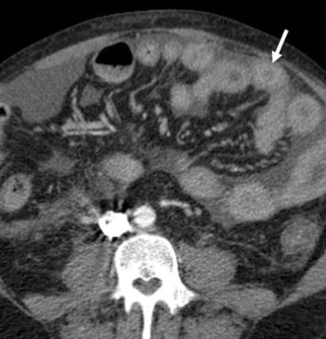

## Intraabdominal Infections {background-color="#9B0014"}

   

Prof. Russell E. Lewis   Department of Molecular Medicine  
University of Padua

   russelledward.lewis\@unipd.it
   https://github.com/Russlewisbo

  slides available at: www.padovaid.com

|  |  |
|------------------------------------|------------------------------------|
| {width="100"} | {width="100"} |

## Learning objectives

 

1.  Classify intraabdominal infections (primary vs. secondary vs.
    tertiary)
2.  Understand epidemiology and risk factors for each infection type
3.  Master the microbiology and pathogenesis of IAI
4.  Apply diagnostic criteria for peritonitis variants
5.  Select appropriate antimicrobial therapy based on clinical context
6.  Recognize when source control is essential
7.  Manage CAPD-associated peritonitis
8.  Diagnose and treat intraperitoneal abscesses
9.  Risk-stratify patients for prognosis and outcomes
10. Implement prevention strategies for secondary prophylaxis

::: notes
These objectives guide the presentation and help learners understand the
key competencies needed to manage intraabdominal infections in clinical
practice.
:::

------------------------------------------------------------------------

## Definition and classification

**Peritonitis:** Inflammatory response within the peritoneal cavity due
to microbial or chemical contamination

 

{fig-align="center" width="330"}

::::: columns
::: {.column width="50%"}

**By Location**

-   Diffuse
-   Localized

:::

::: {.column width="50%"}

**By Type**

-   Primary (spontaneous)
-   Secondary
-   Tertiary

:::
:::::

::: notes
The definition emphasizes that peritonitis is fundamentally an
inflammatory response. The trichotomy (primary/secondary/tertiary) helps
determine etiology and guide management. Location classification is also
important for diagnostic imaging and source control planning.
:::

------------------------------------------------------------------------

## Primary vs. secondary vs. tertiary

   

| Feature | Primary | Secondary | Tertiary |
|------------------|------------------|------------------|------------------|
| **Intraabdominal source** | None | Present  (perforation, ischemia) | Persistent after   source control |
| **Frequency** | \~1% of peritonitis cases | 80–90% of cases | Less common |
| **Typical organisms** | Monomicrobial gram-negative | Polymicrobial aerobic/anaerobic | MDR, gram-negative, low virulence |
| **Mortality** | 5–20% | 10–40% | 30–64% |

::: notes
This table encapsulates the clinical distinctions. Primary peritonitis
lacks an obvious abdominal source, while secondary results from visceral
perforation or other intraabdominal pathology. Tertiary peritonitis
develops after initial treatment, often with unusual organisms.
Understanding these categories is critical for directing imaging,
cultures, and surgical decision-making.
:::

------------------------------------------------------------------------

## Community-acquired vs. Healthcare-associated

 

**Community-acquired** (\~80% of IAI)

-   Further subdivided: low-risk vs. high-risk
-   Risk factors: drug-resistant bacteria, severity
    (mild/moderate/severe), comorbidities
-   Common pathogens: *E. coli, Klebsiella*, anaerobes

**Healthcare-associated**

-   Complications of elective or emergency abdominal surgery
-   Nosocomial isolates (MRSA, MDR gram-negatives, *Candida*)
-   Higher mortality and morbidity

::: notes
This distinction affects empiric antibiotic selection.
Community-acquired infections in low-risk patients may use narrower
agents, while healthcare-associated infections mandate broad coverage.
The presence of recent surgery, prolonged hospitalization, or
immunosuppression shifts antimicrobial choices toward agents covering
resistant organisms.
:::

------------------------------------------------------------------------

## Uncomplicated vs. complicated infections

   

**Uncomplicated IAI**

-   Intramural inflammation of GI tract
-   Localized to single organ (e.g., appendicitis, cholecystitis)
-   No extension into peritoneal space

**Complicated IAI (cIAI)**

-   Extension beyond organ of origin
-   Peritonitis (diffuse or localized)
-   Abscess formation
-   Spillage into sterile peritoneal space

::: notes
Uncomplicated infections typically respond well to antibiotics alone,
though some require percutaneous drainage. Complicated infections
mandate more aggressive source control—surgery or percutaneous drainage
is often necessary. The progression from uncomplicated to complicated is
a major reason for early recognition and intervention in suspected
appendicitis, diverticulitis, and cholecystitis.
:::

# Primary peritonitis (SBP) {background-color="#9B0014"}

## Primary peritonitis: Epidemiology

   

::::: columns
::: {.column width="25%"}

:::

::: {.column width="75%"}
-   **Prevalence** — Accounts for \~1% of all peritonitis cases

    -   Present in 10–30% of hospitalized cirrhotic patients with
        ascites

-   **High-Risk Patient Groups**

    -   Cirrhosis (alcoholic, postnecrotic, cryptogenic)

    -   Congestive heart failure

    -   Nephrotic syndrome

    -   Metastatic malignancy

    -   Systemic lupus erythematosus

    -   Rare in patients with no underlying disease
:::
:::::

::: aside
The key insight is that any condition producing ascites increases SBP
risk. Cirrhosis is the most common underlying disease. In children,
acute viral hepatitis and streptococcal infections are relatively more
frequent. The presence of high-volume ascites (Child-Turcotte-Pugh class
C or high MELD) is a major risk factor.
:::

------------------------------------------------------------------------

## Risk factors for SBP development

::::: columns
::: {.column width="36%"}
{fig-align="center" width="465"}
:::

::: {.column width="63%"}
     

-   High-volume ascites (advanced cirrhosis, Child-Pugh class C)

-   High Model for End-Stage Liver Disease (MELD) score

-   Coexisting gastrointestinal hemorrhage

-   Previous SBP episode

-   Low ascitic fluid protein (\<1 g/dL)

-   Elevated serum bilirubin (\>2.5 mg/dL)

-   Proton pump inhibitor use (reduces gastric acidity, increases
    translocation)
:::
:::::

   

::: aside
These risk factors reflect compromised host defenses and increased
bacterial translocation. GI bleeding particularly increases the risk
because of direct inoculation of bacteria into the peritoneal cavity and
subsequent bacteremia. Low protein content in ascites correlates with
reduced opsonic activity and impaired complement-mediated bacterial
killing.
:::

------------------------------------------------------------------------

## Primary peritonitis: Microbiology

 

**Defining Characteristic:** Monomicrobial infection

**Most Common Organisms (in cirrhotic patients)**

1.  *Escherichia coli* (most frequent)
2.  *Klebsiella pneumoniae*
3.  Other Enterobacterales
4.  *Streptococcus pneumoniae* (especially pediatrics)
5.  Other streptococci (including enterococci)
6.  Anaerobes (uncommon)
7.  *Pseudomonas aeruginosa* (rare)

**Gram-Negative Dominance** — 60–69% of cases caused by gram-negative
enteric bacteria;   organisms presumed of gastrointestinal origin

 

::: aside
The predominance of gram-negatives reflects bacterial translocation from
the GI tract. *S. aureus* is unusual (2–4% of cases) and may indicate
umbilical hernia erosion. Anaerobes are reported infrequently, possibly
due to the bacteriostatic activity of ascites against *Bacteroides spp.*
and the relatively high oxygen tension in peritoneal fluid. In pediatric
cases, hematogenous spread of *S. pneumoniae* is more common.
:::

------------------------------------------------------------------------

## Pathogenesis of primary peritonitis

   

**Bacterial Translocation**

-   Passage of viable bacteria from the GI tract lumen to mesenteric
    lymph nodes and bloodstream
-   Increased risk with portal hypertension and collateral vessel
    formation
-   Enhanced by decreased gastric acidity (PPI use) and altered bowel
    flora

**Hematogenous Seeding**

-   Bacteria reach peritoneal cavity via circulating blood
-   Explains predominantly **monomicrobial pattern**
-   Bacteremia present in 75% of cases with aerobic organisms

**Host Factors**

-   Reduced opsonic activity (low complement, reduced immunoglobulins)
-   Impaired polymorphonuclear cell function
-   Loss of anatomic barriers in advanced cirrhosis

::: notes
Understanding pathogenesis helps explain why the infection is
monomicrobial (unlike secondary peritonitis from mixed flora) and why it
occurs predominantly in cirrhotic patients. It's not a gross breach of
the bowel wall (like a perforation), where the entire mixed luminal
flora would spill out simultaneously. Instead, it's a selective process
— typically a single organism that's hardy enough to translocate
successfully through the intestinal epithelium and survive in the
lymphatics/bloodstream. Hematogenous seeding reinforces this. The
bloodstream usually carries only one dominant organism during a
bacteremic episode. So when that bacterium reaches the ascitic fluid, it
seeds it as a single species. The blood essentially acts as a filter —
polymicrobial bacteremia is relatively uncommon.
:::

## Clinical presentation

 

-   Fever (\> 37.8° C)

-   Nausea and vomiting

-   Diarrhea

-   Abdominal pain

    -   Tenderness

    -   Rebound tenderness

    -   Bowel sounds hypoactive or absent

-   Cirrhosis - large volume ascites

## Paracentesis

 



## Diagnosis of SBP: Ascitic fluid examination {.smaller}

**Essential Tests**

::::: columns
::: {.column width="50%"}
-   WBC count with differential
-   Protein concentration
-   Gram stain
-   Culture (inoculate blood culture bottles)
-   Glucose
-   Amylase
-   Lactate dehydrogenase (LDH)
-   SAA (serum-ascitic albumin gradient)
:::

::: {.column width="50%"}
{width="320"}
:::
:::::

**Diagnostic Threshold**

| Parameter                | Significance                    |
|--------------------------|---------------------------------|
| PMN \>250/mm³            | Presumptive SBP                 |
| Ascitic culture positive | Confirms SBP                    |
| SAA \>1.1 g/dL           | Suggests non-peritoneal ascites |

::: aside
 **SAA = Serum albumin − Ascitic fluid albumin**

A gradient **≥ 1.1 g/dL** indicates portal hypertension (e.g.,
cirrhosis, heart failure, Budd-Chiari) with roughly 97% accuracy. A
gradient **\< 1.1 g/dL** suggests a non–portal hypertensive cause (e.g.,
peritoneal carcinomatosis, tuberculosis, nephrotic syndrome,
pancreatitis).
:::

## SBP variants:   Monomicrobial nonneutrocytic bacterascites {.smaller}

**Definition**

-   **Positive ascitic fluid culture**
-   **PMN \<250 cells/mm³**
-   No clinical peritonitis signs

**Natural History**

-   Resolves spontaneously in 62–86% of cases
-   Progresses to SBP in remainder (sometimes within hours)
-   Mortality same as classic SBP regardless of neutrophil response

**Clinical Significance**

-   May represent early colonization before host response
-   Symptomatic patients at higher risk for progression
-   Asymptomatic patients often remain colonized only
-   Treat if symptomatic or if organisms are gram-positive cocci

::: notes
This variant demonstrates the spectrum of SBP. Patients with
monomicrobial nonneutrocytic bacterascites warrant close observation and
may need empiric therapy if symptomatic. The causative organisms
resemble those in classic SBP, suggesting similar translocation
mechanisms.
:::

------------------------------------------------------------------------

## SBP variants:   Culture-negative neutrocytic ascites {.smaller}

**Definition**

-   **PMN \>250 cells/mm³**
-   **Negative ascitic fluid culture**
-   No evident intraabdominal surgical source
-   Absence of pancreatitis

**Epidemiology**

-   Occurs in 35% of patients with clinical SBP
-   Blood culture positive in one-third of cases

**Reasons for Culture Negativity**

-   Antibiotic administration before sampling, Inadequate culture
    technique
-   Fastidious organisms

**Improved Detection**

-   Inoculate 10–20 mL ascitic fluid into blood culture bottles at
    bedside
-   Increases culture yield significantly

::: notes
Culture-negative neutrocytic ascites must be distinguished from other
causes of elevated ascitic PMN (tuberculous peritonitis, malignancy,
hemorrhage from traumatic tap, pancreatitis). The diagnostic criteria
specify PMN \>250 with negative culture and no surgically treatable
source. Treatment principles are similar to culture-positive SBP.
:::

------------------------------------------------------------------------

## SBP variants:  Polymicrobial bacterascites {.smaller}

**Definition**

-   Multiple bacterial species on culture or Gram stain
-   PMN \<250 cells/mm³
-   No elevation of ascitic protein

**Etiology**

-   *Traumatic paracentesis (needle enters bowel)*
-   Incidence: \<1% of procedures
-   Risk factors: ileus, abdominal scars, adhesions

**Natural History**

-   Usually resolves spontaneously
-   Peritoneal fluid protein \>1 g/dL and adequate opsonic activity
    predict spontaneous resolution
-   Treat only if symptomatic or if evolves to classic peritonitis

**Clinical Pearl**

> Do not treat polymicrobial bacterascites empirically unless clinical
> deterioration occurs.

::: notes
This variant is important to recognize to avoid unnecessary antibiotic
exposure. The polymicrobial pattern is the key distinguishing feature—it
reflects a contamination event rather than true infection. The high PMN
count is absent, which supports the contaminant hypothesis. Multiple
samples should prompt repeat paracentesis to assess progression.
:::

------------------------------------------------------------------------

## Primary peritonitis diagnosis:  Recommended paracentesis protocol {.smaller}

 

**Universal Recommendation for Cirrhotic Patients**

-   Diagnostic paracentesis on **hospital admission** for all cirrhotic
    patients with ascites
-   Perform regardless of admission reason
-   Even asymptomatic patients may have SBP

**Timing and Frequency**

-   At baseline assessment
-   When admitted with complications (variceal bleed, etc.)
-   When clinical deterioration occurs
-   Repeat if initial cultures negative but high clinical suspicion

**Specimen Handling**

-   Inoculate blood culture bottles at bedside (10–20 mL)
-   Obtain cell count, differential, protein, glucose, amylase
-   Gram stain for rapid assessment

::: notes
The guideline emphasis on universal paracentesis reflects the high
prevalence of SBP in this population and the potential for asymptomatic
presentation. Early detection improves outcomes. Bedside inoculation
into blood culture media increases organism recovery and reduces
culture-negative cases.
:::

------------------------------------------------------------------------

## Treatment of SBP: Empiric therapy

   

**First-Line Agent**

-   **Cefotaxime** 2 g IV every 6–8 hours (or 3 g every 6 hours for
    high-risk patients) or other 3rd generation cephalosporin
-   Covers gram-negative enteric bacteria and streptococci
-   Can transition to oral after initial response
-   If recent history of MDR colonization or infection, may require
    broader-spectrum therapy

**Alternative Regimens**

| Condition        | Agent                                          |
|------------------|------------------------------------------------|
| Non-severe       | Cefixime 400 mg PO BID                         |
| Renal impairment | Adjust cephalosporin dosing                    |
| β-lactam allergy | Fluoroquinolone (ciprofloxacin or norfloxacin) |

::: notes
Cefotaxime has excellent coverage for organisms causing SBP and achieves
good peritoneal penetration. The choice between inpatient IV and oral
outpatient therapy depends on severity and ability to tolerate PO
intake. Fluoroquinolones are not ideal for empiric therapy but are
acceptable in penicillin-allergic patients.
:::

------------------------------------------------------------------------

## Albumin supplementation {.smaller}

::::: columns
::: {.column width="20%"}

:::

::: {.column width="75%"}
**Indication**

-   All patients with SBP
-   Particularly important in hemodynamically unstable patients

**Albumin Dosing**

-   **1.5 g/kg at diagnosis** (maximum 100 g)
-   **1 g/kg on day 3**

**Mechanism**

-   Expands plasma volume
-   Improves renal perfusion
-   Reduces variceal bleeding risk
-   Decreases renal dysfunction (hepatorenal syndrome)

**Outcome Benefit**

-   Reduces in-hospital mortality
-   Decreases kidney injury
-   Standard of care in SBP management
:::
:::::

::: notes
Albumin infusion represents a major advance in SBP management. Its
benefit extends beyond simple volume expansion—it improves end-organ
perfusion and preserves renal function, both critical in cirrhotic
patients at risk for hepatorenal syndrome.
:::

------------------------------------------------------------------------

## Treatment of SBP: Duration and outcomes

 

**Duration of Therapy**

-   **5 days of IV cefotaxime** is sufficient for uncomplicated SBP
    (ineffective for ESBL producing isolates)
-   May transition to oral fluoroquinolone or cephalosporin
-   Repeat paracentesis not needed if clinical improvement occurs

**Response Assessment**

-   Clinical improvement (fever resolution, abdominal tenderness
    improves)
-   Laboratory response (declining WBC, improving renal function)

**Prognosis After SBP**

-   **In-hospital mortality:** 5–20%
-   **Long-term survival:** Poor—survivors warrant liver transplant
    assessment
-   Liver disease severity (MELD, bilirubin) predicts outcomes

::: notes
The relatively short treatment duration (5 days) differs from secondary
peritonitis, which requires longer courses depending on source control
adequacy. Clinical deterioration despite appropriate therapy suggests
either diagnostic error (secondary peritonitis, other diagnosis) or
severe underlying liver disease.
:::

------------------------------------------------------------------------

## Prevention of SBP: Primary prophylaxis

**Indicated When**

-   **Low ascitic protein** (\<1.5 g/dL) +
    -   Impaired renal function (creatinine \>1.2 mg/dL) OR
    -   Impaired liver function (bilirubin \>2.5 mg/dL) OR
    -   Low platelet count (\<40,000/μL)

**Agents for Primary Prophylaxis**

| Agent         | Dosing            | Notes       |
|---------------|-------------------|-------------|
| Norfloxacin   | 400 mg daily PO   | First-line  |
| Ciprofloxacin | 750 mg weekly PO  | Alternative |
| TMP-SMX       | 1 DS tablet daily | Alternative |

**Efficacy**

-   Reduces SBP incidence by 50–60%
-   Improves short-term survival
-   Cost-effective in high-risk patients
-   Recent meta-analysis have questioned efficacy

::: notes
Primary prophylaxis focuses on patients with the highest risk—those with
low protein ascites and additional markers of severe liver disease.
Fluoroquinolones are preferred due to gram-negative coverage and
selective gut decontamination. The goal is to prevent the initial SBP
episode in susceptible patients.
:::

------------------------------------------------------------------------

## Prevention of SBP: Secondary prophylaxis

**Indicated**

-   All patients after first SBP episode
-   Reduces recurrence by 80%

**Agents**

-   Norfloxacin 400 mg daily (first-line)
-   Ciprofloxacin 750 mg weekly
-   TMP-SMX 1 DS tablet daily

**Duration**

-   Lifelong or until liver transplantation
-   Continue indefinitely to prevent recurrence

**Additional Measures**

-   Referral for liver transplant evaluation (poor prognosis after SBP)
-   Alcohol cessation counseling
-   Variceal screening and beta-blocker therapy

::: notes
Secondary prophylaxis is a crucial management principle. Approximately
70% of patients experience recurrent SBP within one year without
prophylaxis. Lifelong prophylaxis is standard. Patients with SBP have
advanced liver disease and should be evaluated for transplant candidacy.
:::

# Secondary peritonitis {background-color="#9B0014"}

## Secondary peritonitis: Epidemiology

 

**Prevalence**

-   Most common intraabdominal infection (80–90% of cases)
-   Results from visceral perforation or intraabdominal pathology

**Common Causes**

::::: columns
::: {.column width="50%"}
**Surgical Emergencies**

-   Perforated peptic ulcer
-   Ruptured appendicitis
-   Perforated diverticulitis
-   Acute cholecystitis/perforation
:::

::: {.column width="50%"}
**Other Sources**

-   Ischemic bowel necrosis
-   Traumatic GI perforation
-   Gynecologic pathology (ruptured ovarian cyst, tubo-ovarian abscess)
-   Biliary or pancreatic disease
:::
:::::

::: notes
Secondary peritonitis is the clinical reality of most IAI cases. The
source determines both the microbiology (which GI segment? which
organisms?) and the urgency of source control. Unlike primary
peritonitis, secondary peritonitis typically requires surgical
intervention or percutaneous drainage alongside antimicrobial therapy.
:::

------------------------------------------------------------------------

## Etiologies of secondary peritonitis (representative)

 

| Organ System | Common Causes |
|------------------------------------|------------------------------------|
| **Upper GI** | Perforated peptic ulcer, perforated gastric ulcer |
| **Small bowel** | Meckel's diverticulitis, small bowel perforation, ischemic necrosis |
| **Appendix** | Perforated appendicitis |
| **Colon** | Diverticulitis (perforation), toxic megacolon,   ischemic colitis |
| **Biliary** | Perforation of gallbladder, cholangitis |
| **Gynecologic** | Ruptured tubo-ovarian abscess,   perforated ovarian cyst |
| **Trauma** | Iatrogenic or penetrating perforation |

::: aside
This table emphasizes that secondary peritonitis can originate from
nearly any abdominal organ. The location of the primary disease
influences which organisms are present and the strategy for source
control. For example, perforated peptic ulcer involves mostly upper GI
flora (gram-positives and anaerobes), while colonic perforation involves
more gram-negative rods and obligate anaerobes.
:::

------------------------------------------------------------------------

## GI tract microbiota and bacterial density

 

**Bacterial Population Gradient**

-   **Stomach**: 10³–10⁴ CFU/mL (most anaerobes suppressed by acid)
-   **Small intestine**: 10⁴–10⁷ CFU/mL (increasing distally)
-   **Terminal ileum**: 10⁷–10⁹ CFU/mL (mixed aerobic/anaerobic)
-   **Colon**: 10¹¹–10¹² CFU/mL (predominantly anaerobes \> aerobes by
    1000:1)

**Clinical Implication**

-   **Upper GI perforation**: Fewer organisms, less anaerobic load
-   **Lower GI perforation**: Heavy polymicrobial inoculum with
    anaerobic dominance

::: aside
This density gradient is critical for understanding secondary
peritonitis microbiology. A perforated duodenal ulcer introduces mostly
aerobic organisms and some anaerobes, while colonic perforation
introduces massive inocula of obligate anaerobes, facultative
gram-negatives, and enterococci. **This explains why colonic perforation
carries higher mortality and requires broader empiric coverage.**
:::

## Causes of secondary peritonitis {.smaller}

| Organ | Cause of Peritonitis |
|----|----|
| **Distal esophagus** | Boerhaave syndrome |
|  | Malignancy |
|  | Trauma |
|  | Iatrogenic |
| **Stomach** | Peptic ulcer perforation |
|  | Malignancy |
|  | Trauma |
|  | Iatrogenic |
| **Duodenum** | Peptic ulcer perforation |
|  | Trauma |
|  | Iatrogenic^a^ |
| **Biliary tract** | Cholecystitis |
|  | Stone perforation from gallbladder or common duct |
|  | Malignancy |
|  | Trauma |
|  | Iatrogenic |
| **Pancreas** | Pancreatitis (e.g., alcohol, drugs, gallstones) |
|  | Trauma |
|  | Iatrogenic |
| **Small bowel** | Ischemic bowel |
|  | Incarcerated hernia |
|  | Crohn disease |
|  | Malignancy |
|  | Meckel diverticulum |
|  | Trauma |
| **Large bowel and appendix** | Ischemic bowel |
|  | Diverticulitis |
|  | Malignancy |
|  | Ulcerative colitis and Crohn disease |
|  | Appendicitis |
|  | Volvulus |
|  | Trauma (mostly penetrating) |
|  | Iatrogenic |

## Secondary peritonitis: Microbiology

 

**Key Features**

-   **Polymicrobial** (2–5 organisms typical, up to 10+)
-   Reflects normal GI flora
-   Aerobic-anaerobic polymicrobial common (not all may grown in
    culture)

**Dominant Organisms**

| Category | Examples | Prevalence |
|------------------------|------------------------|------------------------|
| **Gram-negative rods** | *E. coli, Klebsiella, Proteus, Enterobacter* | 60–80% |
| **Anaerobes** | *Bacteroides fragilis*, anaerobic cocci, *Clostridium* | 60–90% |
| **Gram-positive cocci** | *Streptococcus, Enterococcus, Staphylococcus* | 40–60% |

::: aside
The polymicrobial nature of secondary peritonitis contrasts sharply with
primary peritonitis. Multiple organisms allow synergistic pathogenesis:
gram-negatives cause early sepsis and toxemia, while anaerobes
(especially *B. fragilis*) promote abscess formation. Enterococci are
present in 30–60% of cases; their treatment significance remains debated
but is important in high-risk patients (recent cephalosporin exposure,
immunosuppression).
:::

------------------------------------------------------------------------

## Aerobic-anaerobic coverage in  secondary peritonitis {.smaller}

**Early Infection (First Hours)**

-   Gram-negative rod dominance (*E. coli, Klebsiella*)
-   Rapid multiplication and toxin production
-   Systemic toxemia and early sepsis
-   Clinical: fever, tachycardia, hypotension

**Late Infection (Days)**

-   Anaerobic bacteria proliferate (*Bacteroides fragilis* group)
-   Reduced oxygen tension favors anaerobic growth
-   Enhanced abscess formation (fibrin encapsulation)
-   Clinical: loculation, persistent fever despite initial therapy

## Aerobic-anaerobic coverage in  secondary peritonitis, cont. {.smaller}

**Clinical Consequences**

-   Single-agent therapy (e.g., cephalosporin alone) inadequate
-   Requires dual coverage: aerobic + anaerobic agents
-   Source control essential to disrupt both populations

::: aside
**This synergy concept explains why inadequate anaerobic coverage leads
to treatment failure, recurrent fever, and abscess formation even when
gram-negative coverage is appropriate.** It reinforces the need for
combination therapy in secondary peritonitis—β-lactam/β-lactamase
inhibitor combinations, carbapenems, or cephalosporin + metronidazole
combinations.
:::

------------------------------------------------------------------------

## Pathogenesis and virulence factors in  secondary peritonitis {.smaller}

**Initial Contamination**

-   Spillage of GI flora into sterile peritoneal space
-   Magnitude of inoculum determines early severity
-   Bacterial adherence and LPS/endotoxin trigger inflammation

**Host Response Activation**

-   Complement activation (local and systemic)
-   Cytokine release (TNF-α, IL-1, IL-6, IL-8)
-   Polymorphonuclear recruitment to peritoneum
-   Increased vascular permeability

**Bacterial Virulence Factors**

-   Lipopolysaccharide (gram-negative endotoxin)
-   Capsule and fimbriae (adherence, invasion)
-   Toxins and enzymes (tissue invasion, abscess formation)
-   Antibiotic resistance (β-lactamase, efflux pumps)

::: notes
Understanding virulence helps explain clinical features: endotoxin
causes systemic toxemia and shock, capsules protect bacteria from host
immune system, and antibiotic resistance delays treatment response. The
bacterial factors plus host response together determine whether
infection becomes localized (abscess) or remains diffuse (generalized
peritonitis).
:::

------------------------------------------------------------------------

## Pathophysiology: Local response to   secondary peritonitis {.smaller}

::::: columns
::: {.column width="60%"}
**Fibrin Deposition**

-   Fibrinogen converts to fibrin clot at peritoneal surface, forms
    barrier limiting bacterial spread
-   Encapsulates contaminated area

**Omental "Walling Off"**

-   Greater omentum migrates to infection site, forms physical barrier
    around infection focus
-   Limits spread to distant peritoneal recesses

**Peritoneal Fluid Exudation**

-   Increased permeability → fluid accumulation containing antibodies,
    complement, white cells
-   Dilutes bacteria but may impair local immunity

**Compartmentalization**

-   Peritoneal reflections and mesenteric attachments route infection
-   Creates dependent recesses (pelvis, paracolic gutters, Morrison's
    pouch)
-   Explains localization patterns and abscess locations
:::

::: {.column width="40%"}
         

:::
:::::

::: notes
These local responses are protective mechanisms attempting to contain
infection. However, they also create sanctuary sites for bacteria
(abscesses) where antibiotics and immune cells may have reduced access.
This underscores why source control—drainage of collections, removal of
devitalized tissue—is essential in secondary peritonitis.
:::

------------------------------------------------------------------------

## Pathophysiology: Systemic response to   secondary peritonitis {.smaller}

   

::::: columns
::: {.column width="50%"}
**SIRS (Systemic Inflammatory Response Syndrome)**

-   Fever, tachycardia, tachypnea, leukocytosis
-   Results from TNF-α, IL-1, IL-6 release
-   May progress to sepsis and multiorgan failure

**Hemodynamic Changes**

-   Initial phase: vasoconstriction (compensatory)
-   Late phase: vasodilation and increased capillary permeability
-   Hypovolemia and hypotension (septic shock)
:::

::: {.column width="50%"}
**Organ Dysfunction**

-   Renal hypoperfusion → acute kidney injury
-   Pulmonary capillary leak → ARDS
-   Hepatic dysfunction → coagulopathy
-   GI hypomotility → ileus

**Mortality Correlation**

-   Extent of organ dysfunction predicts outcome
-   Reflected in APACHE II [@Ref176] score, Mannheim Peritonitis Index
    [@Ref178]
-   Delayed recognition/treatment increases mortality
:::
:::::

::: notes
The systemic response can be as life-threatening as local infection.
Rapid, aggressive fluid resuscitation, vasopressor support, and early
source control are critical. Even with antibiotics, patients with
profound systemic response may deteriorate if source control is delayed
or inadequate.
:::

------------------------------------------------------------------------

## Clinical manifestations of secondary peritonitis {.smaller}

**Symptoms**

-   **Acute abdominal pain** (sudden onset if perforation)
-   Pain localized initially, generalizes with diffuse peritonitis
-   Nausea and vomiting (may be present or absent)
-   May have antecedent symptoms (dyspepsia before ulcer rupture,
    diarrhea before diverticulitis)

**Physical Findings**

-   Rebound tenderness and guarding (peritoneal irritation)
-   Absent or diminished bowel sounds (ileus)
-   Abdominal distention (third-spacing of fluid)
-   Hypotension and tachycardia (sepsis)
-   Fever (usually present but may be absent in elderly or
    immunocompromised)

**Severity Indicators**

-   Hemodynamic instability
-   Acute kidney injury
-   Leukocytosis \>15,000 or left shift
-   Metabolic acidosis

::: notes
Clinical presentation varies with speed of onset and extent of
contamination. Perforated peptic ulcer typically presents with acute,
severe pain; perforated diverticulitis may have more insidious onset.
Elderly and immunocompromised patients may present atypically without
fever. Absence of fever should never exclude peritonitis.
:::

------------------------------------------------------------------------

## Diagnostic workup: Laboratory studies {.smaller}

 

**Complete Blood Count**

-   WBC elevation (typically 12,000–20,000)
-   Left shift (immature bands) indicates severity
-   Absence of leukocytosis does not exclude peritonitis

**Inflammatory Markers**

| Test | Utility |
|------------------------------------|------------------------------------|
| **C-reactive protein (CRP)** | Elevated; reflects severity |
| **Procalcitonin** | \>2 ng/mL suggests bacterial peritonitis; guides de-escalation |
| **Lactate** | Elevated in sepsis; correlates with severity |

## Diagnostic workup: Laboratory studies, cont.

 

**Chemistry**

-   Renal function (creatinine, BUN)
-   Electrolytes (hypokalemia common from GI losses)
-   Liver function tests
-   Glucose (hyperglycemia or hypoglycemia possible)

**Blood Cultures**

-   Obtain before antibiotics if possible
-   Positive in 20–40% of secondary peritonitis
-   Guide specific organism coverage

::: aside
Laboratory findings support but do not prove peritonitis. WBC and CRP
can be falsely normal in elderly or immunocompromised. Procalcitonin \>2
ng/mL supports bacterial infection and helps differentiate from
non-infectious peritonitis (e.g., spontaneous rupture of abdominal
aortic aneurysm). Lactate elevation indicates tissue hypoperfusion and
severe disease.
:::

------------------------------------------------------------------------

## Diagnostic imaging: CT abdomen/pelvis

 

{fig-align="center"}

::: aside
Intraperitoneal abscess (arrow) following a posthemicolectomy
anastomosis leak for diverticulitis, with a percutaneous drainage
catheter (CT scan of abdomen and pelvis, coronal view). (B) Evidence
extravasation of contrast (arrows) in the surgical site of Hartmann
pouch procedure (Gastrografin enema). *Courtesy Thomas Marino, MD,
Wellington Regional Medical Center, FL*
:::

## Diagnostic imaging: CT performance {.smaller}

 

**Sensitivity and Specificity**

-   **CT with IV contrast: 97% sensitivity for complicated IAI**
-   Best imaging modality for secondary peritonitis and abscesses

**Key CT Findings**

-   Free air (pneumoperitoneum) → indicates perforation
-   Free fluid with inflammatory changes
-   Focal abscess collections
-   Source organ pathology (dilated colon, appendiceal thickening, etc.)
-   Evidence of ischemia (pneumatosis, portal venous gas)

**Contraindications**

-   Hemodynamic instability (may necessitate OR before imaging)

-   Renal insufficiency (contrast nephropathy risk)

-   Iodine allergy

## **Alternative imaging**

 

{fig-align="center"}

-   **Ultrasound**: Portable, real-time, good for fluid assessment;
    lower sensitivity than CT
-   **MRI**: Excellent soft tissue detail; limited by cost and time;
    useful in renal insufficiency

::: aside
CT is the gold standard for imaging secondary peritonitis and guides
source control decisions. However, clinical deterioration with shock may
necessitate immediate surgical exploration without imaging. **The
presence of pneumoperitoneum is virtually diagnostic of perforation and
indicates need for surgical intervention.**
:::

## Secondary peritonitis

{fig-align="center"}

::: aside
The three panel CT scan of abdomen and pelvis with coronal views. Panel
A shows a large complex fluid collection, marked with an arrow,
containing air in the pelvis following a hysterectomy. Panel B shows a
computed tomography scan of the abdomen and pelvis in a coronal view
with an arrow pointing to a right lower quadrant air and fluid
collection caused by leakage from a primary anastomosis after colon
cancer surgery. Panel C presents a computed tomography scan of the
abdomen and pelvis in a coronal view, indicating a fluid and air
collection, marked with an arrow, involving the gallbladder fossa
following a laparoscopic cholecystectomy. The arrows highlight the
respective areas of concern in each panel.
:::

## Paracentesis and peritoneal cultures {.smaller}

::::: columns
::: {.column width="50%"}
**Indications**

-   Confirm diagnosis when imaging equivocal
-   Obtain organisms for culture and susceptibility
-   Obtain cell count and fluid analysis
:::

::: {.column width="50%"}
**Technique**

-   Sterile procedure (surgical preparation)
-   Avoid areas of adhesion, stomas, surgical wounds
-   Obtain 20–30 mL in sterile container
-   Send for Gram stain, culture, cell count
:::
:::::

**Fluid Analysis**

| Parameter | Finding |
|------------------------------------|------------------------------------|
| **Appearance** | Turbid, purulent, bloody |
| **PMN count** | Usually \>50,000/mm³ in secondary peritonitis |
| **Gram stain** | May show gram-negative rods, gram-positive cocci, anaerobes |
| **Culture** | Polymicrobial growth expected |

## **Clinical utility of paracentesis**   **in secondary peritonitis**

   

-   Gram stain may guide initial therapy
-   Culture confirms organisms and guides de-escalation
-   Lower yield than in primary peritonitis (polymicrobial, fastidious
    anaerobes)

::: aside
Paracentesis is less often done in secondary peritonitis than primary
(diagnosis usually clinical + imaging), but cultures are valuable for
guiding therapy. Polymicrobial growth and anaerobic organisms are
expected. Gram stain results may be back within hours and help direct
initial therapy while awaiting cultures.
:::

------------------------------------------------------------------------

## Prognosis:   Risk stratification in secondary peritonitis {.smaller}

   

**APACHE II Score**

-   Predicts mortality based on physiology, age, comorbidities
-   APACHE II \>15 associated with 50% mortality
-   APACHE II \>25 associated with \>80% mortality

## **Mannheim Peritonitis Index (MPI)**

| Factor                        | Points |
|-------------------------------|--------|
| Age \>50                      | 5      |
| Female gender                 | 5      |
| Organ failure                 | 7      |
| Malignancy                    | 4      |
| Duration of peritonitis \>24h | 4      |
| Origin (non-colonic)          | 4      |
| Diffuse peritonitis           | 6      |
| Exudate (purulent)            | 6      |

  **MPI Interpretation**

-   MPI \<21: 0% mortality

-   MPI 21–29: 11% mortality

-   MPI \>29: 47% mortality

    

::: aside
Risk scores help counsel patients and families on prognosis and guide
intensity of care. However, these are population-based estimates and
individual patient factors (comorbidities, immune status, speed of
source control) also matter. The best prognostic factor is often how
quickly source control is achieved and how rapidly the patient's
physiology improves.
:::

------------------------------------------------------------------------

## Tertiary peritonitis {.smaller}

**Definition**

-   Persistent or recurrent peritonitis despite successful source
    control of primary infection
-   Diagnosis: Peritonitis with signs of sepsis \>48 hours after
    adequate surgery and source control

**Epidemiology**

-   Occurs in 3–10% of secondary peritonitis cases
-   Associated with delayed source control
-   Higher mortality: 30–64%

**Microbiology**

-   Less virulent organisms (coagulase-negative staphylococci, Candida)
-   Multidrug-resistant gram-negatives (Enterobacter, Pseudomonas)
-   MRSA
-   Often monomicrobial or sparse growth

**Pathogenesis**

-   Host immune dysfunction (exhaustion of cytokine response, impaired
    opsonization)
-   Biofilm-forming organisms
-   Inadequate source control or recurrent leak

::: notes
Tertiary peritonitis represents treatment failure and poor prognosis.
The shift to less virulent organisms suggests immune exhaustion rather
than new contamination. Management is challenging because recurrent
surgery may not help and often worsens outcomes. Focus shifts to
supportive care, optimization of nutrition, and management of organ
dysfunction.
:::

------------------------------------------------------------------------

## Tertiary peritonitis: Management principles {.smaller}

**Diagnostic Challenge**

-   Distinguish from inadequately treated secondary peritonitis
-   Consider recurrent leak, anastomotic dehiscence, ischemia

**Management Approach**

-   **Repeat imaging** (CT) to identify new source
-   **Selective repeat surgery** only if surgically correctable source
    identified
-   **Avoid routine re-exploration** (may worsen outcomes)
-   **Maximize supportive care**: vasopressors, ECMO if needed,
    nutritional support
-   **Broad-spectrum antimicrobials**: carbapenem ± anti-Candida ±
    vancomycin pending cultures
-   **Consider antifungal therapy** (Candida common)

**Prognosis**

-   Mortality 30–64% despite appropriate management
-   Poor prognostic factors: organ failure, delayed recognition,
    immunosuppression
-   Consider goals of care discussion early

::: aside
  Tertiary peritonitis represents a transition to palliative care in
many cases. Aggressive re-exploration without a clear target often
worsens outcomes.
:::

------------------------------------------------------------------------

## Antimicrobial therapy for   secondary peritonitis: An overview

**Goal**

-   Cover aerobes (gram-negative rods, gram-positive cocci) and
    anaerobes
-   Account for severity (mild-moderate vs. high-risk)
-   Consider prior antibiotic exposure (resistance risk)

**Risk Stratification**

| Risk Category | Features | Typical Organisms |
|------------------------|------------------------|------------------------|
| **Low-risk** | Community-acquired, no recent hospitalization, no immunosuppression | Susceptible gram-negatives, anaerobes |
| **High-risk** | Healthcare-associated, recent surgery, immunosuppressed, prolonged hospitalization | MDR gram-negatives, MRSA, *Candida*, enterococci |

**Timing**

-   Initiate empiric therapy immediately (within 1 hour)
-   Source control should be initiated in parallel (not sequential)

::: notes
The principle of early empiric therapy is critical—mortality increases
for every hour of delayed antibiotics. Broad empiric coverage is
justified until cultures guide de-escalation. The choice of agent
depends on risk factors for resistant organisms and severity of
presentation.
:::

## Antimicrobial therapy for secondary peritonitis:  Drug classes for aerobic coverage

**Beta-Lactams with beta-Lactamase Inhibitors**

| Agent                       | Dosing         | Notes                           |
|--------------------------|-----------------|-----------------------------|
| **Amoxicillin-clavulanate** | 875–125 mg TID | Oral; limited spectrum          |
| **Ampicillin-sulbactam**    | 3 g IV Q6H     | Good anaerobic coverage         |
| **Piperacillin-tazobactam** | 4.5 g IV Q6–8H | Excellent coverage; pseudomonal |

**Cephalosporins (typically combined with metronidazole)**

| Agent | Dosing | Notes |
|------------------------|------------------------|------------------------|
| Ceftriaxone | 2 g IV Q12H +   metronidazole 500 mg TID | Lower pseudomonal coverage |
| Ceftazidime | 2 g IV Q8H +   metronidazole 500 mg TID | Better *Pseudomonas* coverage |

**Carbapenems** (broad spectrum, both Gram negative and anaerobes-
reserve use)

-   Meropenem 1 g IV Q8H (or extended infusion)
-   Imipenem-cilastatin 500 mg IV Q6H
-   Ertapenem 1 g daily (does not cover P*seudomonas*)
-   Excellent gram-negative and anaerobic coverage

::: notes
Piperacillin-tazobactam is often first-line empiric therapy in
hospitalized patients due to its excellent coverage and pseudomonal
activity. Carbapenems are reserved for MDR organisms or
β-lactam-resistant organisms. Fluoroquinolones are inadequate as
monotherapy for anaerobes and should be avoided for primary therapy.
:::

## Antimicrobial therapy for secondary peritonitis: Anaerobic coverage

**Metronidazole**

-   Dosing: 500 mg IV Q6–8H or 400–500 mg PO TID
-   Excellent anaerobic coverage
-   Minimal aerobic gram-negative coverage
-   *Always combine with aerobic agent*

**Clindamycin**

-   Dosing: 600 mg IV Q6–8H
-   Good anaerobic coverage
-   Some gram-positive aerobes covered
-   Emerging resistance in *Bacteroides*
-   Less preferred than metronidazole + cephalosporin

**Carbapenems** (cover both aerobes and anaerobes)

-   Single agent sufficient
-   Reserved for β-lactam-resistant organisms or severe disease

::: notes
Metronidazole remains the anaerobic agent of choice due to activity
against *Bacteroides fragilis* and cost-effectiveness. The combination
of metronidazole with a cephalosporin is a time-tested, economical
regimen for community-acquired secondary peritonitis. Carbapenems
provide monotherapy but are reserved due to cost and resistance
selection pressure unless patient has previous colonization or infection
history with ESBLs.
:::

## New antibiotics active against resistant   gram-negative bacilli {.smaller}

 

::: {style="font-size: 0.75em;"}
| Agent | ESBLs | AmpC | KPC | OXA-48 | MBL | CRAB | CRPA |
|---------|:-------:|:-------:|:-------:|:-------:|:-------:|:-------:|:-------:|
| **Plazomicin**  (not available in EU) | ✓ | ✓ | ✓ | ✓ | ± | ✗ | ✗ |
| **Eravacycline** | ✓ | ✓ | ✓ | ✓ | ✓ | ✓ | ✗ |
| **Tigecycline** | ✓ | ✓ | ✓ | ✓ | ✓ | ✓ | ✗ |
| **Temocillin** | ✓ | ✓ | ✓ | ✗ | ✗ | ✗ | ✗ |
| **Cefiderocol** | ✓ | ✓ | ✓ | ✓ | ✓ | ✓ | ✓ |
| **Ceftazidime/avibactam** | ✓ | ✓ | ✓ | ✓ | ✗ | ✗ | ± |
| **Ceftolozane/tazobactam** | ✓ | ✗ | ✗ | ✗ | ✗ | ✗ | ✓ |
| **Meropenem/vaborbactam** | ✓ | ✓ | ✓ | ✗ | ✗ | ✗ | ✗ |
| **Imipenem/relebactam** | ✓ | ✓ | ✓ | ✗ | ✗ | ✗ | ± |
| **Ampicillin/sulbactam + ceftazidime/avibactam** | ✓ | ✓ | ✓ | ✓ | ✓ | ✗ | ± |
:::

::: aside
ESBL- extended spectrum beta lactamase, AmpC- inducible extended beta
lactamase, KPC, OXA-48 MBL are carbapenemases, CRAB-
carbapenem-resistant Acinetobacer baumanii, CRPA- carbapenem-resistant
*Pseudomonas*   To treat ESBL- or AmpC-producing Enterobacterales,
all above antibiotics can be used except for ceftolozane/tazobactam
against hyperproducing AmpC Enterobacterales. To treat KPC-producing
Enterobacterales, all can be used but ceftolozane/tazobactam. To treat
OXA-48 producers, all but temocillin, ceftolozane/tazobactam,
meropenem/vaborbactam, and imipenem/relebactam. To treat MBL producers,
only eravacycline, tigecycline, cefiderocol, and ampicillin/sulbactam
plus ceftazidime/avibactam. To treat CRAB, only eravacycline,
tigecycline, and cefiderocol. To treat CRPA, only cefiderocol
(ceftolozane/tazobactam is only active against carbapenem-resistant,
non-carbapenemase-producing *Pseudomonas aeruginosa*).
:::

## New agents for resistant organisms in   secondary peritonitis {.smaller}

 

**Extended-Spectrum Agents**

| Agent | Organism Coverage | When to Use |
|------------------------|------------------------|------------------------|
| Ceftolozane-tazobactam | Pseudomonas, resistant GN | Healthcare-associated, MDR risk |
| Ceftazidime-avibactam | Carbapenem-resistant organisms, ESBLs | Suspected resistance, prior carbapenems |
| Meropenem-vaborbactam | Metallo-β-lactamases,   carbapenem-resistant | Last-resort therapy |

## Anti-*Candida* Agents {.smaller}

   

| Agent | Dosing | When to Use |
|------------------------|------------------------|------------------------|
| Fluconazole | 400–800 mg/day | Upper GI perforation, prolonged hospitalization |
| Anidulafungin | 200 mg loading, then 100 mg/day | Suspected azole-resistant Candida |
| Caspofungin | 70 mg loading, then 50 mg/day | Alternative to fluconazole, suspected azole-resistant Candida |
| Micafungin | 100 mg daily | Alternative to fluconazole, suspected azole-resistant Candida |
| Liposomal amphotericin B | 3–5 mg/kg/day | Suspected azole-resistant Candida, nephrotoxic |

## Vancomycin {.smaller}

   

-   Dosing: 15–20 mg/kg IV Q8–12H (goal trough 15–20 μg/mL)
-   For MRSA or severe penicillin allergy
-   Reserve use to avoid resistance

::: notes
These newer agents address increasing resistance in hospital-associated
infections. Decisions to use them should be based on patient risk
factors (immunosuppression, prior broad-spectrum therapy), severity of
presentation, and local resistance patterns. The combination of new
β-lactam/β-lactamase inhibitors with anti-Candida coverage is common in
high-risk healthcare-associated IAI.
:::

## Source Control in Secondary Peritonitis {.smaller}

 

**Principles of Source Control**

1.  **Identify and eliminate source** (perforation, necrotic tissue,
    abscess)
2.  **Operative debridement**: Remove devitalized tissue, purulent
    material
3.  **GI decompression**: NG tube, venting catheter if ileus
4.  **Peritoneal lavage**: Saline irrigation to reduce bacterial load
5.  **Drainage** of dependent recesses (pelvis, paracolic gutters,
    Morrison's pouch)
6.  **Repair or resection** of primary pathology

**Timing**

-   **Emergent** (within 1–2 hours): Perforation with peritonitis,
    uncontrolled sepsis
-   **Urgent** (within 6–12 hours): Contained abscess, clinical
    deterioration
-   **Delayed** (\>24 hours): Selected patients with localized
    collection responding to antibiotics

**Operative Techniques**

-   Primary repair when possible (peptic ulcer perforation)
-   Resection with anastomosis vs. colostomy (depends on contamination,
    blood supply)
-   Avoid contamination of clean peritoneal surfaces

::: aside
Source control is often ESSENTIAL in secondary peritonitis. Antibiotics
alone fail in cases of inadequate source control. The timing of surgery
depends on presentation (shock vs. hemodynamically stable) and
anatomical factors. Percutaneous drainage under CT guidance is
increasingly used for select abscess collections, delaying or avoiding
surgery.
:::

## Supportive Care in Secondary Peritonitis {.smaller}

**Hemodynamic Management**

-   Aggressive fluid resuscitation (often requires 5–10 L in first 24
    hours)
-   Vasopressors if hypotension persists after fluids (norepinephrine
    first-line)
-   Goal: Restore tissue perfusion, prevent organ failure

**Respiratory Support**

-   Mechanical ventilation if acute respiratory distress syndome (ARDS)
    develops
-   Positive end-expiratory pressure (PEEP) to improve oxygenation
-   Careful fluid management to balance resuscitation and pulmonary
    edema

**Nutritional Support**

-   Enteral nutrition when possible (preserves gut mucosa)
-   Total parenteral nutrition if unable to tolerate enteral feeds
-   Early nutrition improves outcomes and reduces infection risk

**Organ Support**

-   Renal replacement therapy if acute kidney injury develops
-   Correcting coagulopathy (fresh frozen plasma, vitamin K, platelets)
-   Managing hyperglycemia (insulin therapy, tight control)

::: notes
Supportive care intensity often determines outcome as much as
antimicrobials and source control. Mortality in secondary peritonitis is
often from SIRS/sepsis and organ dysfunction, not bacterial infection
per se. Early vasopressor support, mechanical ventilation, and
nutritional intervention are standard in intensive care management.
:::

## Prevention of Postoperative Peritonitis {.smaller}

**Preoperative Measures**

-   Appropriate patient selection and optimization
-   Preoperative antibiotics (within 60 minutes of incision)
-   Hair clipping (not shaving) to prevent microabrasions

**Intraoperative Measures**

-   Strict aseptic technique
-   Avoid contamination during bowel manipulation
-   Gentle tissue handling to minimize ischemia
-   Adequate hemostasis
-   Maintain normothermia and normocapnia

**Postoperative Measures**

-   Remove drains/catheters as soon as possible
-   Monitor for signs of sepsis (fever, tachycardia, leukocytosis)
-   Early mobilization and feeding to promote GI function
-   Recognize anastomotic leaks early (CT imaging if deterioration)

**Surgical Technique Factors**

-   Primary vs. staged repair
-   Choice of anastomosis (mechanical, hand-sewn)
-   Drain placement (controversial; generally avoid unless high
    contamination)

::: notes
Prevention of postoperative peritonitis centers on asepsis, adequate
blood supply, and early detection of complications. Modern practice
emphasizes primary repair when possible and avoidance of delayed
complications through prompt re-imaging when clinical deterioration
occurs.
:::

# Peritoneal-dialysis associated peritonitis {background-color="#9B0014"}

## Peritoneal dialysis

{fig-align="center"}

## PD-Associated peritonitis: Epidemiology {.smaller}

::::: columns
::: {.column width="50%"}

:::

::: {.column width="50%"}
**Incidence**

-   Major complication of peritoneal dialysis (CAPD, APD)
-   Occurs in most dialysis patients over time
-   Recurrence rate: 20–30%

**Primary Reason for Modality Failure**

-   PD peritonitis recurrence is the leading cause of switch to
    hemodialysis
-   Repeated episodes increase peritoneal membrane damage

**Risk Factors**

-   **Catheter-related factors**: improper insertion, migration, tunnel
    infection
-   **Touch contamination**: improper bag exchange technique
-   **Biofilm formation** on catheter surface
-   **Break in aseptic technique**
-   **Peritoneal membrane permeability** changes
-   **Patient-dependent factors**: poor hygiene, younger age
:::
:::::

::: notes
Touch contamination during bag exchange is the most common cause,
reflecting the importance of patient education and technique
optimization. Catheter-related infection (exit-site infection, tunnel
infection) can progress to peritonitis. Unlike primary peritonitis
(bacterial translocation) and secondary peritonitis (perforation), PD
peritonitis is almost exclusively due to exogenous contamination.
:::

------------------------------------------------------------------------

## PD Peritonitis: Microbiology {.smaller}

**Organism Distribution**

| Category | Prevalence | Examples |
|------------------------|------------------------|------------------------|
| Gram-positive | 60–80% | *S. epidermidis, S. aureus, Streptococcus spp.* |
| Gram-negative | 15–30% | *E. coli, Klebsiella*, Enterobacterales |
| **Fungi** | 5–10% (increasing) | *Candida spp.*, rare molds |
| Mycobacteria | \<5% | *M. tuberculosis*   (geographic dependent) |

**Common Pathogens**

-   Coagulase-negative staphylococci (*S. epidermidis*): Most common
    gram-positive
-   *S. aureus*: Often from patient's skin flora, more virulent
-   *Streptococcus* spp.: May indicate bowel translocation
-   Enterococci: Rare but significant if present
-   P*seudomonas*: Often healthcare-associated, poor prognosis

**Biofilm Considerations**

-   *S. epidermidis* forms biofilm on catheter, protects from immune
    response and antibiotics

::: notes
The dominance of gram-positives (unlike secondary peritonitis) reflects
skin contamination as the source. Multiple episodes in the same patient
may prompt testing for exit-site infection or tunnel infection.
Polymicrobial peritonitis should raise suspicion for bowel perforation
(secondary peritonitis masquerading as CAPD peritonitis).
:::

------------------------------------------------------------------------

## PD Peritonitis: Diagnosis {.smaller}

**ISPD [@Ref364] Criteria (International Society for PD)**

Diagnosis requires 2 of 3:

1.  **Cloudy peritoneal effluent** (visual inspection)
2.  **Peritoneal WBC \>100 cells/mm³** (typically \>50% PMN)
3.  **Positive dialysate culture** **or Gram stain**

**Typical Laboratory Findings**

| Parameter            | Finding                                  |
|----------------------|------------------------------------------|
| **Appearance**       | Cloudy/turbid (vs. clear in health)      |
| **WBC count**        | \>100/mm³, usually 500–10,000            |
| **PMN predominance** | \>50% (polymorphonuclear)                |
| **Bacteria**         | Gram stain positive in 40–50%            |
| **Culture yield**    | Positive in 90–95% with proper technique |

**Specimen Collection**

-   Obtain specimen during fresh exchange
-   Use sterile technique
-   Send for cell count, differential, Gram stain, culture (aerobic and
    anaerobic)

::: notes
The ISPD criteria are sensitive and allow treatment initiation before
culture confirmation. Blood culture bottles are not typically used for
CAPD peritonitis; instead, inoculation directly into broth is standard.
Some centers use BACTEC automated systems to improve organism recovery.
:::

------------------------------------------------------------------------

## PD Peritonitis: Treatment Principles {.smaller}

**Empiric Therapy**

-   **Intraperitoneal (IP) antibiotics preferred**
-   Cover gram-positives initially (cefazolin or vancomycin)
-   Add gram-negative coverage (ceftazidime or aminoglycoside)

**Standard IP Regimens**

| Agent | Dosing (Bolus / Maintenance) | Target |
|------------------------|------------------------|------------------------|
| **Cefazolin** | 500 mg/2 L exchanges / 125 mg/2 L | Gram-positive coverage |
| **Ceftazidime** | 500 mg/2 L exchanges / 125 mg/2 L | Gram-negative, Pseudomonas |
| **Vancomycin** | 30 mg/kg loading / 15 mg/kg per exchange | MRSA, resistant gram-positive |

**Duration**

-   **ISPD guidelines**: 14–21 days of IP antibiotics, assess response
    at 2–5 days (peritoneal fluid should clear)
-   Culture results guide de-escalation

## **Dialysis catheter management**

 

-   Continue CAPD during treatment (antibiotics via dialysate)
-   Remove catheter if no improvement by day 4–5
-   Remove catheter for fungal peritonitis (usually)
-   Remove if exit-site or tunnel infection present

::: aside
IP administration achieves high local concentrations and is preferred to
IV therapy. Continuous IP exposure (via each exchange) maintains levels
better than intermittent dosing. Patient tolerance of continued CAPD
during treatment is variable; some require brief hospitalization with IV
therapy and temporary hemodialysis.
:::

------------------------------------------------------------------------

## PD Peritonitis: Fungal and Mycobacterial Infection {.smaller}

**Fungal PD Peritonitis**

-   Incidence: 5–10% of all CAPD peritonitis: Most common: Candida spp.
    (\>90% of fungal cases)
-   Risk factors: prior antibiotics, immunosuppression, diabetes

**Management of Fungal Peritonitis**

-   **Antifungal agents** (fluconazole, amphotericin B): Often requires
    IV therapy in addition to IP
-   **Mandatory catheter removal** (biofilm barrier limits drug
    penetration)

**Mycobacterial PD Peritonitis**

-   ***M. tuberculosis***: Geographic variation (high in endemic areas)
-   **Nontuberculous mycobacteria** (NTM): Rising incidence

**Management of Mycobacterial Peritonitis**

-   Long course of anti-TB drugs (6+ months for TB)
-   Continue CAPD during treatment (if possible)
-   Catheter removal for persistent infection (NTM)
-   Diagnosis delay common (insidious presentation)

::: notes
Fungal and mycobacterial peritonitis are relatively uncommon but carry
worse prognosis. Fungal infections almost always require catheter
removal because fungi form biofilms and antimicrobials have limited
penetration. TB peritonitis requires prolonged therapy and should be
considered in high-risk patients with chronic, low-grade peritonitis.
:::

------------------------------------------------------------------------

## PD Peritonitis: Outcomes and Catheter Removal {.smaller}

**Outcomes with Treatment**

-   **Resolution**: 90–95% of bacterial peritonitis cured with
    appropriate therapy
-   **Recurrence**: 20–30% of patients experience repeat episodes
-   **Modality failure**: 30–40% eventually switch to hemodialysis

**Indications for Catheter Removal**

-   **Fungal peritonitis** (almost universally)
-   **Failure to respond** by 4–5 days of therapy
-   **Exit-site or tunnel infection** with peritonitis
-   **Polymicrobial peritonitis** (suggests bowel perforation; need
    imaging)
-   **Refractory peritonitis** (multiple episodes with same organism)
-   **Patient choice** (prefer hemodialysis)

**Prevention of Recurrence**

-   Patient education (proper exchange technique, hand hygiene)
-   Catheter modification (Y-set or disconnect systems)
-   Use of prophylactic topical antibiotics (mupirocin)
-   More frequent exchanges during acute peritonitis
-   Prompt treatment of exit-site infections

::: notes
Patient technique training and infection prevention are paramount in
reducing CAPD peritonitis recurrence. Even one episode increases risk of
future episodes, so optimization of technique and consideration of Y-set
systems is warranted. Exit-site infections must be aggressively treated
to prevent progression to peritonitis.
:::

## Intraperitoneal Abscess {background-color="#9B0014"}

## Intraperitoneal Abscesses: Definition and Epidemiology {.smaller}

**Definition**

-   Focal collections of pus within the peritoneal cavity
-   Walled-off by fibrin, omentum, and peritoneum
-   Complications of primary or secondary peritonitis

**Common Locations**

| Location          | Frequency | Clinical Features                     |
|-------------------|-----------|---------------------------------------|
| Pelvic            | 30–40%    | Dependent site; difficult to examine  |
| Paracolic gutters | 20–30%    | Follow colon anatomy                  |
| Subphrenic        | 15–20%    | Upper abdomen; may irritate diaphragm |
| Perihepatic       | 10–15%    | Near hepatic hilum, fissures          |
| Morrison's pouch  | 5–10%     | Dependent upper abdomen               |

**Formation Mechanism**

-   Peritoneal routes of drainage determine abscess site
-   Right paracolic gutter → pelvis (gravity)
-   Upper abdomen → subphrenic spaces
-   Lesser sac collections from anterior abdominal pathology

::: notes
Understanding anatomy is critical for predicting abscess location. The
right paracolic gutter is the most common drainage route, explaining the
high frequency of pelvic abscesses after upper or mid-abdominal
pathology. Knowledge of dependent recesses guides imaging assessment and
drainage planning.
:::

## Intraperitoneal Abscesses: Microbiology

**Organism Characteristics**

-   **Polymicrobial** (usually 2–5 organisms)
-   Reflects organisms from primary source (GI tract)
-   Similar to secondary peritonitis microbiology

**Common Organisms**

-   \*E. coli\* (gram-negative rod)
-   *Bacteroides fragilis* (obligate anaerobe)
-   *Streptococcus* spp. (gram-positive cocci)
-   *Enterococcus* spp. (gram-positive coccus)
-   Other anaerobes (*Peptostreptococcus, Clostridium*)

**Culture Characteristics**

-   Lower culture yield than peritoneal fluid (bacteria within abscess
    wall)
-   Gram stain may guide initial therapy
-   Anaerobic cultures essential (often missed if not specifically
    requested)

**Implications for Therapy**

-   Broad-spectrum empiric coverage needed
-   β-lactam + anaerobic agent, or carbapenem
-   Culture-guided de-escalation critical
-   Drainage required in addition to antibiotics

::: notes
Abscess fluid is hostile to bacterial growth compared to peritoneal
fluid, so organism recovery is lower. Nonetheless, cultures are
important for species identification and susceptibility testing. The
polymicrobial nature demands broad empiric coverage that covers both
aerobes and anaerobes.
:::

------------------------------------------------------------------------

## Intraperitoneal Abscesses: Clinical Presentation

**Symptoms** - **Fever** (may be low-grade, intermittent) - **Localized
abdominal or flank pain** (depending on location) - **GI symptoms**:
nausea, vomiting, anorexia (if gastric irritation) - **Urinary
symptoms**: dysuria, frequency (if bladder compression) - **Subphrenic
abscess**: Shoulder pain (referred), dyspnea

**Physical Findings** - Localized abdominal tenderness (over abscess
site) - Palpable mass (large collections only) - Fever - Hemodynamic
instability (if large, with systemic toxicity)

**Laboratory/Imaging Abnormalities** - Leukocytosis (may be modest in
chronic abscess) - Elevated CRP - CT findings: Fluid collection with
enhancing rim, air-fluid level if gas-forming organism

::: aside
Abscess presentation can be subtle compared to acute peritonitis. Some
abscesses develop insidiously over days to weeks with low-grade fever
and vague discomfort. Others present acutely with severe localized
symptoms. Shoulder pain in subphrenic abscess is a classic referred pain
finding. Imaging is critical for diagnosis and localization.
:::

------------------------------------------------------------------------

## Intraperitoneal Abscesses: Diagnosis

**Imaging Modalities**

| Modality | Sensitivity | Utility |
|------------------------|------------------------|------------------------|
| **CT with IV contrast** | 95–97% | Gold standard; localization; guidance for drainage |
| **Ultrasound** | 90–95% | Real-time, portable; bedside assessment |
| **MRI** | 90–95% | Excellent soft tissue; limited in acute care |

**CT Findings**

-   Fluid collection with enhancing rim
-   Air-fluid level (gas-forming organisms)
-   Loculation (multiloculated abscesses)
-   Associated organ pathology
-   Size and location relative to surrounding structures

**Paracentesis (if not already done)**

-   May be diagnostic if fluid obtained
-   Often done as precursor to drainage
-   Culture crucial for organism identification

::: notes
CT is the imaging gold standard and serves dual purposes: diagnosis and
guidance for drainage. The enhancing rim reflects inflammation and
abscess wall. Air within the collection suggests gas-forming organisms
(E. coli, Bacteroides, some Clostridia). MRI is excellent for diagnosis
but is impractical in acute care due to scan time.
:::

## CT imaging: intraperitoneal abscess {.smaller}

{fig-align="center"}

::: aside
1.  At least two large loculated fluid collections with rim enhancement
    measuring up to 10.2 cm in the right paracolic gutter and 13.6 cm in
    the pelvis. These may represent seromas in the postsurgical setting
    versus abscesses.

2.  Mild mesenteric fat stranding in the lower abdomen and pelvis,
    likely related to postsurgical changes within acute inflammatory
    process not excluded.

3.  Additional cystic focus in the left pelvis measuring approximately
    2.4 cm which may represent an additional loculated fluid collection
    versus cyst arising from the left ovary.

4.  Small to moderate left pleural effusion with adjacent atelectasis.

5.  Minimal subcutaneous emphysema along the right lower ventral
    abdominal wall, may represent postsurgical changes versus infection.
:::

## Liver abscess

{fig-align="center"}

::: aside
The illustration shows multiple liver abscesses with an arrow and
abnormal terminal ileum in panel A, and a percutaneously placed drain in
one abscess in panel B. Panel A shows a computed tomography scan of the
abdomen and pelvis in a coronal view, indicating multiple liver
abscesses, marked with an arrow, and an abnormal terminal ileum located
caudal to the liver. The abscesses are surrounded by secondarily
infected ascites. Panel B presents a computed tomography scan in an
axial view, showing a percutaneously placed drain in one of the liver
abscesses. Arrows point to the areas of concern in both panels,
including the abscesses and the drain placement.
:::

## Intraperitoneal Abscesses: Treatment — Drainage Decisions

**Percutaneous vs. Surgical Drainage**

| Factor | Percutaneous | Surgical |
|------------------------|------------------------|------------------------|
| **Access** | Image-guided (CT/US) | Direct visualization |
| **Invasiveness** | Minimally invasive | Formal operation |
| **Morbidity** | Lower | Higher (general anesthesia, incisions) |
| **Efficacy** | 80–90% success | Near 100% success |
| **Best used in** | Accessible collections, stable patient | Inaccessible collections, unstable patient |

**Selection Criteria for Percutaneous Drainage**

-   Accessible collection (not multiloculated or complex)

-   

    > 3–4 cm in diameter (smaller often respond to antibiotics alone)

-   Hemodynamically stable patient

-   Expertise available for image-guided drainage

**When Surgery is Preferred**

-   Inaccessible collections (multiloculated, complex)
-   Failure of percutaneous drainage
-   Hemodynamic instability
-   Associated pathology requiring intervention

::: notes
Modern practice favors percutaneous drainage under CT or ultrasound
guidance. This approach has lower morbidity than surgical drainage.
However, success depends on collection characteristics and patient
factors. Large, complex, multiloculated abscesses and hemodynamically
unstable patients may require surgical intervention. Drainage plus
antibiotics is the standard; antibiotics alone are inadequate.
:::

------------------------------------------------------------------------

## Intraperitoneal Abscesses: Antibiotic Therapy

**Duration and Route**

-   **IV therapy** initially (acute abscess)
-   **Transition to oral** after clinical improvement (usually 7–10 days
    IV, then oral)
-   **Total course**: 10–14 days (shorter if source controlled and
    drained)

**Empiric Regimen**

-   **β-lactam + β-lactamase inhibitor**: Piperacillin-tazobactam 4.5 g
    Q6–8H
-   **Or cephalosporin + metronidazole**: Ceftriaxone 2 g Q12H +
    metronidazole 500 mg TID
-   **Or carbapenem**: Meropenem 1 g Q8H

**Transition to Oral**

-   After clinical improvement and drain output minimal
-   Options: Amoxicillin-clavulanate, fluoroquinolone + metronidazole
    (limited)

**Culture-Directed De-escalation**

-   Narrow spectrum once organism susceptibilities known
-   Select oral agent based on susceptibilities and drug properties
-   Complete course based on clinical response (not arbitrary duration)

::: notes
Drainage combined with antibiotics is superior to either modality alone.
The duration of therapy depends on abscess size, organism virulence, and
rapidity of clinical response. Large collections may require longer
courses or repeat imaging to ensure complete resolution. Some
authorities advocate procalcitonin-guided therapy duration.
:::

------------------------------------------------------------------------

## Intraperitoneal Abscesses: Prognosis

**Outcomes with Appropriate Management**

-   **Cure rate**: 85–95% with combined drainage and antibiotics
-   **Mortality**: 5–15% (higher in elderly, immunocompromised)

**Factors Affecting Prognosis**

| Factor | Impact |
|------------------------------------|------------------------------------|
| **Time to diagnosis** | Delayed diagnosis → higher mortality |
| **Size \>5 cm** | Larger collections → worse prognosis |
| **Multiple organisms (esp. anaerobes)** | More virulent; worse outcome |
| **Associated peritonitis** | Indicates severe primary disease |
| **Patient age, comorbidities** | Older, immunocompromised → worse |

**Complications of Treatment**

-   **Recurrent abscess**: May occur if inadequate drainage or source
    not controlled
-   **Fistula formation**: If drain erodes into viscus
-   **Drain site infection**: May progress if not managed
-   **Incomplete resolution**: Imaging follow-up recommended at 4–6
    weeks

::: notes
Successful treatment of intraperitoneal abscesses requires both
diagnosis and source control. Modern imaging and percutaneous drainage
techniques have dramatically improved outcomes. Follow-up imaging is
important to ensure complete resolution and to detect any recurrence.
:::

------------------------------------------------------------------------

## SECTION 5: SUMMARY AND KEY TAKEAWAYS

------------------------------------------------------------------------

## Clinical Pearl: The 10 Key Takeaways on IAI

1.  **Primary peritonitis (\~1% of cases)** occurs without evident
    abdominal source; typically monomicrobial gram-negatives in
    cirrhotic patients; diagnosis confirmed by PMN \>250/mm³ and
    positive culture.

2.  **SBP prevention with antibiotics** (norfloxacin primary
    prophylaxis) reduces incidence 50–60%; secondary prophylaxis after
    first episode is lifelong.

3.  **Secondary peritonitis (80–90% of cases)** is polymicrobial,
    requires source control, and mortality is more dependent on adequacy
    of drainage/surgery than antibiotic choice.

4.  **Empiric therapy must cover aerobes and anaerobes**; β-lactam +
    β-lactamase inhibitor or cephalosporin + metronidazole are standard
    options for community-acquired secondary peritonitis.

5.  **Tertiary peritonitis** (persistent after source control) carries
    30–64% mortality; repeated surgery often worsens outcomes;
    supportive care and selective re-imaging are key.

::: notes
These five takeaways cover the major categories and core management
principles. They emphasize the importance of classification, source
control, and appropriate empiric therapy guided by clinical context.
:::

------------------------------------------------------------------------

## Clinical Pearl: Key Takeaways (continued)

6.  **CT imaging is 97% sensitive** for complicated IAI;
    pneumoperitoneum indicates perforation and need for urgent surgery.

7.  **Fever is not always present** in elderly, immunocompromised, or on
    immunosuppressive therapy; maintain high suspicion with abdominal
    pain and leukocytosis.

8.  **CAPD peritonitis is predominantly gram-positive** (touch
    contamination) and responds to IP antibiotics in 90–95%; fungal
    peritonitis requires catheter removal.

9.  **Intraperitoneal abscesses require both drainage and antibiotics**;
    percutaneous drainage under imaging guidance is now first-line for
    accessible, hemodynamically stable patients.

10. **Early recognition and source control are critical** to outcome;
    every hour of delay in antibiotics increases mortality; source
    control (surgery or drainage) should proceed in parallel with
    antimicrobials, not sequentially.

::: notes
These final five takeaways emphasize imaging, diagnostic acumen, and the
importance of timely intervention. They underscore that outcomes depend
more on speed of diagnosis and source control than on the specific
antibiotic chosen.
:::

------------------------------------------------------------------------

## Algorithm: Approach to Suspected IAI {.smaller}

<iframe src="images-fuo/intraabdominal-infection-algorithm.html" width="100%" height="600" style="border:none;">

</iframe>

::: notes
This algorithm summarizes the diagnostic approach. The key branch points
are: (1) Is there a clear intraabdominal source? (2) What is the
patient's immune status and clinical stability? (3) Is the patient
responding to therapy? Persistent fever or deterioration warrants repeat
imaging to rule out missed/recurrent infection.
:::

## When to Worry: Red Flags for MDR Organisms {.smaller}

   

**High-Risk Features for Resistant Pathogens**

-   **Healthcare-associated infection** (recent hospitalization,
    surgery, invasive procedure)
-   **MRSA colonization** or prior MRSA infection
-   **Prior broad-spectrum antibiotics** (β-lactams, carbapenems,
    fluoroquinolones)
-   **Immunosuppression** (chemotherapy, transplant, HIV with CD4 \<200)
-   **Severe illness at presentation** (septic shock, APACHE \>25)
-   **Candida species** in blood cultures or peritoneal fluid
-   **Diabetic or renal failure** patients
-   **Polymicrobial bacteremia** with unusual organisms

**Modified Empiric Therapy for High-Risk Patients**

-   Extended-spectrum agent: Ceftazidime-avibactam or
    ceftolozane-tazobactam
-   Add vancomycin for MRSA coverage
-   Add antifungal (fluconazole or echinocandin) if high risk for
    Candida
-   Consider consulting infectious diseases specialist

::: notes
These red flags help clinicians escalate empiric therapy beyond standard
regimens. High-risk patients are more likely to harbor resistant
organisms and require broader, empiric coverage. De-escalation based on
cultures is important to prevent antibiotic resistance development.
:::

## Quick Reference:   Empiric Antibiotic Selection by Scenario

   

| Clinical Scenario | First-Line Empiric | Alternative | Duration |
|------------------|------------------|------------------|------------------|
| **Primary peritonitis (SBP)** | Cefotaxime 2 g Q6–8H | Ciprofloxacin 400 mg PO Q12H | 5 days |
| **Secondary peritonitis, CA** | Piperacillin-tazobactam 4.5 g Q6–8H | Ceftriaxone 2 g Q12H + metronidazole 500 mg TID | 10–14 days |
| **Secondary peritonitis, HA** | 3rd-4th gen Cephalosporin + vancomycin + anti-Candida | Carbapenem ± antifungal | 10–14 days |
| **CAPD peritonitis** | Cefazolin IP + ceftazidime IP | Vancomycin IP | 14–21 days |
| **Intraperitoneal abscess** | Piperacillin-tazobactam 4.5 g Q6–8H | Ceftriaxone + metronidazole | 10–14 days |

**Abbreviations:** CA = community-acquired; HA = healthcare-associated;
IP = intraperitoneal

::: notes
This table provides rapid reference for empiric antibiotic selection
based on clinical scenario and acquisition source. All regimens can be
modified based on local resistance patterns, allergy history, and organ
dysfunction. Infectious diseases consultation is appropriate for
high-risk or refractory cases.
:::

## Further Learning

**Key References**

-   Solomkin JS, et al. Infectious Diseases Society of America
    guidelines for complicated intra-abdominal infections. *Clin Infect
    Dis*. 2017;64(7):e69-e89.

-   Carbapenem-resistant Enterobacteriaceae: Emerging threat and options
    for infection control. *Am J Infect Control*. 2012.

-   Multidrug-resistant organisms and healthcare epidemiology: Recent
    advances and clinical perspectives. *Crit Care Med*. 2023.

## References

   
