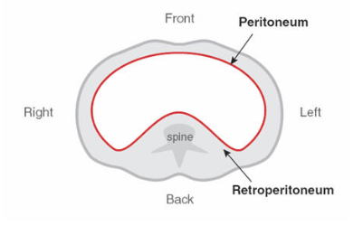
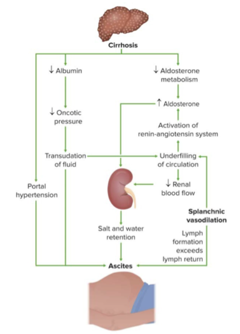
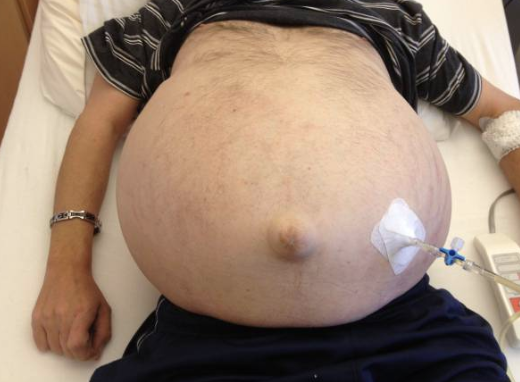
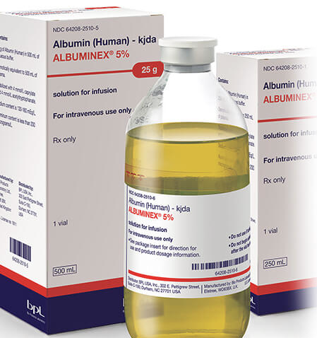
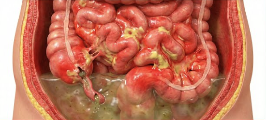
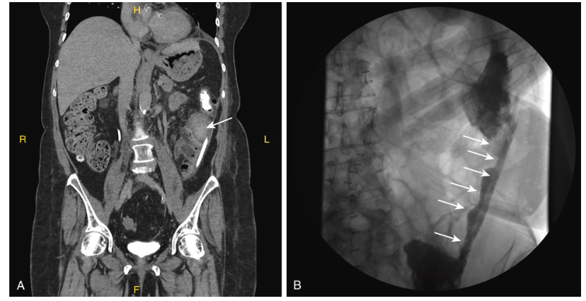
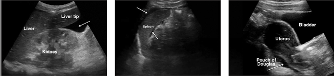
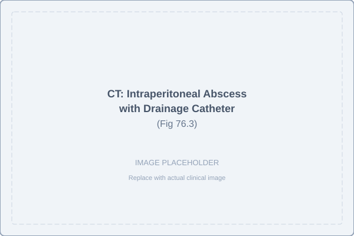
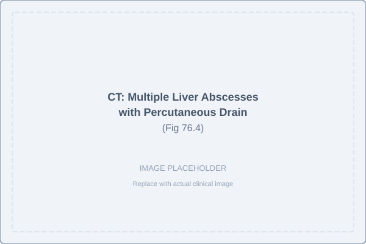
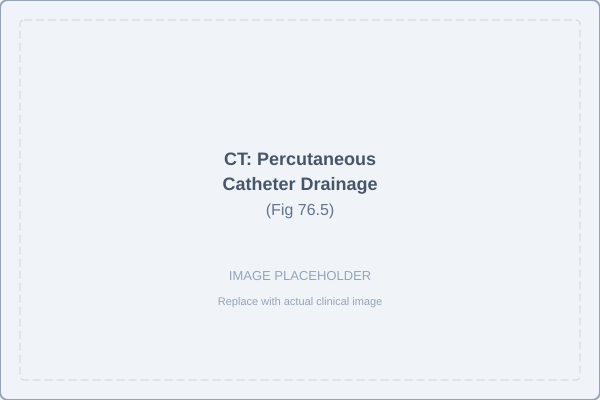

# SHORT VIEW SUMMARY

## Definition

Intraabdominal infections represent a spectrum of conditions involving contamination of the peritoneal cavity or intraabdominal organs with microorganisms. The key clinical concepts include:

- **Peritonitis**: An inflammatory response within the peritoneal cavity resulting from contamination with microorganisms, chemicals, or both
- **Classification**: Infections are classified as diffuse or localized; primary (spontaneous), secondary, or tertiary; and community-acquired or healthcare-acquired
- **Primary peritonitis**: No intraabdominal surgical source of infection
- **Secondary peritonitis**: Presence of an identifiable intraabdominal source of infection (perforation, ischemia, etc.)
- **Complicated infections**: Extend beyond the organ of origin with spillage into the peritoneal space; uncomplicated infections are contained within a single organ
- **Risk stratification**: Community-acquired infections are subdivided into low-risk and high-risk based on probability of drug-resistant organisms and severity (mild, moderate, severe)
- **Tertiary peritonitis**: Persistent or recurrent infection without a surgically treatable focus, often involving less virulent organisms

## Epidemiology

- Primary peritonitis accounts for approximately 1% of all peritonitis cases
- Secondary peritonitis is the most common intraabdominal infection (80-90% of cases)
- Primary peritonitis occurs primarily in cirrhotic patients with ascites; risk increases with coexisting gastrointestinal hemorrhage, low ascitic protein (\<1.5 g/dL), and elevated serum creatinine
- Tertiary peritonitis is associated with disturbance of host immune response and occurs in critically ill patients without an obvious surgically treatable focus
- Continuous ambulatory peritoneal dialysis (CAPD) peritonitis represents a major complication with recurrence in 20-30% of patients, often prompting switch to hemodialysis
- Intraperitoneal abscesses occur secondarily following diseased organs, penetrating trauma, or surgical procedures

## Microbiology

- **Primary peritonitis**: Monomicrobial infection in \>95% of cases; gram-negative enteric bacteria in 69% of cirrhotic patients (predominantly *Escherichia coli*)
- **Secondary peritonitis**: Characteristically polymicrobial with both facultative and obligate anaerobes; depends on site and prior antibiotic exposure
- **Key organisms**: Facultative gram-negative bacilli (*E. coli*, *Klebsiella*, *Enterobacter*), obligate anaerobes (*Bacteroides fragilis*, other *Bacteroides* spp., *Clostridium* spp.), and gram-positive cocci (streptococci, enterococci)
- **CAPD peritonitis**: Gram-positive organisms in 60-80% (primarily coagulase-negative staphylococci); gram-negative bacteria in 15-30%
- **ESBL prevalence**: Extended-spectrum beta-lactamase-producing gram-negative bacilli increasingly encountered in both healthcare-associated and community-acquired infections
- **Enterococci**: Found in 15-20% of secondary peritonitis; treatment indicated in select high-risk patients
- **Candida species**: Present in \~20% of acute GI perforations; more common in healthcare-associated settings with prior antibiotics

## Diagnosis

- **Primary peritonitis**: Diagnosed by excluding primary source with ascitic fluid analysis (WBC count, protein, Gram stain, culture)
- **Serum-ascitic albumin gradient \>1.1 g/dL**: Suggests nonperitoneal cause (e.g., portal hypertension)
- **Ascitic fluid findings suggestive of peritonitis**: ≥250 PMN cells/mm³ [@Ref11] with positive culture or clinical symptoms
- **Secondary peritonitis**: Requires imaging (CT or ultrasound) to identify source and assess for abscess formation
- **CAPD peritonitis**: \>100 WBC/mm³ (predominantly PMN cells) in dialysate with microorganism isolation in 90-95% of cases
- **Culture methods**: Inoculating blood culture bottles with ascitic fluid at bedside improves culture sensitivity [@Ref33]

## Therapy

- **Primary peritonitis**: Empirical antibiotics based on likely pathogens with 5-7 days recommended duration (oral transition after 48 hours if improved)
- **Albumin supplementation**: 1.5 g/kg within 6 hours of diagnosis plus 1 g/kg on day 3 for patients with serum creatinine \>1 mg/dL or bilirubin \>4 mg/dL significantly reduces acute kidney injury and mortality (16% vs 35% mortality)
- **Secondary peritonitis**: Requires antibiotics, source control [@Ref183], abscess drainage, and supportive care
- **CAPD peritonitis**: Intraperitoneal antibiotics for 14-21 days; catheter removal necessary in 10-20% of cases
- **Antifungal therapy**: Indicated for invasive Candida infections; echinocandins preferred first-line
- **Intraperitoneal abscesses**: Require drainage (percutaneous or surgical), targeted antibiotics, and source control

## Prevention

- **Primary peritonitis prophylaxis**:
  - Short-term: Ceftriaxone 1 g daily for 7 days during gastrointestinal hemorrhage in cirrhotic patients
  - Long-term: Ciprofloxacin 500 mg daily, norfloxacin 400 mg daily [@Ref101], or double-strength trimethoprim-sulfamethoxazole daily
- **Indications for long-term prophylaxis**: Prior episode of primary peritonitis or high-risk factors (ascitic protein \<1.5 g/dL, creatinine ≥1.2 mg/dL, BUN ≥25 mg/dL, sodium ≤130 mEq/L, or hepatic failure with MELD ≥9)

------------------------------------------------------------------------

# PERITONITIS OVERVIEW

## Anatomy and Physiology

The peritoneal cavity is a complex anatomic space that accommodates multiple organs and facilitates motion while containing normal fluid. The anatomic relationships are critical in determining routes of infection spread:

- The peritoneal cavity extends from the diaphragm to the pelvic floor, containing the stomach, small intestine, colon, liver, gallbladder, and spleen
- The transverse mesocolon divides the peritoneal cavity horizontally into upper and lower spaces
- The greater omentum extends from the transverse mesocolon and provides additional compartmentalization
- The lesser sac, the largest recess, is surrounded by the pancreas, kidneys (posteriorly), stomach (anteriorly), and liver/spleen (laterally); its limited communication via the foramen of Winslow allows isolated suppuration
- Anatomic spaces at risk for abscess formation include: subphrenic spaces, subhepatic spaces, paracolic gutters, Morison pouch (hepatorenal fossa), lesser sac, rectovesical/rectouterine pouch, and interloop spaces

The peritoneum is a serous membrane composed of a monolayer of mesothelial cells beneath which are lymphatic vessels, blood vessels, and nerve endings. Normal peritoneal fluid (approximately 100 mL) is clear yellow with low specific gravity and protein content (typically \<3 g/dL), containing few leukocytes (\<250/mm³, predominantly mononuclear). The peritoneal membrane has high permeability and facilitates both fluid exudation and absorption.

{fig-align="center" width="70%"}

## Classification and Definitions

Peritonitis is classified based on:

1.  **Origin**: Primary (spontaneous), secondary (from intraabdominal source), or tertiary (persistent/recurrent after treatment)
2.  **Extent**: Diffuse or localized
3.  **Chronicity**: Acute or chronic
4.  **Acquisition**: Community-acquired (\~80%) or healthcare-associated
5.  **Risk stratification**: Low-risk vs high-risk based on pathogen probability and severity

## Pathophysiology

### Local Response

The peritoneum responds to contamination with characteristic inflammatory reactions:

- Dramatic outpouring of protein-rich fluid (\>3 g/dL) into the peritoneal cavity
- Recruitment of polymorphonuclear leukocytes for bacterial phagocytosis and killing
- Fibrinogen polymerization forming fibrinous exudate plaques that localize infection
- Formation of fibrinous adhesions between bowel, mesentery, and omentum
- Inhibition of intestinal motility in involved segments

The extent and rate of spread depend on bacterial virulence, volume and nature of exudate, and effectiveness of localization mechanisms. Potential outcomes include: spontaneous resolution if defenses are adequate, formation of a confined abscess, or progressive diffuse peritonitis if defenses are overwhelmed.

### Systemic Response

The inflammatory response involves multiple cytokine mediators:

- Tumor necrosis factor-α (TNF-α), interleukin-1 (IL-1), IL-6, interferon-γ (IFN-γ), and soluble adhesion molecules released in response to bacterial products and tissue trauma
- Cytokine concentrations are dramatically higher in peritoneal exudate than in serum
- Systemic manifestations mediated by cytokine translocation via mesenteric lymph channels
- Renal insufficiency develops in approximately 30% of patients with primary peritonitis and is the most sensitive predictor of mortality

------------------------------------------------------------------------

# PRIMARY PERITONITIS (SPONTANEOUS BACTERIAL PERITONITIS)

## Etiology

Primary peritonitis (spontaneous bacterial peritonitis, SBP) represents infection of the peritoneal cavity without an evident intraabdominal source. It occurs in patients with predisposing conditions that result in ascites:

- **Cirrhosis and portal hypertension**: The most common predisposing condition (prevalence 10-30% in hospitalized cirrhotic patients with ascites) [@Ref12; @Ref22]
- **Cirrhosis type**: Alcoholic cirrhosis, postnecrotic cirrhosis, chronic active hepatitis, acute viral hepatitis
- **Other conditions**: Congestive heart failure, metastatic malignancy, systemic lupus erythematosus, nephrotic syndrome, lymphedema, or rarely no underlying disease
- **Risk factors for SBP in cirrhotic patients**:
  - High-volume ascites (advanced cirrhosis, MELD \>9)
  - Concurrent gastrointestinal hemorrhage
  - Prior episode of primary peritonitis
  - Low ascitic protein (\<1 g/dL)
  - Elevated serum bilirubin (\>2.5 mg/dL)
  - Proton pump inhibitor use [@Ref26; @Ref38]

{fig-align="center" width="55%"}

The common pathogenic link is the presence of ascites, likely due to impaired reticuloendothelial clearance of bacteria and reduced opsonic activity in ascitic fluid [@Ref41].

{fig-align="center" width="65%"}

## Bacteriologic Characteristics

Primary peritonitis is characteristically a monomicrobial infection, with microorganisms of presumed enteric origin:

- **Most common pathogens**: *E. coli* (most frequent), *Klebsiella pneumoniae*, other *Enterobacterales*, *Streptococcus pneumoniae*, and other streptococcal species
- **Percentage distribution** (in cirrhotic patients):
  - Gram-negative enteric bacteria: 69%
  - *Streptococcus* species: 15%
  - *Staphylococcus aureus*: 2-4% (unusual; may occur with umbilical hernia erosion)
- **Rare pathogens**: *Pseudomonas aeruginosa*, fungi, anaerobes (less than 1%)

### Variants of Primary Peritonitis

Three distinct variants have been described:

1.  **Monomicrobial nonneutrocytic bacterascites**: Positive cultures but \<250 neutrophils/mm³; may represent early bacterial colonization; 62-86% resolve spontaneously, remainder progress to SBP
2.  **Culture-negative neutrocytic ascites**: \>250 neutrophils/mm³ with negative cultures (in absence of prior antibiotics); occurs in 35% of clinically suspected SBP; blood cultures positive in one-third of cases [@Ref32]
3.  **Polymicrobial bacterascites**: Due to traumatic paracentesis [@Ref34] with bowel entry (\<1% of procedures); transient in most cases if protein \>1 g/dL and opsonic activity adequate

::: callout-note
**Diagnostic Pearl**: The finding of \>250 neutrophils/mm³ in peritoneal fluid warrants empirical antibiotic therapy even with negative cultures if SBP is clinically suspected, as blood cultures are positive in one-third of culture-negative cases.
:::

## Pathogenesis

The route of infection in primary peritonitis is typically not apparent, but several mechanisms have been proposed:

### Routes of Bacterial Entry

1.  **Hematogenous/lymphogenous**: Bacteria from intestinal translocation enter portal circulation; hepatic reticuloendothelial system is primary site for clearance
2.  **Transmural migration**: Enteric bacteria traverse intact bowel wall (demonstrated with hypertonic peritoneal solutions in animal models)
3.  **Vaginal ascension**: Transfallopian spread in prepubertal females; associated with intrauterine devices
4.  **Distant foci**: Hematogenous seeding from skin, soft tissues, urinary tract, respiratory tract, or odontogenic infections

### Host Factors Facilitating Infection

- **Impaired reticuloendothelial clearance**: Cirrhosis is associated with impaired hepatic bacterial clearance
- **Reduced opsonization**: Low complement and immunoglobulin levels in ascitic fluid, particularly in cirrhosis and nephrotic syndrome
- **Impaired phagocytosis**: Alcohol abuse and cirrhosis cause reduced intracellular killing by monocytes and neutrophils
- **Intestinal bacterial overgrowth**: Proton pump inhibitors may increase bacterial overgrowth and translocation risk
- **Portosystemic shunts**: Allow portal blood to bypass hepatic filtering

## Clinical Manifestations

Primary peritonitis often presents insidiously in cirrhotic patients with minimal or nonspecific symptoms:

### Symptoms

- Abdominal pain (often mild or absent)
- Fever (variable, may be absent)
- Change in mental status (hepatic encephalopathy)
- Malaise, fatigue
- Nausea and vomiting

::: callout-warning
**Clinical Pearl**: Primary peritonitis may present with only fever and a decline in mental status without marked peritoneal signs; a low threshold for paracentesis is essential in cirrhotic patients with ascites.
:::

### Physical Findings

- Mild abdominal tenderness (may be absent)
- Decreased rebound tenderness compared to secondary peritonitis
- Absence of classic peritoneal signs in many cases
- Jaundice and stigmata of cirrhosis

## Laboratory Findings

### Peritoneal Fluid Analysis

- **WBC count**: ≥250 cells/mm³ (predominantly PMN); cultures positive in 40-60% of cases
- **Protein concentration**: Usually reflects serum levels (low in cirrhotic patients)
- **Gram stain**: Positive in only 10-15% of cases
- **Culture**: Positive in 40-60%; single organism in \>95%
- **Blood cultures**: Positive in 75% of patients with aerobic bacterial peritonitis

::: callout-note
**Diagnostic Technique**: Inoculation of blood culture bottles with 10-20 mL of ascitic fluid at bedside improves culture yield, particularly for fastidious organisms.
:::

{fig-align="center" width="55%"}

### Additional Studies

- **Serum-ascitic albumin gradient \>1.1 g/dL**: Suggests portal hypertension (not peritonitis)
- **Ascitic glucose**: May be low in secondary peritonitis or tuberculous peritonitis
- **Ascitic amylase and LDH**: May help distinguish primary from secondary peritonitis
- **Blood chemistry**: Assess renal function (creatinine), liver function (bilirubin, INR)

## Diagnosis

Primary peritonitis is diagnosed by:

1.  Clinical suspicion in patient with ascites and signs of infection
2.  Paracentesis with ascitic fluid cell count ≥250 PMN/mm³
3.  Exclusion of a primary intraabdominal source of infection (clinical exam, imaging if needed)
4.  Positive ascitic fluid or blood culture

::: callout-note
**Diagnostic Criteria for SBP**: - Ascitic fluid PMN count ≥250 cells/mm³ - Positive ascitic or blood culture with single organism - No evidence of secondary peritonitis (perforation, pancreatitis, etc.)
:::

## Prognosis

Prognosis in primary peritonitis is significantly influenced by the presence of complications:

- **Mortality**: Historically 30-40% in hospitalized patients; improved with early diagnosis and therapy
- **Renal failure**: Develops in 30-40% of patients and is the major cause of death
- **Recurrence**: 69% at 1 year if prophylaxis not given after first episode
- **Albumin administration**: Meta-analysis of four controlled trials demonstrated significant mortality reduction (16% vs 35%) and reduction in acute kidney injury (8% vs 31%) when albumin given with antibiotics

## Therapy

### Antimicrobial Therapy

Empirical therapy should be initiated immediately after paracentesis upon clinical suspicion:

::: callout-warning
**Indications for Initiation of Antimicrobial Therapy**: - Temperature \>37.8°C (100°F) - Abdominal pain and/or tenderness - Unexplained change in mental status - Laboratory abnormalities (renal failure, acidosis, peripheral leukocytosis) - Ascitic fluid PMN count ≥250 cells/mm³
:::

#### First-Line Regimens

| Organism | Preferred Agent |
|---------------------------|---------------------------------------------|
| *S. pneumoniae* or Group A streptococci | High-dose penicillin, ceftriaxone, or cefotaxime |
| Penicillin-resistant pneumococci | Vancomycin ± fluoroquinolone |
| Methicillin-sensitive *S. aureus* | Nafcillin or first-generation cephalosporin (cefazolin) |
| Methicillin-resistant *S. aureus* | Vancomycin, daptomycin, telavancin, or linezolid |
| *P. aeruginosa* | Antipseudomonal penicillin, ceftazidime, cefepime, carbapenem ± aminoglycoside or fluoroquinolone |
| ESBL-producing gram-negative bacilli | Carbapenem (preferred) |

### Duration and Route of Therapy

- **Duration**: 5-7 days is standard for most cases
- **Transition to oral**: After 48 hours of intravenous therapy if clinical improvement demonstrated and effective oral agent available
- **Clinical improvement**: ≥25% decline in ascitic PMN count at 24-48 hours indicates adequate therapy
- **Repeat paracentesis**: Consider if:
  - Unusual organism isolated
  - Lack of expected clinical response
  - Elevated PMN count on follow-up

### Albumin Administration

Albumin is indicated to prevent renal insufficiency and reduce mortality:

- **Dosing**: 1.5 g/kg IV within 6 hours of diagnosis, then 1 g/kg on day 3
- **Indications**:
  - Ascitic fluid PMN ≥250 cells/mm³
  - Serum creatinine \>1 mg/dL, BUN \>30 mg/dL, or total bilirubin \>4 mg/dL
- **Mechanism**: Maintains effective arterial blood volume and prevents acute kidney injury
- **Evidence**: Reduces mortality from 35% to 16% and acute kidney injury from 31% to 8%

{fig-align="center" width="65%"}

### Vasopressor Consideration

- Beta-blockers associated with increased mortality in SBP; should be discontinued in hypotensive or hyponatremic patients

## Prevention

::: callout-tip
**Prophylaxis Reduces Mortality**: Antibiotic prophylaxis has been proven in randomized controlled trials to decrease infection episodes and lower mortality in high-risk patients.
:::

### Short-Term Prophylaxis (Acute Gastrointestinal Bleeding)

- **Agent**: Intravenous ceftriaxone 1 g daily
- **Duration**: 7 days inpatient
- **Transition**: Change to oral double-strength trimethoprim-sulfamethoxazole, ciprofloxacin 500 mg twice daily, or norfloxacin 400 mg twice daily once bleeding cessation and clinical stability achieved

### Long-Term Prophylaxis

| Indication | Preferred Agents |
|-----------------------------|-------------------------------------------|
| Prior episode of SBP | Ciprofloxacin 500 mg daily, norfloxacin 400 mg daily, or double-strength TMP-SMX daily |
| Ascitic protein \<1.5 g/dL AND one of: | Same as above |
| \- Serum creatinine ≥1.2 mg/dL |  |
| \- BUN ≥25 mg/dL |  |
| \- Serum sodium ≤130 mEq/L |  |
| \- Hepatic failure (MELD ≥9, bilirubin ≥3 mg/dL) |  |
| High-risk GI bleeding | Ciprofloxacin or norfloxacin |

::: callout-note
**Alternative Agent**: Rifaximin has been shown effective in reducing SBP occurrence, though routine use data are insufficient at present.
:::

------------------------------------------------------------------------

# SECONDARY AND TERTIARY PERITONITIS

## Etiology

Secondary peritonitis results from spillage of gastrointestinal or genitourinary microorganisms into the peritoneal cavity following loss of mucosal integrity. It accounts for 80-90% of intraabdominal infections and is the most common.

### Causes by Organ

| Organ | Cause of Peritonitis |
|-------------------|-----------------------------------------------------|
| **Distal esophagus** | Boerhaave syndrome, malignancy, trauma, iatrogenic perforation |
| **Stomach** | Peptic ulcer perforation, malignancy, trauma, iatrogenic injury |
| **Duodenum** | Peptic ulcer perforation, trauma, iatrogenic injury |
| **Biliary tract** | Cholecystitis, stone perforation, malignancy, trauma, iatrogenic injury |
| **Pancreas** | Pancreatitis (alcohol, drugs, gallstones), trauma, iatrogenic injury |
| **Small bowel** | Ischemic bowel, incarcerated hernia, Crohn disease, malignancy, Meckel diverticulum, trauma |
| **Large bowel and appendix** | Ischemic bowel, diverticulitis, malignancy, inflammatory bowel disease, appendicitis, volvulus, penetrating trauma, iatrogenic injury |
| **Uterus/salpinx/ovaries** | Pelvic inflammatory disease, tubo-ovarian abscess, ovarian cyst rupture, malignancy, trauma, iatrogenic injury |

### Special Populations

**Immunocompromised patients**: Typhlitis (neutropenic enterocolitis), an inflammation of the cecum with potential progression to perforation and secondary peritonitis, represents a significant risk.

## Microbiologic Characteristics

Secondary peritonitis is characteristically polymicrobial, with both facultative and obligate anaerobes. The specific microflora depends on the site of origin and may be altered by prior antibiotic therapy, other medications affecting gastric acidity, and host factors.

### Distribution of Organisms

| Organism                                      | Percentage (%) |
|-----------------------------------------------|----------------|
| **Aerobic/Facultative Gram-Negative Bacilli** |                |
| *Escherichia coli*                            | 71             |
| *Klebsiella* spp.                             | 14             |
| *Pseudomonas aeruginosa*                      | 14             |
| *Proteus mirabilis*                           | 5              |
| *Enterobacter* spp.                           | 5              |
| **Anaerobes**                                 |                |
| *Bacteroides fragilis*                        | 35             |
| Other *Bacteroides* spp.                      | 71             |
| *Clostridium* spp.                            | 29             |
| *Prevotella* spp.                             | 12             |
| *Peptostreptococcus* spp.                     | 17             |
| *Fusobacterium* spp.                          | 9              |
| *Eubacterium* spp.                            | 17             |
| **Gram-Positive Aerobic Cocci**               |                |
| *Streptococcus* spp.                          | 38             |
| *Enterococcus faecalis*                       | 12             |
| *Enterococcus faecium*                        | 3              |
| *Staphylococcus aureus*                       | 4              |

### Overall Pattern

- Aerobes only: 17%
- Anaerobes only: 1%
- Anaerobes + aerobes: 82%

::: callout-warning
**Polymicrobial Synergy**: Obligate anaerobes protect aerobic bacteria from phagocytic killing and antibiotic effects through beta-lactamase production. *Bacteroides* species are responsible for late abscess formation, while *E. coli* drives early mortality.
:::

### Emerging Resistance Patterns

- **ESBL-producing *E. coli* and *Klebsiella*[@Ref115; @Ref116] spp.**: Increasing prevalence in both community-acquired and healthcare-associated infections
- **AmpC-producing organisms**: *Enterobacter*, *Serratia*, *Citrobacter*, *Providencia*, *Morganella*, and *Acinetobacter* spp. with resistance to third-generation cephalosporins
- **Carbapenem-resistant Enterobacterales (CRE)**: Emerging threat with multiple resistance mechanisms
- **MRSA**: More prevalent in healthcare-associated infections
- **Enterococci**: Increasing frequency with vancomycin resistance increasingly documented
- **Candida species**: Present in 20% of acute GI perforations, more common with upper GI sources and prior antibiotics

## Pathogenesis

### Establishment of Infection

Anaerobic infections require: - Low oxygen tension - Low oxidation-reduction potential - Abundant nutrients - Sometimes specific growth factors (vitamin K, arginine, serum, blood pigments, bile)

These conditions are met in tissue devitalized by ischemia, trauma, or neoplasia.

### Bacterial Synergy

Mixed infections involve both pathogenic and nonpathogenic organisms whose presence together creates pathogenicity:

1.  **Environmental modification**: Facultative organisms reduce oxygen tension, creating conditions favorable for obligate anaerobes
2.  **Growth factor generation**: One organism produces essential factors for another (e.g., vitamin K production for *Prevotella* by diphtheroids)
3.  **Antibiotic protection**: Anaerobes protect aerobes from phagocytic killing and antibiotic effects via beta-lactamase production
4.  **Differentiated roles**: *E. coli* responsible for early mortality; *B. fragilis* (with *E. coli*) responsible for late abscess formation

## Pathophysiologic Responses

### Local Response

Following peritoneal contamination, a characteristic local inflammatory response occurs:

- **Exudative response**: High protein content (\>3 g/dL) with many cells, primarily PMN leukocytes that phagocytose organisms
- **Fibrinous exudate**: Fibrinogen polymerization forming plaques on inflamed surfaces
- **Adhesion formation**: Exudate glues together adjacent bowel, mesentery, and omentum
- **Motility inhibition**: Impaired intestinal motility in involved loops aids localization

**Outcome depends on interplay of factors**: - Greater bacterial virulence → spread - Larger volume/duration of contamination → spread - Impaired host defenses → spread

Possible outcomes: spontaneous resolution, localized abscess, or diffuse progressive peritonitis.

{fig-align="center" width="70%"}

### Systemic Response

Cytokines mediate systemic manifestations:

- **Major cytokines**: TNF-α, IL-1, IL-6, IFN-γ, and soluble adhesion molecules
- **Source**: Macrophages and host cells responding to bacteria, bacterial products (endotoxin), and tissue trauma
- **Concentration**: Dramatically higher in peritoneal exudate than serum
- **Translocation**: Via mesenteric lymph channels into systemic circulation
- **Consequences**:
  - Reduction of effective arterial blood volume
  - Activation of renin-angiotensin system
  - Renal insufficiency (associated with mortality)
  - Multi-organ failure

## Clinical Manifestations

### Symptoms

The presentation varies depending on acuity and extent of contamination:

- **Acute onset** (perforation): Sudden severe abdominal pain
- **Gradual onset** (perforated viscus, ischemia): Progressive pain
- **Constitutional**: Fever, chills, malaise
- **GI**: Nausea, vomiting, loss of appetite, constipation
- **Systemic**: Tachycardia, tachypnea, confusion (sepsis)

### Physical Findings

- **Peritoneal signs**: Rebound tenderness, guarding, rigidity
- **Absent bowel sounds**: Due to ileus
- **Abdominal distension**: From fluid accumulation and bowel distension
- **Hypotension**: Indicates sepsis and need for urgent intervention
- **Altered mental status**: Indicates severe sepsis/shock

## Diagnostic Studies

### Imaging

**Computed Tomography (CT)**: Gold standard for diagnosis

- Identifies primary source (perforation, abscess)
- Shows free air, free fluid, bowel dilatation
- Assesses for abscess requiring drainage
- Guides percutaneous drainage

**Ultrasound**: Alternative in some settings

- Bedside capability
- Less sensitive than CT for free air and early peritonitis
- Better for ascites quantification

{fig-align="center" width="70%"}

{fig-align="center" width="65%"}

### Laboratory Studies

- **CBC**: Leukocytosis (though may be normal in some cases)
- **Chemistries**: Electrolyte abnormalities, elevated creatinine, elevated LDH
- **Coagulation studies**: Assess for DIC if severe sepsis
- **Lactate**: Elevated in sepsis; correlates with severity
- **Blood cultures**: Positive in 50-80% of cases with bacteremia

### Peritoneal Fluid Analysis

- **Cell count and differential**: PMN predominance
- **Gram stain**: Often negative but should be performed
- **Culture**: Essential for organism identification and susceptibility
- **pH**: Low pH suggests bacterial contamination
- **Glucose**: Low in secondary peritonitis
- **Lactate**: Elevated in bacterial peritonitis

## Prognosis

Prognosis depends on multiple factors:

- **Mortality**: Ranges from 5-15% in low-risk, uncomplicated cases to 30-40% in high-risk, severe cases
- **Tertiary peritonitis**: Worst prognosis with mortality of 30-64%
- **Factors worsening prognosis**:
  - Delayed source control
  - Inadequate initial antimicrobial therapy
  - Multiple organ failure
  - Immunocompromised status
  - Severity of illness (APACHE II score)
  - Presence of resistant pathogens

## Therapy

### Antimicrobial Therapy Principles

::: callout-tip
**Key Principle**: Empirical therapy must cover both aerobic gram-negative bacilli (especially *E. coli*) and obligate anaerobes (*B. fragilis*) based on animal models showing necessity of treating both.
:::

**Timing**: Initiate immediately after appropriate specimens (blood, peritoneal fluid) obtained for culture.

**Duration**: 4-7 days for uncomplicated secondary peritonitis; longer for complicated cases or delayed source control.

**Adjustments**: Modify based on culture and susceptibility results to ensure coverage of predominant pathogens.

### Recommended Antimicrobial Regimens

#### For Mild-to-Moderate Community-Acquired Infections (Low-Risk)

| Agent                                      | Dosing           |
|--------------------------------------------|------------------|
| **Single Agent**                           |                  |
| Ertapenem                                  | 1 g IV daily     |
| Moxifloxacin                               | 400 mg IV daily  |
| **Combination Therapy**                    |                  |
| Cefotaxime [@Ref64; @Ref77] or ceftriaxone | 1-2 g IV Q8H +   |
| \+ metronidazole                           | 500 mg IV Q6-8H  |
| Ciprofloxacin                              | 400 mg IV Q12H + |
| \+ metronidazole                           | 500 mg IV Q6-8H  |

#### For High-Risk or Severe Community-Acquired, Healthcare-Associated, and Tertiary Infections

| Agent                   | Dosing                          |
|-------------------------|---------------------------------|
| **Single Agent**        |                                 |
| Imipenem-cilastatin     | 500 mg IV Q6H                   |
| Meropenem               | 1 g IV Q8H                      |
| Tigecycline             | 100 mg IV once, then 50 mg Q12H |
| Eravacycline            | 1 mg/kg IV Q12H                 |
| **Combination Therapy** |                                 |
| Cefepime or ceftazidime | 2 g IV Q8-12H +                 |
| \+ metronidazole        | 500 mg IV Q6-8H                 |
| Piperacillin-tazobactam | 3.375-4.5 g IV Q6-8H            |
| Ceftazidime-avibactam   | 2.375 g IV Q8H + metronidazole  |
| Ceftolozane-tazobactam  | 1.5 g IV Q8H + metronidazole    |

::: callout-warning
**Resistance Considerations**: - Tigecycline: NOT recommended as empirical therapy for healthcare-associated or tertiary infections due to inactivity against *P. aeruginosa* - Fluoroquinolones: Resistance becoming common; use only if institutional surveys show ≥90% E. coli susceptibility - Piperacillin-tazobactam: Reduced susceptibility with ESBL and AmpC producers; reserved primarily for high-risk patients
:::

### New Agents Against Resistant Gram-Negative Bacilli

| Agent | ESBL | AmpC | CRE | CRAB | CRPA | FDA-cIAI | Notes |
|---------|---------|---------|---------|---------|---------|---------|---------|
| Plazomicin | ✓ | ✓ | ✓ | X | X | X | R-enterococci, gram-pos cocci |
| Eravacycline | ✓ | ✓ | ✓ | ✓ | X | ✓ | Not R-*P. mirabilis*, Morganella, Providencia |
| Tigecycline | ✓ | ✓ | ✓ | ✓ | X | ✓ | Not R-*P. mirabilis*, Morganella, Providencia |
| Cefiderocol | ✓ | ✓ | ✓ | ✓ | ✓ | X | R-enterococci, gram-pos cocci; UTI/VAP only approved |
| Ceftazidime-avibactam | ✓ | ✓ | ✓ | X | ± | ✓ | R-enterococci |
| Ceftolozane-tazobactam | ✓ | X | X | X | ✓ | ✓ | R-enterococci |
| Meropenem-vaborbactam | ✓ | ✓ | ✓ | X | X | X |  |
| Imipenem-relebactam | ✓ | ✓ | ✓ | X | X | ✓ |  |

*Legend: ✓ = Active; X = Not active; ± = Variable/partial activity*

### Special Pathogen Considerations

#### Enterococci

The role of enterococci in polymicrobial intraabdominal infection remains controversial:

- **Prevalence**: Found in \~20% of intraabdominal infections
- **Clinical significance**:
  - Animal models show they enhance abscess formation, bacteremia, and mortality
  - Clinical reports document enterococcal superinfection when initial therapy lacks enterococcal coverage
  - However, selective therapy against *E. coli* and *B. fragilis* may be sufficient in some cases
- **Indications for anti-enterococcal coverage**:
  - Healthcare-associated or postoperative infections
  - Prior broad-spectrum cephalosporin or fluoroquinolone exposure
  - Immunocompromised patients
  - Prosthetic heart valves or valvular disease
  - Septic shock
  - High APACHE II score, advanced age, or prolonged preinfection hospitalization
- **Agents**: Beta-lactam agents (ampicillin-sulbactam), glycopeptides (vancomycin), or newer agents (daptomycin, tigecycline, eravacycline) for VRE

#### Candida Species

The optimal management of *Candida* in polymicrobial intraabdominal infection remains controversial:

- **Prevalence**: Isolated from 20% of acute GI perforations
- **Risk factors for invasive candidemia**:
  - Upper GI tract perforation/disruption
  - Surgical treatment of pancreatitis
  - Previous antibiotic therapy
  - Multiple perforations
  - Immunosuppression (chemotherapy, transplantation)
  - Postoperative or recurrent intraabdominal infection
- **Indications for antifungal therapy**:
  - *Candida* in blood culture (indicates invasive disease)
  - *Candida* as sole organism in residual/recurrent infection
  - *Candida* as predominant organism on Gram stain of peritoneal exudate
  - Severe community-acquired or healthcare-associated IAI with *Candida* isolation (expert recommendation)
- **First-line agent**: Echinocandin (caspofungin, micafungin, anidulafungin)
- **Alternative**: Fluconazole 400-800 mg daily (if non-neutropenic, no recent azole exposure, no azole-resistant species)

::: callout-note
**Management Algorithm**: Most authorities recommend antifungal therapy only for invasive disease (positive blood culture or sole organism), though many experts support treatment for *Candida* in severely ill patients with community-acquired or healthcare-associated infections.
:::

#### ESBL-Producing Organisms

Extended-spectrum beta-lactamase-producing Enterobacterales require special consideration:

- **Prevalence**: Increasing from 1.7% (*E. coli*) and 3.2% (*Klebsiella*) in 2005 to 7.3% and 13.1% respectively in 2012 in North America
- **Mechanism**: Hydrolysis of extended-spectrum cephalosporins (cefotaxime, ceftriaxone, ceftazidime, cefepime)
- **Risk factors**: Healthcare-associated infections, prior antimicrobial exposure
- **Detection**: Nonsusceptibility to ceftriaxone (MIC ≥2 mcg/mL) with cefoxitin susceptibility suggests ESBL
- **Therapy**:
  - Preferred: Carbapenem (imipenem or meropenem)
  - Alternatives: Ceftolozane-tazobactam or ceftazidime-avibactam (plus metronidazole)
  - Carbapenem-sparing: Current IDSA [@Ref1] 2022 guidelines recommend reserving carbapenems when possible

#### Individual Antimicrobial Agents

**Chloramphenicol** - Broad anaerobic coverage (\>99% at 16 μg/mL) - Activity against gram-positive cocci and many *Enterobacterales* - *P. aeruginosa* resistant - Risk of aplastic anemia limits use - Largely replaced by better-tolerated agents - May be option in resource-limited settings

**Clindamycin** - Activity against anaerobes: \>95% (at 8 μg/mL) but increasing resistance documented - 15% of *Clostridium* spp. (except *C. perfringens*) and rare *Fusobacterium* strains resistant - Activity: *S. aureus*, *Streptococcus pyogenes* (but not enterococci or *Enterobacterales*) - Risk of C. difficile-associated diarrhea: 2-20% incidence, with pseudomembranous colitis in half - **No longer recommended** except when other options contraindicated or intolerable

**Metronidazole** - Bactericidal against strict anaerobes: *B. fragilis*, *Fusobacterium*, *Clostridium* spp. - Unique bactericidal action against *B. fragilis* and *C. perfringens* - Resistance among *B. fragilis* to metronidazole: rare - **Limitation**: Poor activity against aerobes and microaerophiles; must combine with agent active against facultative pathogens - Lower incidence of *C. difficile* infection compared to clindamycin

**Tetracyclines**

*Older tetracyclines* (*tetracycline*, *doxycycline*, *minocycline*): Limited utility due to resistance, particularly among anaerobes

*Newer tetracyclines*: - **Tigecycline** (glycylcycline): - Broad spectrum: Anaerobes, gram-positive/negative aerobes, ESBL, AmpC, CRE, MRSA, VRE - Approved as monotherapy for cIAI - **NOT active** against *P. aeruginosa*, *Proteus mirabilis*, *Morganella*, *Providencia* - **Black box warning**: Pooled analysis showed increased mortality vs comparators - Recommendation: Use high-dose (100 mg IV once, then 100 mg IV Q12H); lower doses associated with higher mortality - Alternative for CRE when beta-lactams contraindicated

- **Eravacycline** (halogenated tetracycline):
  - 2-4 fold more potent than tigecycline
  - Broad spectrum similar to tigecycline
  - Approved as monotherapy for cIAI
  - **NOT active** against *P. aeruginosa*, *Proteus mirabilis*, *Morganella*, *Providencia*
  - Emerging alternative to tigecycline with potentially better safety profile

**Beta-Lactams (Penicillins)**

*Older agents* (*penicillin G*, *ampicillin*, *amoxicillin*, *piperacillin*): Inactivated by beta-lactamases; no longer recommended alone

*Beta-lactam/beta-lactamase inhibitor combinations*: - **Ampicillin-sulbactam**: Previously FDA-approved for IAI, now **no longer recommended** due to emerging resistance - **Amoxicillin-clavulanate**: Oral formulation may complete therapy but not recommended for empirical treatment - **Piperacillin-tazobactam**: - Spectrum: Gram-positive and many gram-negative aerobes and anaerobes - Recommended for severe community-acquired cIAI - **Limitations**: Does not inhibit AmpC beta-lactamases or carbapenem-resistant [@Ref194] organisms; high-inoculum ESBL infections may overcome beta-lactamase inhibition - Recent CLSI changes: Lowered susceptible breakpoint from ≤16 to ≤8 μg/mL; introduced SDD category at 16 μg/mL - Current recommendation: Reserve for high-risk patients with close monitoring of susceptibilities

**Temocillin** - 6-α-methoxy derivative of ticarcillin - Stable against ESBLs, KPC carbapenemases, and AmpC beta-lactamases - Available in UK and EU but not FDA-approved in US - **Limitation**: Borderline activity against KPC and AmpC; may be inadequate for systemic infections despite UTI activity - Interest renewed as carbapenem-sparing option

**Cephalosporins**

*First and second-generation* (*cefazolin*, *cefuroxime*): Resistant *B. fragilis*; require metronidazole; limited recent evidence

*Cephamycins* (*cefoxitin*, *cefotetan*): Increased resistance at many medical centers; **cannot be recommended**

*Third and fourth-generation* (*cefotaxime*, *ceftriaxone*, *ceftazidime*, *cefepime*): - Better activity against *Enterobacterales* - Ceftazidime and cefepime: Activity against *P. aeruginosa* - **Poor anaerobic activity**: Require metronidazole addition - **ESBL resistance**: Emerging problem; can be selected under antimicrobial pressure - Increasingly resistant; higher prevalence in healthcare-associated infections

*New cephalosporin combinations*: - **Ceftazidime-avibactam**: - Avibactam: New beta-lactamase inhibitor blocking ESBLs, AmpC, and some carbapenemases - Effective against ESBL and AmpC producers - IDSA 2022: Reserve for CRE (not routine ESBL use to preserve activity) - Must add metronidazole for anaerobic coverage

- **Ceftolozane-tazobactam**:
  - Active against drug-resistant *P. aeruginosa*
  - Not affected by common *P. aeruginosa* resistance mechanisms
  - **Limitations**: Limited ESBL and AmpC coverage; lacks gram-positive and enterococcal activity
  - Requires metronidazole addition for anaerobes
  - SIS 2017: Recommended for high-risk patients with ESBL or *P. aeruginosa*
- **Cefiderocol**:
  - Siderophore-conjugated cephalosporin
  - Active against CRE, CRPA, CRAB despite resistance mechanisms
  - **Limitations**: FDA approved for UTI/VAP only, not cIAI; variable anaerobic activity; lacks gram-positive activity
  - Requires metronidazole if used for cIAI

**Carbapenems** - Treatment of choice for serious ESBL-producing infections - **Imipenem-cilastatin**: 500 mg IV Q6H - **Meropenem**: 1 g IV Q8H - Broad spectrum including anaerobes and beta-lactamase producers - **Emerging resistance**: CRE increasingly encountered

*Newer carbapenem combinations*: - **Imipenem-relebactam**: Relebactam blocks AmpC and some carbapenemases; FDA-approved for cIAI - **Meropenem-vaborbactam**: Vaborbactam blocks AmpC and some carbapenemases - Reserve for high-risk or confirmed resistant pathogens per IDSA 2022

**Aztreonam (Monobactam)** - Gram-negative activity including *P. aeruginosa*; lacks gram-positive and anaerobic activity - Used in combination: Aztreonam + vancomycin + metronidazole - Option for patients with severe beta-lactam allergy

**Aminoglycosides** - **Limited role** in modern therapy - Nephrotoxicity and ototoxicity significant concerns - Once-daily dosing preferred over divided dosing - **Current recommendation**: Avoid routine use; reserve for specific situations with careful monitoring - Synergistic with beta-lactams but single agent inactive against anaerobes

**Fluoroquinolones** - Ciprofloxacin or levofloxacin: Gram-negative activity (including *P. aeruginosa*) - **Limitations**: Poor anaerobic coverage; resistant *B. fragilis*; requires metronidazole addition - **Resistance**: Fluoroquinolone-resistant *E. coli* increasingly common in some communities - Current recommendation: Use only if institutional surveys show ≥90% *E. coli* susceptibility

**Polymyxins** - Colistin (polymyxin E) and polymyxin B: Last-resort agents for multidrug-resistant organisms - Activity: CRE, CRPA, CRAB - Nephrotoxicity and neurotoxicity are significant concerns - Reserved for infections resistant to all other agents

### Additional Therapeutic Measures

#### Source Control

Source control is essential and often determines outcome:

- **Prompt identification and repair** of perforation or damaged viscus
- **Resection** of necrotic or irreversibly damaged tissue
- **Drainage** of purulence, feces, blood, and other foreign material
- **Peritoneal irrigation**: Optimal technique remains controversial; some favor running water irrigation
- **Repeat exploration**: May be necessary in severe cases (planned relaparotomy or damage control)

#### Gastrointestinal Decompression

- **Nasogastric tube**: Useful in acute peritonitis with ileus to prevent vomiting and aspiration
- **Fluid management**: Careful balance to maintain perfusion while avoiding overload

#### Fluid Management

- **Initial resuscitation**: Aggressive IV hydration in sepsis
- **Monitoring**: Urine output, hemodynamics, response to therapy
- **Vasopressors**: Consider if hypotensive despite fluids

#### Respiratory Support

- Close monitoring for signs of respiratory failure
- Mechanical ventilation if necessary for severe sepsis/ARDS

#### Prevention of Secondary Peritonitis

Not typically applicable as secondary peritonitis is managed reactively once it develops.

------------------------------------------------------------------------

# PERITONEAL DIALYSIS-ASSOCIATED PERITONITIS

## Long-Term Peritoneal Dialysis

Peritoneal dialysis (PD) is used in chronic kidney disease management due to advantages of preserving residual renal function and cardiovascular hemodynamics. Continuous ambulatory peritoneal dialysis (CAPD) uses patient-performed exchanges 3-4 times daily. Peritonitis represents a major complication occurring in 12-56% of patients annually depending on technique and patient factors.

## Microbiology

The microbiology of CAPD peritonitis differs from other intraabdominal infections:

- **Gram-positive organisms**: 60-80% of cases
  - *Coagulase-negative staphylococci* (most common, \~40-50%)
  - *Staphylococcus aureus* (\~10-15%)
  - *Streptococcus* spp. (various species)
  - *Enterococcus* spp.
- **Gram-negative bacteria**: 15-30%
  - *Enterobacterales* (various species)
  - *Pseudomonas aeruginosa* (associated with poor outcomes)
  - *Acinetobacter* spp.
  - Origin: Urinary tract, bowel, skin, contaminated water
- **Fungal**: 5-10% (particularly *Candida* spp.)
  - Associated with worse prognosis than bacterial peritonitis
  - May represent disseminated candidiasis
  - Requires immediate catheter removal
- **Mycobacterial**: Occasional (tuberculous peritonitis)
- **Polymicrobial peritonitis**: Suggests bowel perforation; requires investigation

## Pathogenesis

The route of infection in CAPD peritonitis is usually:

1.  **Touch contamination**: Most common; improper technique during exchange
2.  **Catheter tunnel infection**: Biofilm formation on catheter
3.  **GI translocation**: Intact bowel wall passage of bacteria
4.  **Ascending infection**: Via catheter from exit site
5.  **Bloodstream seeding**: Hematogenous route (less common)
6.  **Bowel perforation**: Polymicrobial flora; medical emergency

## Diagnosis

### Clinical Presentation

- **Abdominal pain**: Variable severity; may be mild
- **Fever**: May be absent even with peritonitis
- **Cloudy dialysate**: Most reliable clinical sign
- **Nausea/vomiting**: Variable
- **Diarrhea or constipation**: May worsen outcome

::: callout-note
**Diagnostic Criteria for CAPD Peritonitis**: - Peritoneal fluid WBC count \>100 cells/mm³ (predominantly PMN) - Cloudy dialysate fluid - Positive culture (90-95% of cases) - At least one of: fever, abdominal pain, cloudy dialysate
:::

### Laboratory Findings

| Finding | Details |
|------------------------------------|------------------------------------|
| **WBC Count** | \>100 cells/mm³ (optimal: \>400 cells/mm³ for diagnosis) |
| **Differential** | \>50% PMN neutrophils |
| **Culture** | Positive in 90-95% of cases |
| **Gram stain** | Positive in \~10% of cases (low sensitivity) |
| **Blood cultures** | Not routinely helpful |

#### Table 76.7: Updated 2022 ISPD Peritonitis Diagnosis Criteria

| Criterion | Details |
|---------------------------------------|---------------------------------|
| **Probable CAPD peritonitis** | Symptoms + cloudy dialysate + elevated WBC (\>100 cells/mm³) |
| **Confirmed peritonitis** | Probable diagnosis + positive culture |
| **Culture-negative peritonitis** | Probable diagnosis + negative culture after 5 days |
| **Contamination** | Positive culture on single exchange only |
| **Relapsing peritonitis** | Episode within 4 weeks of completing therapy for prior peritonitis with same organism |
| **Repeat peritonitis** | Episode \>4 weeks after completing therapy for prior peritonitis |
| **Tunnel infection** | Subcutaneous track infection with or without peritonitis |

## Prognosis

Prognosis in CAPD peritonitis depends on organism, promptness of treatment, and patient factors:

- **CAPD continuation**: 50-70% of patients continue CAPD after peritonitis episode
- **Catheter removal**: Necessary in 10-20% of patients
  - Higher rates: Fungal peritonitis (\>70%), nontuberculous mycobacterial infections
  - Lower rates: Gram-positive cocci (5-10%), gram-negative bacteria (15-20%)
- **Mortality**: 1-3% directly attributable to peritonitis; higher with fungal infections
- **Relapse/recurrence**: More common with gram-negative organisms than gram-positive

::: callout-warning
**Poor Prognostic Indicators**: - Fungal peritonitis (requires immediate catheter removal) - Polymicrobial infections (suggests bowel perforation) - *Pseudomonas aeruginosa* peritonitis - Delayed initiation of therapy - Relapsing or repeat episodes
:::

## Therapy

### Antimicrobial Therapy Approach

Intraperitoneal (IP) administration of antibiotics is preferred in CAPD peritonitis:

- **Duration**: 14-21 days per 2022 ISPD guidelines (previously 10-21 days)
- **Route**: Intraperitoneal administration at therapeutic levels in dialysate
- **Monitoring**: Repeat peritoneal fluid analysis at 2-3 days if inadequate response
- **Culture-guided therapy**: Adjust based on susceptibilities

::: callout-tip
**Intraperitoneal Administration**: IP dosing achieves high local concentrations while minimizing systemic toxicity, making it preferred over IV therapy for CAPD peritonitis.
:::

### Antimicrobial Regimens

| Organism | Typical Regimen | Dosing |
|--------------------|----------------------------------|------------------|
| **Gram-Positive Cocci** |  |  |
| Staphylococcus spp. (uncomplicated) | Cefazolin OR vancomycin | Cefazolin 500 mg IP Q8H; Vancomycin 15-30 mg/L in dialysate |
| *S. aureus* (methicillin-resistant) | Vancomycin | 15-30 mg/L in each exchange |
| **Gram-Negative Bacilli** |  |  |
| *E. coli*, *Klebsiella*, other | Ceftazidime OR ciprofloxacin | Ceftazidime 500 mg IP Q8H; Ciprofloxacin 100 mg IP daily |
| *Pseudomonas aeruginosa* | Ceftazidime + gentamicin | Ceftazidime 500 mg IP Q8H + gentamicin or tobramycin IP |
| **Anaerobes** | Clindamycin OR metronidazole | IP administration |

### Special Considerations

#### Fungal Peritonitis

- **Indication for therapy**: Positive culture or compelling clinical evidence
- **Treatment**: Systemic antifungal agents preferred over IP
- **First-line agents**:
  - **Echinocandins**: Caspofungin, micafungin, anidulafungin (preferred)
  - **Fluconazole**: 400-800 mg daily (alternative for non-immunosuppressed, no recent azole exposure)
  - **Voriconazole**: Alternative option
- **Catheter removal**: MANDATORY; necessary in \>70% of cases
- **Timing**: Catheter removal within 48 hours of diagnosis or if no improvement within 4-7 days of therapy
- **Prognosis**: Poor; high discontinuation of CAPD (\>70%)

::: callout-warning
**Fungal Peritonitis Pearls**: - Immediate catheter removal is essential - fungal peritonitis is NOT compatible with CAPD continuation - Systemic antifungal therapy is necessary; IP administration alone is inadequate - Risk factors: Prior antibiotic exposure, catheter colonization, immunosuppression
:::

#### Mycobacterial Peritonitis

- Nontuberculous mycobacteria (*Mycobacterium avium* complex, others): 5-10% of CAPD peritonitis
- *Mycobacterium tuberculosis*: Less common but indicates serious infection
- Treatment: Prolonged therapy (months) with appropriate antimycobacterial regimens
- Catheter removal: Often necessary
- Diagnosis: Delayed; requires special stains and culture

#### Culture-Negative Peritonitis

- Occurs in \~5-10% of CAPD peritonitis
- Causes:
  - Inadequate sampling technique
  - Prior antibiotic exposure
  - Atypical organisms (fungi, mycobacteria, fastidious bacteria)
- Management: Continue empirical therapy if clinical peritonitis present; repeat peritoneal fluid analysis
- Outcome: Usually favorable with continued therapy

## Acute Peritoneal Dialysis (Acute PD)

In acute kidney injury, peritonitis may occur with acute PD use:

- **Risk factors**: Same as CAPD but acute presentation
- **Management**: Similar to CAPD peritonitis
- **Consideration**: May switch to hemodialysis if peritonitis uncontrolled
- **Outcome**: Depends on underlying acute kidney injury severity and organism

------------------------------------------------------------------------

# INTRAPERITONEAL ABSCESSES

## Etiology

Intraperitoneal abscesses represent focal collections of pus that complicate peritonitis:

- **Secondary complication**: Result from inadequate localization of primary or secondary peritonitis
- **Formation**: Develops when peritoneal defenses (fibrin, adhesions, omentum) encapsulate infection
- **Location**: Determined by primary disease site and dependent peritoneal drainage
- **Multiple abscesses**: Common; average 2.3 per patient
- **Common sites**: Pelvis (most common in females), paracolic gutters, perihepatic spaces, lesser sac, Morison pouch, retroperitoneal spaces

### Common Locations by Condition

- **Appendicitis**: Right lower quadrant, paracolic gutter, pelvis
- **Diverticulitis**: Left lower quadrant, paracolic gutter, pelvis
- **Perforated peptic ulcer**: Paracolic gutter, perihepatic spaces
- **Cholecystitis**: Perihepatic, right paracolic gutter
- **Pelvic inflammation**: Pelvis, pouch of Douglas
- **Post-surgical**: Depends on operative site; anastomotic sites at risk

## Bacteriologic Findings

Intraperitoneal abscesses are characteristically polymicrobial:

- **Composition**: Identical to the polymicrobial flora of secondary peritonitis
- **Obligate anaerobes**: *Bacteroides fragilis* and other *Bacteroides* spp., *Clostridium* spp., *Prevotella* spp., peptostreptococci, fusobacteria
- **Facultative gram-negative bacilli**: *E. coli*, *Klebsiella*, *Enterobacter*, *Proteus*, *Pseudomonas*
- **Gram-positive cocci**: Streptococci, enterococci, staphylococci
- **Emerging organisms**: ESBL-producing gram-negative bacilli, *Candida* spp., resistant pathogens

## Pathogenesis

Abscess formation requires:

1.  **Localization of infection**: Peritoneal defenses (fibrin, adhesions, omentum) compartmentalize contamination
2.  **Bacterial survival**: Obligate anaerobes require low oxygen tension, achievable in enclosed spaces with devitalized tissue
3.  **Synergistic interactions**: Polymicrobial communities with protective mechanisms (anaerobes protect aerobes from antimicrobials)
4.  **Time**: Progressive accumulation of pus within loculated space
5.  **Barrier**: Host tissue forms capsule limiting abscess spread but also limiting antibiotic penetration

## Clinical Manifestations

### Symptoms

The presentation depends on abscess size, location, and host factors:

- **Fever**: May be persistent or spiking
- **Abdominal pain**: Location-specific; may be subtle
- **Constitutional symptoms**: Malaise, anorexia, weight loss
- **Sepsis**: May present with tachycardia, hypotension, altered mental status
- **GI symptoms**: Nausea, vomiting, diarrhea (depend on location)
- **Urinary symptoms**: Dysuria, frequency (if pelvic abscess)
- **Gynecologic symptoms**: Vaginal discharge, abnormal menses (if tubo-ovarian or pelvic)

### Physical Findings

- **Fever**: Usually present but may be absent in debilitated patients
- **Localized tenderness**: Over abscess site
- **Mass**: May be palpable, particularly with larger abscesses
- **Peritoneal signs**: Variable; may be minimal if abscess well-loculated
- **Sepsis signs**: If abscess ruptures or infection spreads

## Diagnosis

### Imaging

**Computed Tomography (CT)**: Gold standard for diagnosis

- **Sensitivity**: 90-95% for intraperitoneal abscesses
- **Findings**:
  - Fluid collection with enhancing rim
  - Air-fluid levels
  - Associated inflammation in surrounding tissues
  - Loculation or multiple locules
  - Gas within abscess (suggesting anaerobic infection)
- **Capabilities**: Identifies location, size, relationship to organs, guides drainage approach
- **Limitations**: May miss very small abscesses (\<5 mm)

**Ultrasound**: Alternative for mobile patients

- **Sensitivity**: 80-90% for larger abscesses
- **Advantages**: Bedside capability, no radiation
- **Limitations**: Operator-dependent; limited by bowel gas

**MRI**: Excellent soft tissue contrast

- Reserved for complex cases or when CT contraindicated
- May be particularly useful for pelvic abscesses

### Laboratory Findings

- **CBC**: Leukocytosis (though may be normal)
- **Chemistry**: Electrolyte abnormalities, elevated creatinine
- **Blood cultures**: Positive in 20-30% of cases
- **Lactate**: Elevated in severe infections

### Abscess Fluid Characteristics

- **Gram stain**: Positive in 30-50% (shows polymicrobial flora)
- **Culture**: Should be obtained; multiple organisms isolated
- **Sensitivity testing**: Essential for appropriate directed therapy
- **Cell count**: Many PMN, variable organisms

{fig-align="center" width="70%"}

{fig-align="center" width="70%"}

{fig-align="center" width="70%"}

## Prognosis

Prognosis depends on:

- **Abscess size**: Larger abscesses have worse prognosis
- **Location**: Difficult-to-drain locations (lesser sac, multiple loculations) carry higher risk
- **Organism**: ESBL/AmpC producers, fungi, resistant pathogens worsen prognosis
- **Host factors**: Immunocompromised patients, advanced age, comorbidities
- **Treatment delay**: Delayed drainage or inadequate source control increases mortality
- **Underlying disease**: Severity of original process affecting prognosis
- **Overall mortality**: Ranges from 5-15% with appropriate therapy to 30-40% in severe/delayed cases

## Therapy

### Drainage

Drainage is essential for cure; antibiotics alone are insufficient:

**Percutaneous Drainage** (Preferred approach) - **CT or ultrasound-guided**: Allows safe placement with visualization - **Catheter selection**: Size depends on abscess contents (larger bore for thick debris) - **Technique**: Trocar or Seldinger technique - **Advantages**: Minimally invasive, avoids operative risk, allows repeated access if needed - **Outcomes**: Success rate 80-95% depending on abscess characteristics - **Complications**: Perforation of adjacent organs, creation of fistulae (rare)

**Surgical Drainage** - **Indications**: - Failure of percutaneous drainage - Multiple complex loculations not amenable to percutaneous approach - Associated perforation or source requiring operative repair - Immunocompromised host with poor response - **Approach**: Dependent on location; laparotomy most common - **Associated procedures**: Source control, resection of necrotic tissue, repair of perforation

### Antibiotic Therapy

Antibiotics should be guided by culture results but empirical therapy essential initially:

**Empirical Therapy** - Must cover polymicrobial flora: gram-negative bacilli, anaerobes, gram-positive cocci - Duration: 4-7 days minimum after drainage; continued until clinical resolution - Route: IV initially; may transition to oral after improvement

**Culture-Directed Therapy** - Adjust based on susceptibility results - Target most virulent pathogens: *B. fragilis* + *E. coli* model - Special considerations for resistant organisms

**Regimen Selection** (Similar to secondary peritonitis) - For community-acquired, low-risk: Cefotaxime/ceftriaxone + metronidazole or ertapenem - For high-risk: Piperacillin-tazobactam, carbapenem, or newer agents based on susceptibilities - For resistant organisms: Tailored based on resistance pattern

### Source Control

Beyond drainage, address the primary process:

- **Resection**: Remove perforated viscus, necrotic tissue
- **Repair**: Primary closure of perforations when possible
- **Diversion**: Colostomy for certain colorectal perforations
- **Definitive treatment**: Address underlying disease (appendectomy for appendicitis, colectomy for diverticulitis, etc.)

### Follow-Up

- **Repeat imaging**: If inadequate response (persistent fever, leukocytosis) at 3-5 days
- **Drain management**: Leave in place until output minimal and patient clinically improved
- **Culture follow-up**: Repeat if organisms recovered are unusual or slow to respond
- **Transition to oral**: After fever resolves and clinical improvement documented

### Special Situations

#### Hepatic Abscesses

- **Amebic**: *Entamoeba histolytica*; treat with metronidazole ± luminal agents
- **Pyogenic**: Polymicrobial; require drainage + antibiotics
- **Fungal**: *Candida* spp.; require systemic antifungal ± drainage
- **Tuberculous**: *M. tuberculosis*; prolonged therapy; drainage if large

#### Splenic Abscesses

- Rare but serious; high mortality if untreated
- Often require splenectomy given difficulty of drainage
- May respond to antibiotics alone if small and hemodynamically stable

#### Pancreatic Abscesses

- Complicate acute pancreatitis
- Require drainage + antibiotics
- Often polymicrobial with gas-forming organisms
- May require multiple drainages

#### Perinephric Abscesses

- Usually associated with urinary tract infection or stone
- Require drainage + antibiotics
- Urology consultation for underlying urologic pathology

#### Tubo-Ovarian Abscesses

- Result of pelvic inflammatory disease
- May respond to antibiotics alone (smaller lesions)
- Require drainage if large or inadequate response to antibiotics
- May require hysterectomy/oophorectomy if chronic recurrence

------------------------------------------------------------------------

# ANTIMICROBIAL AGENTS - DETAILED DISCUSSION

## Agents for Anaerobic Infections

### Metronidazole

**Spectrum**: Active against obligate anaerobes; inactive against aerobes

**Indications** - Combined with agent active against aerobic gram-negative bacilli - Beta-lactam/beta-lactamase inhibitor provides adequate anaerobic coverage - Carbapenems provide adequate anaerobic coverage - Fluoroquinolone combinations for specific scenarios

**Dosing**: 500 mg IV Q6-8H or 400-500 mg IV Q12H (higher doses more common)

**Advantages** - Excellent anaerobic coverage: *B. fragilis*, *Clostridium* spp., *Fusobacterium*, *Prevotella* - Unique bactericidal action against *B. fragilis* - Rare resistance among anaerobes - Oral formulation available for transition therapy - Lower *C. difficile* risk than clindamycin

**Disadvantages** - No aerobic coverage; must combine - Rare: Peripheral neuropathy with prolonged use - Metallic taste

### Chloramphenicol

**Spectrum**: Broad anaerobic activity; some gram-positive and gram-negative coverage

**Current Role**: Largely replaced; reserved for resource-limited settings

**Concerns**: Risk of aplastic anemia (idiosyncratic reaction)

## Agents for Aerobic Gram-Negative Coverage

### Aminoglycosides (Gentamicin, Tobramycin, Amikacin)

**Current Role**: Limited in modern therapy

**Advantages**: Activity against gram-negative bacilli including *P. aeruginosa*

**Disadvantages** - No anaerobic activity - Nephrotoxicity and ototoxicity - Poor peritoneal penetration - Synergistic killing (not single-agent therapy)

**Current Recommendation**: Avoid routine use; reserve for specific scenarios

### Fluoroquinolones (Ciprofloxacin, Levofloxacin, Moxifloxacin)

**Spectrum**: Aerobic gram-negative (including *P. aeruginosa* with ciprofloxacin/levofloxacin); limited anaerobic

**Indications** - Low-risk community-acquired IAI (ciprofloxacin or levofloxacin + metronidazole) - Moxifloxacin monotherapy for mild-to-moderate IAI (includes anaerobes) - Oral step-down therapy option

**Advantages** - Good oral bioavailability - Tissue penetration - Lower cost

**Disadvantages** - Resistance increasingly common (*E. coli* resistance variable by region) - *B. fragilis* resistance necessitates metronidazole addition (except moxifloxacin) - QT prolongation with fluoroquinolones - Recent FDA warnings regarding safety profile

**Current Recommendation**: Use only if institutional surveillance shows ≥90% *E. coli* susceptibility

## Specialty Agents for Resistant Organisms

### Ceftazidime-Avibactam

**Spectrum**: ESBL, AmpC (at lower levels), some CRE

**Avibactam**: New beta-lactamase inhibitor effective against ESBLs, KPCs, AmpC

**Indications**: Reserve for CRE per IDSA 2022 to preserve activity

**Limitations** - Not active against all CRE - Requires metronidazole for anaerobes - Higher cost

### Ceftolozane-Tazobactam

**Spectrum**: *P. aeruginosa* including drug-resistant strains; ESBL *Enterobacterales*

**Advantages** - Novel *P. aeruginosa* activity - Resistance mechanism evasion (efflux pumps, porin loss, chromosomal AmpC)

**Limitations** - Limited AmpC coverage - No anaerobic activity; requires metronidazole - No gram-positive/enterococcal activity - Higher cost

### Eravacycline

**Spectrum**: Broad; includes anaerobes, gram-positive, gram-negative, ESBL, AmpC, CRE, VRE, MRSA

**Advantages** - Not active against *P. aeruginosa* (not disadvantage for all infections) - 2-4 fold more potent than tigecycline - Emerging as alternative to tigecycline

**Dosing**: 1 mg/kg IV Q12H

**Limitations** - Newer agent; less clinical data - Not active against *P. aeruginosa*

### Tigecycline

**Spectrum**: Broad; anaerobes, gram-positive, gram-negative, resistant pathogens

**Indications**: CRE infections when beta-lactams contraindicated or resistant; high-risk complicated IAI

**Dosing**: 100 mg IV load, then 50 mg IV Q12H (high-dose recommended for infection)

**Advantages** - Broad spectrum - Activity against most resistant pathogens

**Disadvantages** - **Black box warning**: Increased mortality vs comparators in pooled analysis - Not active against *P. aeruginosa*, *Proteus mirabilis*, *Morganella*, *Providencia* - Not recommended as empirical therapy for healthcare-associated or tertiary infections - Higher costs

**Important**: Recommend high dosing to minimize mortality risk

### Cefiderocol

**Spectrum**: ESBL, AmpC, CRE (including MBL), CRPA, CRAB

**Mechanism**: Siderophore-conjugated cephalosporin; iron-dependent bacterial uptake

**Limitations** - FDA approval limited to UTI and hospital-acquired/VAP (not cIAI) - No gram-positive/enterococcal activity; requires metronidazole - Variable anaerobic activity - Cost

**Future Consideration**: May be approved for cIAI in the future

------------------------------------------------------------------------

# CLINICAL GUIDELINES AND RECOMMENDATIONS

## Surgical Infection Society 2017 Guidelines

**Lower-Risk Community-Acquired IAI** - Preferred: Cefotaxime or ceftriaxone + metronidazole OR ertapenem - Alternatives: Ciprofloxacin + metronidazole OR moxifloxacin

**Higher-Risk Community-Acquired IAI** - Preferred: Piperacillin-tazobactam OR imipenem-cilastatin OR meropenem OR cefepime + metronidazole - Alternatives: Ceftazidime + metronidazole OR aztreonam + metronidazole + vancomycin

**ESBL-Producing Enterobacterales** - Preferred: Carbapenem (imipenem or meropenem) OR ceftolozane-tazobactam OR ceftazidime-avibactam + metronidazole

**AmpC-Producing Enterobacterales** - Preferred: Carbapenem OR ceftazidime-avibactam + metronidazole

**CRE** - Carbapenem or ceftazidime-avibactam ± aminoglycoside/polymyxin/tigecycline

## IDSA 2022 Guidance

**ESBL-Producing Enterobacterales** - Recommend carbapenem preference - Reserve ceftazidime-avibactam for CRE

**AmpC-Producing Enterobacterales** - Carbapenem or newer alternatives

**CRE and CRPA** - Tailored based on resistance mechanism - Consider combination therapy

## World Society of Emergency Surgery [@Ref171] 2021 Guidelines

**No MDR Risk** - Piperacillin-tazobactam (continuous infusion), tigecycline, meropenem, or imipenem

**High MDR Risk** - Tigecycline or eravacycline + piperacillin-tazobactam - Or in critically ill: Meropenem or imipenem + vancomycin or teicoplanin

------------------------------------------------------------------------

# SUMMARY AND KEY TAKEAWAYS

## Clinical Pearls

1.  **Primary peritonitis diagnosis**: Low threshold for paracentesis in cirrhotic patients with ascites; can present with minimal peritoneal signs
2.  **Albumin administration**: Critical in SBP to prevent renal failure and mortality; demonstrated 50% mortality reduction in meta-analysis
3.  **Polymicrobial coverage essential**: Secondary peritonitis requires agents active against both *E. coli* and *B. fragilis*
4.  **Source control primacy**: Drainage of intraperitoneal abscesses essential; antibiotics alone insufficient
5.  **Culture importance**: Essential for organism identification and susceptibility; guides therapy optimization
6.  **Resistance emerging**: ESBL, AmpC, CRE increasingly encountered; must consider institution-specific resistance patterns
7.  **Newer agents**: Eravacycline, ceftazidime-avibactam, ceftolozane-tazobactam expand options for resistant pathogens
8.  **CAPD peritonitis management**: Intraperitoneal antibiotics preferred; fungal peritonitis requires immediate catheter removal
9.  **Enterococcal coverage**: Selective, not routine; indicated in high-risk patients with sepsis or prior broad-spectrum exposure
10. **Fluoroquinolone caution**: Use only with documented high institutional susceptibility

## Warning Signs

::: callout-warning
**Clinical Warning Signs Requiring Urgent Action**: - Persistent fever despite appropriate antibiotics (consider resistant pathogen, inadequate source control, or abscess) - Rapid clinical deterioration (suggests perforation, rupture of abscess, or inadequate coverage) - Fungal peritonitis in CAPD (immediate catheter removal mandatory) - Polymicrobial CAPD peritonitis (suggests bowel perforation; investigate urgently) - Increasing renal dysfunction (prognostic indicator; support with albumin and aggressive management) - Recurrent/relapsing infections (consider relapse vs re-infection; repeat cultures essential)
:::

------------------------------------------------------------------------

## References